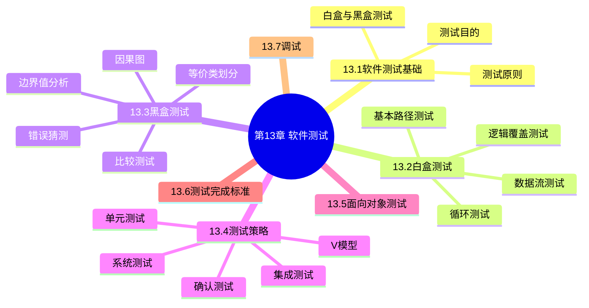
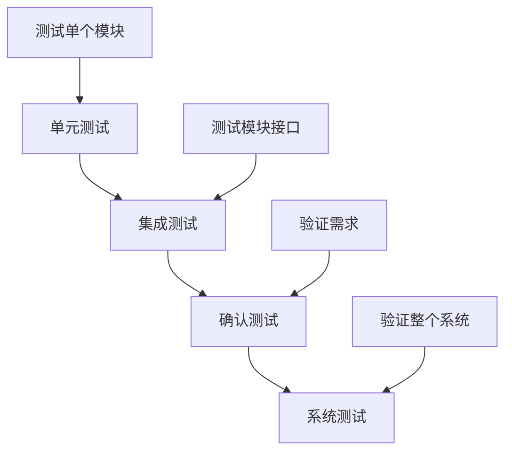

# 第13章 软件测试

## 基本信息
- **课程**：软件工程（第3版）
- **章节**：第13章 软件测试
- **作者**：钱乐秋、赵文耘、牛军钰
- **重要性**：⭐⭐⭐ 核心章节
- **日期**：2026-05-11
- **标签**：#软件测试 #白盒测试 #黑盒测试 #测试策略

---

## 本章概述

软件测试是发现软件中错误和缺陷的主要手段。测试工作量约占软件开发总工作量的40%以上，对于关系到生命安全的软件，测试工作量可能相当于其他开发阶段工作量总和的3~5倍。

---

## 重点内容

### ⭐⭐⭐ 核心重点

1. **白盒测试方法**
   - 逻辑覆盖测试（6种覆盖标准）
   - 基本路径测试
   - 循环测试

2. **黑盒测试方法**
   - 等价类划分
   - 边界值分析
   - 因果图

3. **测试策略**
   - 单元测试
   - 集成测试（自顶向下、自底向上）
   - 确认测试（α测试、β测试）
   - 系统测试

### ⭐⭐ 重要内容

- 软件测试的目的和基本原则
- V模型
- 回归测试
- 测试完成标准

### ⭐ 一般了解

- 数据流测试
- 面向对象测试
- 调试方法

---

## 章节结构

---

## 知识框架

### 测试方法分类

| 测试方法 | 别称 | 核心思想 | 主要用途 |
|---------|------|---------|---------|
| **白盒测试** | 结构测试 | 把程序看作透明盒子，根据内部逻辑结构设计测试用例 | 程序模块测试 |
| **黑盒测试** | 行为测试 | 把程序看作黑盒子，只依据需求规格说明书测试功能 | 各种测试阶段 |

### 逻辑覆盖标准（由弱到强）

### 测试策略层次

---

## 关键概念对比

### 白盒测试 vs 黑盒测试

| 对比项 | 白盒测试 | 黑盒测试 |
|-------|---------|---------|
| **测试依据** | 程序内部逻辑结构 | 软件需求规格说明 |
| **测试视角** | 透明盒子（可见内部） | 黑盒子（不可见内部） |
| **主要方法** | 逻辑覆盖、路径测试 | 等价类、边界值、因果图 |
| **适用阶段** | 单元测试 | 集成测试、确认测试 |
| **优点** | 可发现内部逻辑错误 | 从用户角度验证功能 |
| **缺点** | 无法验证需求符合性 | 无法发现内部逻辑错误 |

### 集成测试策略对比

| 策略 | 方向 | 优点 | 缺点 |
|------|------|------|------|
| **自顶向下** | 从主控模块开始，逐步向下 | 较早验证主要控制和决策 | 低层用桩模块替代，不能反映真实情况 |
| **自底向上** | 从底层模块开始，逐步向上 | 不需要桩模块，可并行测试 | 整体性错误发现较晚 |
| **三明治** | 高层自顶向下+低层自底向上 | 结合两者优点 | 复杂度较高 |

---

## 重要公式和规则

### 1. 等价类划分规则

| 输入条件 | 有效等价类 | 无效等价类 |
|---------|-----------|-----------|
| 取值范围 | 1个（范围内） | 2个（小于最小值、大于最大值） |
| 值的个数 | 1个（等于规定个数） | 2个（少于、多于规定个数） |
| 离散值集合 | 每个允许值1个 | 1个（任意不允许值） |
| 必须遵循的规则 | 1个（符合规则） | 若干个（从不同角度违反） |

### 2. 边界值选择规则

- 正好等于边界的值
- 刚刚大于边界的值
- 刚刚小于边界的值

---

## 疑问与思考

1. **如何确定测试用例的数量？**
   - 需要在测试覆盖率和测试成本之间权衡
   - 优先测试关键模块和高风险功能

2. **条件组合覆盖和路径覆盖哪个更强？**
   - 条件组合覆盖：覆盖判定中条件的所有组合
   - 路径覆盖：覆盖程序的所有执行路径
   - 两者各有侧重，实际测试中常结合使用

3. **回归测试的频率如何确定？**
   - 每次修改后都应进行
   - 重点测试修改波及的模块

---

## 相关链接

### 本章小节笔记
- [第13章-13.1-软件测试基础](第13章-13.1-软件测试基础.md)
- [第13章-13.2-白盒测试](第13章-13.2-白盒测试.md)
- [第13章-13.3-黑盒测试](第13章-13.3-黑盒测试.md)
- [第13章-13.4-测试策略](第13章-13.4-测试策略.md)
- [第13章-13.5-面向对象测试](第13章-13.5-面向对象测试.md)
- [第13章-13.6-测试完成标准](第13章-13.6-测试完成标准.md)
- [第13章-13.7-调试](第13章-13.7-调试.md)

### 相关图片
- 图13.1 例13.1程序流程图
- 图13.2 例13.2程序流程图
- 图13.3 复合条件的流图
- 图13.5 例13.3流图
- 图13.6 循环的类别
- 图13.7 因果图的基本符号
- 图13.8 因果图的约束符号
- 图13.9 饮料自动售货机因果图
- 图13.10 V模型
- 图13.11 单元测试环境
- 图13.12 自顶向下集成
- 图13.13 自底向上集成
- 图13.14 单位时间内发现错误数目的曲线
- 图13.15 调试过程
- 图13.16 归纳法调试过程
- 图13.17 演绎法调试过程

---

## 学习建议

1. **理解概念**：重点理解6种逻辑覆盖标准的区别和联系
2. **掌握方法**：熟练掌握等价类划分和边界值分析的实际应用
3. **理清层次**：明确单元测试、集成测试、确认测试、系统测试的区别
4. **多做练习**：通过实际例题加深对测试用例设计的理解
5. **关注重点**：白盒测试和黑盒测试是考试重点，务必掌握
