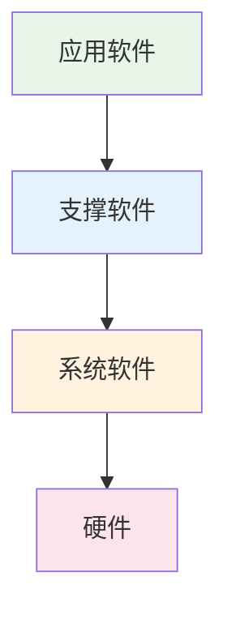

# 第1章-1.1-计算机软件

## 基本信息
- **课程**：软件工程
- **章节**：第1章 1.1节 计算机软件
- **日期**：2026-06-30
- **标签**：#计算机软件 #软件发展 #软件特点 #软件分类 #软件语言

---

## 重点内容

### ⭐⭐⭐ 核心概念
- **软件定义**：计算机系统中的程序及其文档，程序是计算任务的处理对象和处理规则的描述
- **软件发展的三个阶段**：个体编程(1946-1956) -> 作坊式开发(1956-1968) -> 工程化方法(1968至今)
- **软件分类三类**：系统软件、支撑软件、应用软件

### ⭐⭐ 重要概念
- **软件与硬件的根本区别**：软件是逻辑实体，无机械磨损
- **软件语言五类**：需求定义语言、功能性语言、设计性语言、程序设计语言、文档语言
- **程序设计语言分类**：低级/高级、过程式/非过程式、通用/专用、交互式/非交互式、顺序/并发/分布

### ⭐ 基础概念
- **衡量标准的演变**：功效优先(第一阶段) -> 结构清晰(第二阶段) -> 工程化(第三阶段)
- **软件故障曲线**：与硬件不同，软件无磨损老化，但维护可能引入新故障

---

## 详细笔记

### 一、软件的定义

根据《计算机科学技术百科全书》，计算机软件指**计算机系统中的程序及其文档**。

> 📚 **课本出处**：第1章 1.1节"计算机软件"

- **程序**：计算任务的处理对象和处理规则的描述
  - 处理对象：数据（数字、文字、图形、图像、声音等）或信息（数据及有关的含义）
  - 处理规则：处理的动作和步骤
- **文档**：为了便于了解程序所需的阐述性资料

> 💡 **理解技巧**：软件 = 程序 + 文档。程序是"做什么"和"怎么做"的描述，文档是"为什么这样做"和"怎么用"的说明。

---

### 二、软件的发展（1.1.1）

> 📚 **课本出处**：第1章 1.1.1节"软件的发展"

徐家福教授在《计算机科学技术百科全书》中将软件发展分为三个阶段：

#### 阶段一：个体编程阶段（1946—1956年）

| 维度 | 特征 |
|:----:|:-----|
| **硬件条件** | 存储容量小，运算速度慢 |
| **编程语言** | 低级语言（机器语言、汇编语言） |
| **应用领域** | 以数值数据处理为主的科学计算 |
| **程序特点** | 输入输出量小，计算量大 |
| **衡量标准** | 功效（运行时间省、占用内存小） |
| **工作方式** | 个体工作方式 |
| **文档情况** | 几乎没有文档，"软件"一词尚未出现 |
| **研究内容** | 科学计算程序、服务性程序、程序库 |
| **研究对象** | 顺序程序 |

> ⚠️ **常见误区**：第一阶段不是说没有程序，而是程序的开发完全依赖个人编程技巧，没有系统化的方法论指导。

#### 阶段二：作坊式开发阶段（1956—1968年）

| 维度 | 特征 |
|:----:|:-----|
| **硬件发展** | 大容量存储器出现，外围设备迅速发展 |
| **编程语言** | 高级程序设计语言出现 |
| **应用领域** | 扩大到大量数据处理（非数值数据） |
| **新事物** | 操作系统、数据库及其管理系统 |
| **工作方式** | 从个体方式转向合作方式 |
| **文档情况** | 20世纪60年代初出现"软件"一词 |
| **研究对象** | 增加了并发程序 |
| **关键问题** | 缺乏有效的工程化方法 -> **软件危机** |

#### 阶段三：工程化方法阶段（1968年至今）

| 维度 | 特征 |
|:----:|:-----|
| **硬件发展** | 巨型机和微型机两个方向，计算机网络飞速发展 |
| **软件工程** | 1968年NATO会议首次提出"软件工程" |
| **应用领域** | 渗透到各个业务领域，嵌入式应用 |
| **开发方式** | 从个体合作转向工程方式 |
| **新方向** | 智能化、自动化、集成化、并行化、自然化 |

---

### 三、软件的特点（1.1.2）

> 📚 **课本出处**：第1章 1.1.2节"软件的特点"

软件与硬件相比，有以下不同特点：

| 特点 | 说明 |
|:----:|:-----|
| **逻辑实体** | 不是有形的系统元件，开发成本和进度难以准确估算 |
| **无制造过程** | 开发成功后只需复制即可，但维护工作量大 |
| **无机械磨损** | 软件不会像硬件那样因磨损而退化 |

#### 硬件与软件故障曲线对比

**硬件故障曲线**（图1.1）：
- 使用初期：因设计/制造问题，故障率较高
- 稳定期：故障修复后，故障率降到稳定水平
- 衰退期：因机械磨损、老化，故障率急剧上升

#### 📷 图1.1 硬件的故障曲线

> 📚 **课本出处**：图1.1 展示了硬件故障率随时间变化的"浴盆曲线"

**软件故障曲线**（图1.2）：
- 使用初期：未发现的错误引起较高故障率
- 理想曲线：故障修复后，故障率趋于零（无磨损老化）
- 实际曲线：维护修改可能引入副作用，使故障率再次升高

#### 📷 图1.2 软件的故障曲线

> 📚 **课本出处**：图1.2 展示了软件的实际故障曲线与理想曲线的对比

> 💡 **理解技巧**：硬件会"变旧"（磨损老化），软件不会"变旧"但会"变乱"（维护引入新bug）。这就是为什么软件维护如此重要且困难。

---

### 四、软件的分类（1.1.3）

> 📚 **课本出处**：第1章 1.1.3节"软件的分类"

根据《计算机科学技术百科全书》，软件分为三类：

| 类型 | 位置 | 说明 | 示例 |
|:----:|:----:|:-----|:-----|
| **系统软件** | 最靠近硬件 | 与具体应用领域无关，其他软件通过它发挥作用 | 编译程序、操作系统 |
| **支撑软件** | 中间层 | 支撑软件的开发、维护与运行 | 数据库管理系统、网络软件、软件工具 |
| **应用软件** | 最外层 | 特定应用领域专用的软件 | 人口普查软件、嵌入式应用软件 |

---

### 五、软件语言（1.1.4）

> 📚 **课本出处**：第1章 1.1.4节"软件语言"

软件语言是用于书写计算机软件的语言，主要包括五类：

| 语言类型 | 用途 | 典型代表 |
|:--------:|:-----|:---------|
| **需求定义语言** | 书写软件需求定义 | PSL |
| **功能性语言** | 书写软件功能规约 | Z语言、广谱语言 |
| **设计性语言** | 书写软件设计规约 | PDL |
| **程序设计语言** | 书写计算机程序 | FORTRAN、C、Java等 |
| **文档语言** | 书写软件文档 | 自然语言、半形式化语言 |

#### 程序设计语言的分类

**按语言级别**：
| 级别 | 特点 | 示例 |
|:----:|:-----|:-----|
| 低级语言 | 与特定机器结构密切相关，功效高但使用复杂 | 机器语言、汇编语言 |
| 高级语言 | 不反映特定机器结构，易学易用但功效较低 | FORTRAN、C、Java |

**按用户要求**：
| 类型 | 特点 | 示例 |
|:----:|:-----|:-----|
| 过程式语言 | 通过指明一列可执行的运算及运算次序来描述计算过程 | FORTRAN、C、Java |
| 非过程式语言 | 不显式指明处理过程细节 | PROLOG |

**其他分类维度**：

| 分类维度 | 类型1 | 类型2 | 类型3 |
|:--------:|:-----:|:-----:|:-----:|
| 应用范围 | 通用语言 | 专用语言 | - |
| 使用方式 | 交互式语言 | 非交互式语言 | - |
| 成分性质 | 顺序语言 | 并发语言 | 分布语言 |

> 📚 **课本出处**：第1章 1.1.4节，表1.1列出了五类软件语言及其在软件生存周期各阶段的使用情况

---

## 疑问与思考

### ❓ 待解决问题
1. 软件危机的"软件"定义在当时和现在有何变化？1956-1968年间出现"软件"一词后，对行业发展有什么具体影响？
2. 系统软件和支撑软件的边界在现代是否越来越模糊？例如，IDE既算系统软件还是支撑软件？
3. 非过程式语言（如PROLOG）在实际工程中应用不多，为什么教材仍然将其作为一个重要分类？
4. 软件无机械磨损但维护会引入新故障，那么有没有一种方法可以完全避免维护引入的副作用？

### 💡 个人理解/技巧
- 软件发展三个阶段可以用"工具"来类比：第一阶段是手工匠人（个体），第二阶段是小作坊（合作），第三阶段是工厂流水线（工程化）
- 软件语言的五类恰好对应软件开发的五个阶段：需求 -> 功能规约 -> 设计 -> 编码 -> 文档
- 软件分类三层模型中，系统软件是"地基"，支撑软件是"工具"，应用软件是"房子"
- 程序设计语言的多种分类维度说明：同一门语言可以从不同角度归类（如Java既是高级语言，又是过程式/非过程式兼有，又是通用语言）

---

## 总结

### 软件发展三阶段对比

| 对比项 | 第一阶段(1946-1956) | 第二阶段(1956-1968) | 第三阶段(1968至今) |
|:------:|:-------------------:|:-------------------:|:-------------------:|
| **编程语言** | 低级语言 | 高级语言 | 多种语言并存 |
| **应用领域** | 科学计算 | 数据处理扩展 | 渗透各领域 |
| **工作方式** | 个体 | 合作 | 工程化 |
| **衡量标准** | 功效 | 结构清晰性 | 正确性、可用性、开销合宜 |
| **文档意识** | 无 | 开始重视 | 规范化 |
| **研究对象** | 顺序程序 | 并发程序 | 分布式、嵌入式 |

### 关键要点

1. **软件 = 程序 + 文档**：程序是处理对象和处理规则的描述，文档是阐述性资料
2. **软件危机催生了软件工程**：缺乏工程化方法导致的困境
3. **软件是逻辑实体**：无机械磨损但维护复杂，故障曲线与硬件不同
4. **软件三类分层**：系统软件（底层） -> 支撑软件（中间） -> 应用软件（上层）
5. **五类软件语言**贯穿软件生存周期各阶段
6. **程序设计语言**可从多个维度分类：级别、用户要求、应用范围、使用方式、成分性质

---

## 相关链接

### 本节相关图片
- [图1.1 硬件的故障曲线](../../../images/2eeb406718e2217f2c0d18678443ab0a6a19c5dbed1ee7bf0185d6e6a9b7f7b6.jpg)
- [图1.2 软件的故障曲线](../../../images/b802101b597074ba067e05ab8e0276d425be3e47748a43b60e2b266b5142e98d.jpg)

### 关联章节
- [第1章-概论](./第1章-概论.md)
- [第1章-1.2-软件工程](./第1章-1.2-软件工程.md)
- 第1章-1.3-软件过程（待创建）
- 第1章-1.4-软件过程模型（待创建）

---

## 检查清单

- [x] 已理解软件的定义（程序+文档）
- [x] 已掌握软件发展三个阶段的特征
- [x] 已理解软件与硬件故障曲线的区别
- [x] 已掌握软件三类分类及层次关系
- [x] 已掌握软件语言五类及程序设计语言的多种分类
- [x] 已插入课本原图（图1.1、图1.2）
- [x] 已记录重点标记
- [x] 已添加课本出处标注

---

*笔记创建时间：2026-06-30*
