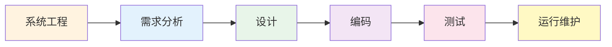

# 第1章-1.2-软件工程

## 基本信息
- **课程**：软件工程
- **章节**：第1章 1.2节 软件工程
- **日期**：2026-06-30
- **标签**：#软件工程 #软件危机 #工程定义 #软件工程框架 #软件生存周期

---

## 重点内容

### ⭐⭐⭐ 核心概念
- **软件工程的三个代表性定义**：Bauer定义、IEEE定义、百科全书定义
- **软件工程框架三要素**：目标、活动、原则
- **软件工程四大原则**：选取适宜开发风范、采用合适设计方法、提供高质量工程支持、有效管理
- **软件生存周期六阶段**：系统工程 -> 需求分析 -> 设计 -> 编码 -> 测试 -> 运行维护

### ⭐⭐ 重要概念
- **软件危机**：20世纪60年代中期出现，超出预算、超期交付、难以维护
- **NATO会议**：1968年首次提出"软件工程"一词
- **软件设计的两层次**：系统设计（概要设计）+ 详细设计

### ⭐ 基础概念
- **正确性、可用性、开销合宜**：软件工程的三大目标
- **测试四层次**：单元测试 -> 集成测试 -> 确认测试 -> 系统测试

---

## 详细笔记

### 一、软件工程的背景——软件危机

> 📚 **课本出处**：第1章 1.2节引言部分

在软件工程概念出现之前，软件开发主要依赖开发人员的个人技能，没有可遵循的开发方法指导，开发过程缺乏有效管理。

**软件危机的表现**：
- 超出预算的经费
- 超过预期的交付时间
- 大量已有软件难以维护
- 缺乏文档和好的开发方法指导

**软件工程的诞生**：
- 1968年，NATO会议首次提出"软件工程"一词
- 希望用**工程化的方法**来进行软件的开发

---

### 二、软件工程定义（1.2.1）

> 📚 **课本出处**：第1章 1.2.1节"软件工程定义"

目前尚无统一的、一致的定义，以下给出三个代表性定义：

#### 1. Fritz Bauer（NATO会议）

> 软件工程是建立和使用一套合理的工程原则，以便获得经济的软件，这种软件是可靠的，可以在实际机器上高效地运行。

**关键词**：工程原则、经济、可靠、高效

#### 2. IEEE（软件工程术语汇编）

> 软件工程是：
> 1. 将系统化的、严格约束的、可量化的方法应用于软件的开发、运行和维护，即将工程化应用于软件；
> 2. 对上述方法的研究。

**关键词**：系统化、严格约束、可量化、工程化

#### 3.《计算机科学技术百科全书》

> 软件工程是应用计算机科学理论和技术以及工程管理原则和方法，按预算和进度实现满足用户要求的软件产品的工程，或以此为研究对象的学科。

**关键词**：计算机科学理论 + 工程管理原则和方法

> 💡 **理解技巧**：三个定义的共同点是"用工程化方法开发软件"，区别在于侧重点不同——Bauer强调工程原则，IEEE强调方法论，百科全书强调理论与管理的结合。

---

### 三、软件工程框架（1.2.2）

> 📚 **课本出处**：第1章 1.2.2节"软件工程框架"

杨芙清院士在《计算机科学技术百科全书》中指出，软件工程的框架可概括为**目标、活动和原则**。

#### 1. 软件工程目标

软件工程目标是生产具有以下三种特性的产品：

| 目标 | 含义 |
|:----:|:-----|
| **正确性** | 软件产品达到预期功能的程度 |
| **可用性** | 软件基本结构、实现以及文档为用户可用的程度 |
| **开销合宜** | 软件开发、运行的整个开销满足用户要求的程度 |

#### 2. 软件开发活动

软件开发的基本活动包括五个方面：

| 活动 | 核心问题 | 产出 |
|:----:|:--------:|:-----|
| **需求分析** | 做什么？ | 需求规约 |
| **设计** | 怎么做？ | 设计规约 |
| **实现** | 用代码做 | 程序代码 |
| **验证与确认** | 做对了吗？ | 测试报告 |
| **维护** | 改对了吗？ | 修改后的软件 |

> 详见1.3节

#### 3. 软件工程原则

软件工程的四条基本原则：

| 序号 | 原则 | 说明 |
|:----:|:-----|:-----|
| 1 | **选取适宜的开发风范** | 权衡软件需求、硬件需求及其他因素之间的制约，适应需求的易变性 |
| 2 | **采用合适的设计方法** | 考虑模块化、信息隐蔽、局部化、一致性、适应性等问题 |
| 3 | **提供高质量的工程支持** | 包括配置管理、质量保证等，按期交付高质量产品 |
| 4 | **有效的软件工程管理** | 直接影响可用资源的有效利用，提高组织的生产能力 |

> 📚 **课本出处**：第1章 1.2.2节，四个原则分别对应风范选择、设计方法、工程支持、项目管理

---

### 四、软件生存周期（1.2.3）

> 📚 **课本出处**：第1章 1.2.3节"软件生存周期"

如同人的一生，软件也有一个孕育、诞生、成长、衰亡的生存过程。

**软件生存周期定义**：软件产品或软件系统从产生、投入使用到被淘汰的全过程。

软件生存周期大致可以分为**6个阶段**：

#### 阶段一：计算机系统工程

| 要素 | 说明 |
|:----:|:-----|
| **系统组成** | 计算机硬件、软件、人、数据库、文档、规程等 |
| **核心任务** | 确定待开发软件的总体要求和范围 |
| **关键活动** | 成本估算、进度安排、可行性分析（经济/技术/法律） |
| **产出** | 可行性分析报告 |

#### 阶段二：需求分析

| 要素 | 说明 |
|:----:|:-----|
| **核心问题** | 软件要"**做什么**"？ |
| **确定内容** | 功能、性能、数据、界面等要求 |
| **产出** | 软件需求规约（需求规格说明） |

#### 阶段三：设计

| 要素 | 说明 |
|:----:|:-----|
| **核心问题** | 软件"**怎么做**"？ |
| **系统设计（概要设计/总体设计）** | 设计软件系统的体系结构、组成成分的功能和接口、连接和通信、全局数据结构 |
| **详细设计** | 设计各组成成分的实现细节、局部数据结构和算法 |
| **产出** | 设计规约 |

#### 阶段四：编码

| 要素 | 说明 |
|:----:|:-----|
| **核心任务** | 用某种程序设计语言将设计结果转换为可执行的程序代码 |
| **产出** | 源程序代码 |

#### 阶段五：测试

| 要素 | 说明 |
|:----:|:-----|
| **核心任务** | 发现并纠正软件中的错误和缺陷 |
| **测试层次** | 单元测试 -> 集成测试 -> 确认测试 -> 系统测试 |
| **产出** | 测试报告 |

#### 阶段六：运行和维护

| 要素 | 说明 |
|:----:|:-----|
| **触发条件** | 发现潜藏错误、增加新功能、适应环境变化 |
| **核心任务** | 对投入运行的软件进行修改 |
| **维护类型** | 纠错性维护、适应性维护、完善性维护、预防性维护 |

---

## 疑问与思考

### ❓ 待解决问题
1. 软件工程框架中"目标、活动、原则"三者之间是什么关系？目标是最终追求，活动是实现手段，原则是约束条件？
2. 软件生存周期的六个阶段是否一定是线性顺序的？在实际项目中是否会有阶段重叠或反复？
3. 软件工程的四大原则与三要素（方法、工具、过程）之间有什么对应关系？
4. "正确性、可用性、开销合宜"三个目标之间是否存在矛盾？追求高正确性是否必然增加开销？
5. 需求分析产出"需求规约"，设计产出"设计规约"——这两种规约的区别和联系是什么？

### 💡 个人理解/技巧
- 软件工程三要素（方法/工具/过程）的关系：**方法**回答"怎么做"，**工具**提供"用什么做"，**过程**规定"何时做、谁来做"
- 生存周期六阶段可以用"写文章"类比：系统工程=确定写什么（选题），需求分析=列提纲，设计=构思结构，编码=动笔写，测试=校对修改，维护=再版修订
- 三个定义的递进关系：Bauer(1968)强调"工程原则" -> IEEE强调"系统化方法" -> 百科全书(最新)强调"理论+管理"的综合
- 软件工程四大原则的内在逻辑：选对风范(战略) -> 用对方法(战术) -> 提供支持(保障) -> 有效管理(组织)

---

## 总结

### 软件工程三要素对比表

| 要素 | 核心问题 | 关键内容 | 对应原则 |
|:----:|:--------:|:---------|:---------|
| **方法** | 怎么做？ | 技术途径、步骤、策略 | 采用合适的设计方法 |
| **工具** | 用什么做？ | 辅助实现方法的自动化/半自动化工具 | 提供高质量的工程支持 |
| **过程** | 何时做？谁来做？ | 活动的组织、里程碑、角色分工 | 选取适宜的开发风范 |

### 软件生存周期六阶段表

| 阶段 | 核心问题 | 主要活动 | 产出 |
|:----:|:--------:|:---------|:-----|
| **系统工程** | 做不做？ | 需求分析、成本估算、可行性分析 | 可行性分析报告 |
| **需求分析** | 做什么？ | 确定功能、性能、数据、界面 | 需求规约 |
| **设计** | 怎么做？ | 系统设计 + 详细设计 | 设计规约 |
| **编码** | 用什么做？ | 编程实现 | 源程序代码 |
| **测试** | 做对了吗？ | 单元/集成/确认/系统测试 | 测试报告 |
| **运行维护** | 改对了吗？ | 纠错/适应/完善/预防性维护 | 修改后的软件 |

### 软件工程四大原则

| 序号 | 原则 | 对应层面 |
|:----:|:-----|:--------:|
| 1 | 选取适宜的开发风范 | 方法层面 |
| 2 | 采用合适的设计方法 | 技术层面 |
| 3 | 提供高质量的工程支持 | 工具层面 |
| 4 | 有效的软件工程管理 | 管理层面 |

### 关键要点

1. **软件危机是软件工程诞生的直接原因**：1968年NATO会议
2. **软件工程 = 工程化方法 + 软件开发**：强调系统化、可量化、可管理
3. **框架三要素**：目标（正确性/可用性/开销合宜）、活动（需求/设计/实现/验证/维护）、原则（四条基本原则）
4. **生存周期六阶段**是软件开发的宏观流程，具体实施时可选用不同的过程模型
5. **测试是质量保障的关键环节**，包含四个层次：单元 -> 集成 -> 确认 -> 系统
6. **维护是生存周期中持续时间最长的阶段**，通常占总工作量的60%-80%

---

## 相关链接

### 关联章节
- [第1章-概论](./第1章-概论.md)
- [第1章-1.1-计算机软件](./第1章-1.1-计算机软件.md)
- 第1章-1.3-软件过程（待创建）
- 第1章-1.4-软件过程模型（待创建）

---

## 检查清单

- [x] 已理解软件危机的背景和软件工程的诞生
- [x] 已掌握软件工程三个代表性定义
- [x] 已理解软件工程框架（目标/活动/原则）
- [x] 已掌握软件生存周期六个阶段
- [x] 已理解各阶段的核心问题和产出
- [x] 已添加课本出处标注

---

*笔记创建时间：2026-06-30*
