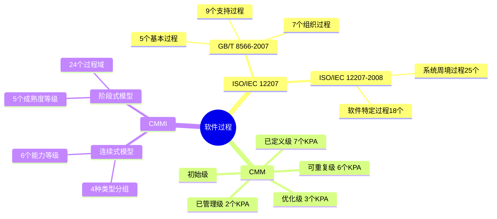

# 第1章-1.3-软件过程

## 基本信息
- **课程**：软件工程
- **章节**：第1章 概论 1.3节 软件过程
- **日期**：2026-06-30
- **标签**：#软件过程 #CMM #CMMI #ISO12207 #能力成熟度

---

## 重点内容

### ⭐⭐⭐ 核心概念
- **软件过程**：生产最终满足需求且达到工程目标的软件产品所需的步骤
- **CMM 5个成熟度等级**：初始级 -> 可重复级 -> 已定义级 -> 已管理级 -> 优化级
- **CMMI 两种表示法**：阶段式模型（关注组织成熟度）vs 连续式模型（关注过程域能力）

### ⭐⭐ 关键过程域
- **CMM 18个KPA**：分布在可重复级（6个）、已定义级（7个）、已管理级（2个）、优化级（3个）
- **CMMI 24个过程域**：涵盖过程管理、项目管理、工程和支持4大类

### ⭐ ISO/IEC 12207 标准
- **GB/T 8566-2007**：5个基本过程 + 9个支持过程 + 7个组织过程
- **ISO/IEC 12207-2008**：2大类过程组，7个过程组，43个过程

---

## 详细笔记

### 一、软件过程概述

软件过程是生产一个最终满足需求且达到工程目标的软件产品所需的步骤。《计算机科学技术百科全书》指出，软件过程是软件生存周期中的一系列相关的过程。过程是活动的集合，活动是任务的集合。

> 📚 **课本出处**：第1章 1.3节"软件过程"

软件过程有3层含义：

| 含义 | 说明 |
|:----:|:-----|
| 个体含义 | 软件产品或系统在生存周期中某一类活动的集合 |
| 整体含义 | 软件产品或系统在所有含义下的软件过程的总体 |
| 工程含义 | 应用软件工程的原则、方法来构造软件过程模型 |

---

### 二、软件生存周期过程（1.3.1）

国际标准化组织（ISO）和国际电工委员会（IEC）于1995年发布了软件生存周期过程国际标准ISO/IEC 12207-1995，我国参照国际标准制订了相应的国家标准GB/T 8566-2007。

> 📚 **课本出处**：第1章 1.3.1节"软件生存周期过程"

#### 1. GB/T 8566-2007 软件生存周期过程

GB/T 8566-2007标准把软件生存周期中可以开展的活动分为**5个基本过程**、**9个支持过程**和**7个组织过程**。每一个过程划分为一组活动，每项活动又进一步划分为一组任务。

**（1）基本过程（primary processes）**

供各主要参与方在软件生存周期期间使用，包括：获取过程、供应过程、开发过程、运作过程、维护过程。

**（2）支持过程（supporting processes）**

具有不同目的，并作为有机组成部分来支持其他过程，包括：文档编制过程、配置管理过程、质量保证过程、验证过程、确认过程、联合评审过程、审核过程、问题解决过程、易用性过程。

**（3）组织过程（organizational processes）**

可被某个组织用来建立和实现由相关的生存周期过程和人员组成的基础结构，包括：管理过程、基础设施过程、改进过程、人力资源过程、资产管理过程、重用程序管理过程、领域工程过程。

> 💡 **理解技巧**：基本过程是"做事"，支持过程是"保障做事的质量"，组织过程是"建立做事的基础"。三者构成一个完整的软件过程框架。

对于一个软件项目，可根据其具体情况对标准的过程、活动和任务进行剪裁。

#### 📷 表1.1 GB/T 8566-2007 的过程和活动

> 📚 **课本出处**：表1.1 列出了GB/T 8566-2007三大类过程及其包含的活动

---

#### 2. ISO/IEC 12207 软件生存周期过程

ISO/IEC 12207-2008标准将软件生存周期中的过程分成**两大类**、**7个过程组**、**43个过程**。

**（1）第一类系统周境过程（system context processes）**

处理独立的软件产品、服务或软件系统的系统周境，包含4个过程组、25个过程：

| 过程组 | 包含过程数 | 主要过程 |
|:------:|:----------:|:---------|
| 协定过程组 | 2 | 获取过程、供应过程 |
| 组织级项目使能过程组 | 5 | 生存周期模型管理、基础设施管理、项目投资管理、人力资源管理、质量管理 |
| 项目过程组 | 7 | 项目计划管理、项目评估和控制、决策管理、风险管理、配置管理、信息管理、测量 |
| 技术过程组 | 11 | 利益相关方需求定义、系统需求分析、系统体系结构设计、实现、系统集成、系统合格性测试、软件安装、软件验收支持、软件运作、软件维护、软件处置 |

**（2）第二类软件特定过程（software specific processes）**

用于实现一个软件产品或者大型系统中的某一服务，包含3个过程组、18个过程：

| 过程组 | 包含过程数 | 主要过程 |
|:------:|:----------:|:---------|
| 软件实现过程组 | 7 | 软件实现、需求分析、体系结构设计、详细设计、构造、集成、合格性测试 |
| 软件支持过程组 | 8 | 文档管理、配置管理、质量保证、验证、确认、评审、审核、问题解决 |
| 软件复用过程组 | 3 | 领域工程、复用资产管理、复用程序管理 |

---

### 三、能力成熟度模型 CMM（1.3.2）

美国卡耐基-梅隆大学软件工程研究所（SEI）从1986年起着手软件能力成熟度模型（CMM-SW）的研究，目的是提供一种评价软件承接方能力的方法，也可用于帮助软件组织改进其软件过程。SEI于1991年发布了CMM 1.0版。

> 📚 **课本出处**：第1章 1.3.2节"能力成熟度模型"

#### 1. 软件过程成熟度5个等级

CMM模型定义了5个软件过程成熟度等级：

#### 📷 图1.3 软件过程成熟度的5个等级

> 📚 **课本出处**：图1.3 展示了CMM的5个成熟度等级，从初始级到优化级逐级提升

下面简要介绍5个等级：

**（1）初始级（initial）**

软件过程的特点是无秩序的，甚至是混乱的。几乎没有什么过程是经过妥善定义的，成功往往依赖于个人或小组的努力。

**（2）可重复级（repeatable）**

建立了基本的项目管理过程来跟踪成本、进度和功能特性。制定了必要的过程纪律，能重复早先类似应用项目取得的成功。

**（3）已定义级（defined）**

已将管理和工程活动两方面的软件过程文档化、标准化，并综合成该组织的标准软件过程。所有项目均使用经批准、剪裁的标准软件过程来开发和维护软件。

**（4）已管理级（managed）**

收集对软件过程和产品质量的详细度量值，对软件过程和产品都有定量的理解和控制。

**（5）优化级（optimizing）**

过程的量化反馈和先进的新思想、新技术促使过程不断改进。

> ⭐ **核心重点**：5个等级是逐级递进的，要达到某个级别必须先满足所有较低级别的要求。

#### 📷 图1.4 CMM的结构

> 📚 **课本出处**：图1.4 展示了CMM的整体结构，包括成熟度等级、关键过程域和关键实践

#### 2. CMM的结构

成熟度等级表明了一个软件组织的过程能力的水平。除初始级外，每个成熟度等级都包含若干个**关键过程域（KPA）**。CMM提供了**18个关键过程域**，每个关键过程域都有一组对改进过程能力非常重要的目标，并确定了一组相应的关键实践。

关键实践按照5个**共同特性**进行组织：

| 共同特性 | 说明 |
|:--------:|:-----|
| 执行约定 | 建立组织对实施该过程域的承诺 |
| 执行能力 | 为实施该过程域提供必要的条件 |
| 执行活动 | 描述实施该过程域所需的活动 |
| 测量和分析 | 对过程进行度量和分析 |
| 验证实现 | 验证活动是否与已建立的过程一致 |

#### 📷 表1.2 关键过程域

> 📚 **课本出处**：表1.2 列出了CMM在可重复级到优化级之间的18个关键过程域

| 成熟度等级 | 关键过程域（KPA） |
|:----------:|:-----------------|
| 可重复级 | 需求管理、软件项目计划、软件项目跟踪和监督、软件分包合同管理、软件质量保证、软件配置管理 |
| 已定义级 | 组织级过程焦点、组织级过程定义、培训大纲、集成软件管理、软件产品工程、组间协调、同行评审 |
| 已管理级 | 定量过程管理、软件质量管理 |
| 优化级 | 缺陷预防、技术更新管理、过程更改管理 |

> ⚠️ **常见误区**：CMM的等级不是"可跳级"的，一个组织必须先达到较低级别，才能追求更高级别。

---

### 四、能力成熟度模型集成 CMMI（1.3.3）

CMM的成功导致了适用于不同学科领域的模型的衍生。1998年由美国产业界、政府和卡耐基-梅隆大学软件工程研究所共同主持CMMI项目。2000年发布了CMMI-SE/SW/IPPD，集成了适用于软件开发的SW-CMM、适用于系统工程的EIA/IS731以及适用于集成化产品和过程开发的IPD CMM。

> 📚 **课本出处**：第1章 1.3.3节"能力成熟度模型集成"

CMMI提供了**两种表示法**：阶段式模型和连续式模型。

#### 1. 阶段式模型

阶段式模型的结构类同于软件CMM，它关注组织的**成熟度**，包含5个成熟度等级：初始的、已管理的、已定义的、定量管理的、优化的。

#### 📷 图1.5 阶段式成熟度等级

> 📚 **课本出处**：图1.5 展示了CMMI阶段式模型的5个成熟度等级特征

#### 📷 图1.6 成熟度等级结构

> 📚 **课本出处**：图1.6 展示了CMMI各成熟度等级包含的过程域结构

CMMI-SE/SW/IPPD中包含了**24个过程域**，划分在成熟度等级2~5之中：

| 成熟度等级 | 过程域 |
|:----------:|:-------|
| 已管理的 | 需求管理(REQM)、项目计划(PP)、项目监督和控制(PMC)、供应商合同管理(SAM)、度量和分析(MA)、过程和产品质量保证(PPQA)、配置管理(CM) |
| 已定义的 | 需求开发(RD)、技术解决方案(TS)、产品集成(PI)、验证(VER)、确认(VAL)、组织级过程焦点(OPF)、组织级过程定义(OPD)、组织级培训(OT)、集成化项目管理(IPM)、风险管理(RSKM)、集成化建组(IT)、决策分析和解决方案(DAR)、组织级集成环境(OEI) |
| 定量管理的 | 组织级过程性能(OPP)、项目定量管理(QPM) |
| 优化的 | 组织级改革和实施(OID)、因果分析和解决方案(CAR) |

> 💡 **理解技巧**：阶段式模型和CMM类似，是"整组织"一起升级；而连续式模型允许对不同过程域单独提升能力等级。

#### 2. 连续式模型

连续式模型关注每个**过程域的能力**，一个组织对不同的过程域可以达到不同的过程域能力等级（CL）。CMMI中包括6个过程域能力等级，等级号为0~5。

#### 📷 图1.7 能力等级特征示意图

> 📚 **课本出处**：图1.7 展示了某组织不同过程域的能力等级分布情况

连续式模型的6个能力等级：

| 能力等级 | 名称 | 说明 |
|:--------:|:-----|:-----|
| CL0 | 未完成的 | 过程域未执行或未达到CL1中定义的所有目标 |
| CL1 | 已执行的 | 将可标识的输入工作产品转换成可标识的输出工作产品 |
| CL2 | 已管理的 | 过程制度化，遵循已文档化的计划和过程描述 |
| CL3 | 已定义的 | 从组织标准过程集中剪裁得到，收集过程资产和度量 |
| CL4 | 定量管理的 | 使用测量和质量保证来控制和改进过程域 |
| CL5 | 优化的 | 使用量化手段改变和优化过程域 |

连续式模型将24个过程域按4种类型分组：

| 类型 | 过程域 |
|:----:|:-------|
| 过程管理 | 组织级过程焦点(OPF)、组织级过程定义(OPD)、组织级培训(OT)、组织级过程性能(OPP)、组织级改革和实施(OID) |
| 项目管理 | 项目计划(PP)、项目监督和控制(PMC)、供应商合同管理(SAM)、集成化项目管理(IPM)、风险管理(RSKM)、集成化建组(IT)、项目定量管理(QPM) |
| 工程 | 需求管理(REQM)、需求开发(RD)、技术解决方案(TS)、产品集成(PI)、验证(VER)、确认(VAL) |
| 支持 | 配置管理(CM)、过程和产品质量保证(PPQA)、度量和分析(MA)、决策分析和解决方案(DAR)、组织级集成环境(OEI)、因果分析和解决方案(CAR) |

> ⚠️ **常见误区**：能力等级2~5的名字与成熟度等级2~5同名，但含义不同。能力等级可以独立应用于任何单独的过程域。

---

## 疑问与思考

### ❓ 待解决问题
1. CMM的5个等级中，"可重复级"和"已定义级"的核心区别是什么？一个组织如何判断自己处于哪个等级？
2. CMM的18个KPA和CMMI的24个过程域之间有什么对应关系？
3. 在实际项目中，阶段式模型和连续式模型该如何选择？各自的适用场景是什么？
4. CMMI集成了SW-CMM、EIA/IS731和IPD CMM，这三者分别解决什么问题？
5. GB/T 8566-2007中的"剪裁过程"具体如何操作？在什么情况下需要剪裁？

### 💡 个人理解/技巧
- **CMM 5级口诀**："初重定管优" — 初始（混乱）、可重复（经验复制）、已定义（标准化）、已管理（量化控制）、优化（持续改进）
- **CMM vs CMMI**：CMM只针对软件，CMMI集成了系统工程和产品开发；CMMI是CMM的升级替代版本
- **阶段式 vs 连续式**：阶段式像"考级"（整体升级），连续式像"打分"（单项提升）。阶段式便于评估比较，连续式便于针对性改进
- **GB/T 8566的三类过程**：基本过程是核心业务流，支持过程是质量保障，组织过程是基础设施建设
- **ISO/IEC 12207-2008的两大类**：系统周境过程处理"系统层面"的问题，软件特定过程处理"纯软件"的问题
- 关键过程域的5个共同特性可以理解为"做一件事的5个步骤"：先有承诺（约定），再有条件（能力），然后去做（活动），做得怎样要衡量（测量），最后验证做对了没（验证）

---

## 总结

### CMM 5级对比表

| 等级 | 名称 | 核心特征 | KPA数量 | 关键词 |
|:----:|:-----|:---------|:-------:|:------:|
| 1 | 初始级 | 混乱、无序、依赖个人 | 0 | 混乱 |
| 2 | 可重复级 | 基本项目管理、经验复制 | 6 | 纪律 |
| 3 | 已定义级 | 标准化过程、文档化 | 7 | 标准 |
| 4 | 已管理级 | 量化度量、定量控制 | 2 | 量化 |
| 5 | 优化级 | 持续改进、技术创新 | 3 | 优化 |

### CMM vs CMMI 对比

| 对比项 | CMM | CMMI |
|:------:|:---:|:----:|
| 范围 | 仅软件 | 软件+系统工程+产品开发 |
| 过程域数量 | 18个KPA | 24个过程域 |
| 表示法 | 仅阶段式 | 阶段式 + 连续式 |
| 来源 | SEI | SEI + 产业界 + 政府 |
| 状态 | 已被CMMI替代 | 当前使用 |

### 关键要点

1. **软件过程三层含义**：个体含义、整体含义、工程含义
2. **GB/T 8566-2007**：5个基本过程 + 9个支持过程 + 7个组织过程
3. **ISO/IEC 12207-2008**：2大类、7个过程组、43个过程
4. **CMM 5级递进**：初始 -> 可重复 -> 已定义 -> 已管理 -> 优化
5. **CMMI两种模型**：阶段式（整组织成熟度）+ 连续式（单过程域能力）
6. **CMMI 24个过程域**分4大类：过程管理、项目管理、工程、支持

### 知识点脑图

---

## 相关链接

### 本节相关图片
- [图1.3 软件过程成熟度的5个等级](../../../images/d97d35ed7fa2fd77171896d1734aaeb5842a49170942b7068a65484f15db2368.jpg)
- [图1.4 CMM的结构](../../../images/322bfd762bb0fb5e14a46cc06e352b22c773d5e870ae17fde9cabf64bf6f461c.jpg)
- [图1.5 阶段式成熟度等级](../../../images/cb49ae5fbcc2a4cf29cd08606131086bcde40838b6a4a72e85b48a3c9437497f.jpg)
- [图1.6 成熟度等级结构](../../../images/e8ee34c02529f54f2f12df7b6d75374f574fe23144ec266f41477d3b3c6f8a69.jpg)
- [图1.7 能力等级特征示意图](../../../images/37275313d7b13057c802f4662773cfc3b2bb0187d1423e2ea0d32ca2e46b3fb2.jpg)

### 关联章节
- [第1章-概论](./第1章-概论.md)
- 第1章-1.1-计算机软件（待创建）
- 第1章-1.2-软件工程（待创建）
- 第1章-1.4-软件过程模型（待创建）
- 第1章-1.5-CASE工具与环境（待创建）

---

## 检查清单

- [x] 已理解软件过程的概念和三层含义
- [x] 已掌握GB/T 8566-2007的三大类过程
- [x] 已掌握ISO/IEC 12207-2008的两大类过程
- [x] 已理解CMM的5个成熟度等级及18个KPA
- [x] 已理解CMMI的阶段式和连续式两种模型
- [x] 已插入课本原图（图1.3~图1.7）
- [x] 已添加课本出处标注

---

*笔记创建时间：2026-06-30*
