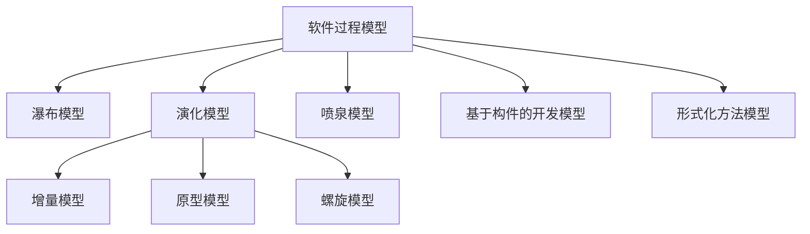
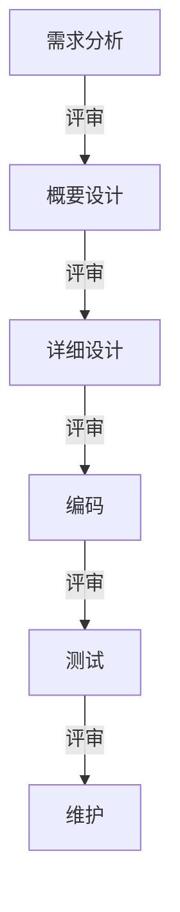
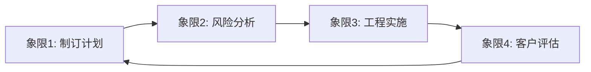
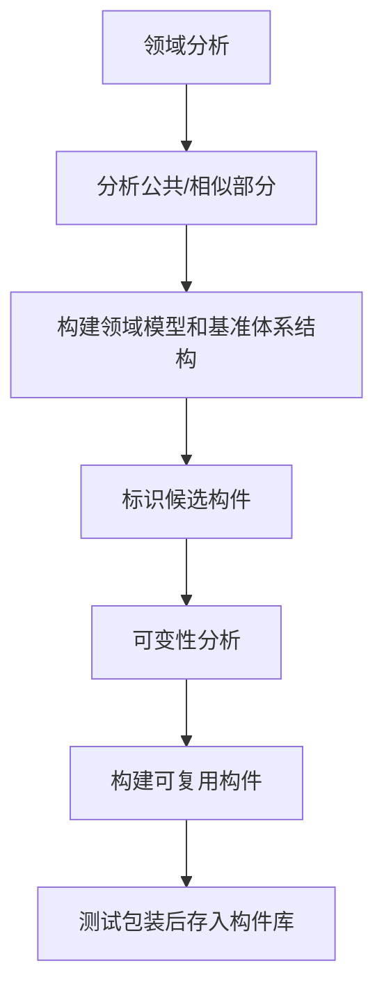
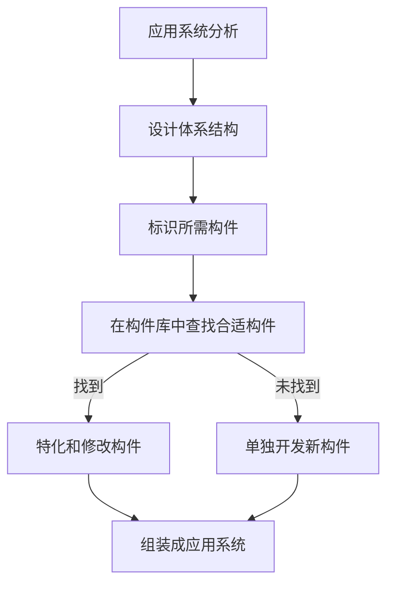
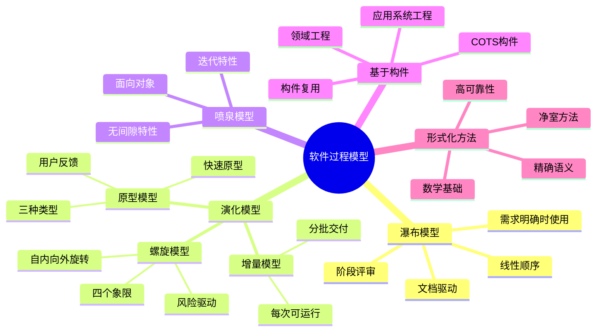

# 第1章-1.4-软件过程模型

## 基本信息
- **课程**：软件工程（第3版）
- **章节**：第1章 1.4节 软件过程模型 ⭐⭐重点
- **日期**：2026-07-01
- **标签**：#软件过程模型 #瀑布模型 #演化模型 #增量模型 #原型模型 #螺旋模型 #喷泉模型 #构件开发 #形式化方法

---

## 重点内容

### ⭐⭐⭐ 核心概念
- **软件过程模型**（软件开发模型）：软件开发全部过程、活动和任务的结构框架
- **8种典型模型**：瀑布、演化（增量/原型/螺旋）、喷泉、基于构件、形式化方法
- **演化模型的共同特点**：从初始原型出发，逐步演化为最终产品

### ⭐⭐ 模型核心特征
- **瀑布模型**：固定顺序、阶段评审、线性推进
- **增量模型**：分批交付、每次发布可运行版本
- **原型模型**：快速构建原型、收集反馈、反复迭代
- **螺旋模型**：风险驱动、四个象限（计划/风险/实施/评估）
- **喷泉模型**：面向对象、迭代、无间隙
- **基于构件**：领域工程 + 应用系统工程、构件复用
- **形式化方法**：数学规约、精确语义、高可靠性

### ⭐ 关键区别
- 瀑布是线性的，演化是迭代的
- 螺旋模型在演化模型基础上增加了**风险分析**
- 喷泉模型专为面向对象开发设计，强调**无间隙**
- 基于构件模型通过**复用**提高效率

---

## 详细笔记

### 一、软件过程模型概述

> 📚 **课本出处**：第1章 1.4节"软件过程模型"

软件过程模型（也称软件开发模型）是软件开发全部过程、活动和任务的结构框架。它规定了从需求到交付的整个开发流程中，各个阶段的顺序、交互方式和产出物。

典型模型包括：

> 💡 **理解技巧**：演化模型是一个"大家族"，增量、原型、螺旋都是它的子类型。它们的共同特征是从不完整的需求出发，通过迭代逐步完善。

---

### 二、瀑布模型（Waterfall Model）

> 📚 **课本出处**：第1章 1.4.1节"瀑布模型"

#### 📷 图1.8 瀑布模型

> 📚 **课本出处**：图1.8 展示了瀑布模型的固定顺序结构，每个阶段完成后经评审再进入下一阶段

**提出者**：W.Royce，1970年

**基本思想**：给出软件生存周期活动的固定顺序，上一阶段完成后向下一阶段过渡，最终得到软件产品。有时也称其为**软件生存周期模型**。

**瀑布模型的特征**（4步循环）：

| 步骤 | 操作 |
|:----:|:-----|
| 1 | 接收上一阶段活动的结果作为本阶段的**输入** |
| 2 | 依据上一阶段的结果实施本阶段应完成的**活动** |
| 3 | 对本阶段的活动进行**评审** |
| 4 | 将本阶段活动的结果作为**输出**，传递给下一阶段 |

**优点**：
- 最早出现的、应用最广泛的过程模型
- 对确保软件开发的顺利进行、提高质量和效率起到重要作用
- 许多其他模型中都包含了瀑布模型的成分

**缺点**：

| 缺点 | 说明 |
|:----:|:-----|
| 需求不确定性 | 客户常常难以清晰描述所有需求，且需求在开发中会变化 |
| 瀑布倒流 | 后阶段发现的错误可能由前阶段引起，需回到前阶段修改 |
| 交付延迟 | 客户在测试完成后才能看到真正可运行的软件 |
| 修改代价巨大 | 需求阶段改正代价1美元，到交付时可能高达1000美元 |

> ⚠️ **常见误区**：实际开发中很少能完全按瀑布模型顺序"没有回流地顺流而下"，瀑布的"倒流"是常态。

**适用场景**：
- 需求明确且稳定的项目
- 对可靠性要求高的安全关键系统
- 项目规模较小、技术成熟

#### 瀑布模型流程示意

---

### 三、演化模型（Evolutionary Model）

> 📚 **课本出处**：第1章 1.4.2节"演化模型"

**背景**：大量实践表明，许多项目在开发早期对需求的认识是**模糊的、不确定的**，软件很难一次开发成功。

**核心思想**：从构造初始的**原型（prototype）**出发，逐步将其演化成最终软件产品。

> 💡 **理解技巧**：演化模型本质上是一种"摸着石头过河"的策略——先做一个能跑的版本，然后根据用户反馈不断改进。

**演化模型的特点**：
- 适用于对软件需求**缺乏准确认识**的情况
- 通过反复迭代，获得原型新版本
- 最终得到令客户满意的软件产品

**典型的演化模型**包括：增量模型、原型模型、螺旋模型

---

### 四、增量模型（Incremental Model）

> 📚 **课本出处**：第1章 1.4.3节"增量模型"

#### 📷 图1.9 增量模型

> 📚 **课本出处**：图1.9 展示了增量模型将开发过程分为若干个日程时间交错的线性序列，每个序列产生一个可发布的"增量"版本

**基本思想**：将软件开发过程分成若干个**日程时间交错的线性序列**，每个线性序列产生软件的一个可发布的"**增量**"版本。

**核心特征**：
- 后一个版本是对前一个版本的**修改和补充**
- 每一次增量都发布一个**可运行的产品**
- 融合了瀑布模型的基本成分（重复应用）和演化模型的迭代特征

**第一个增量**：通常是核心产品，包含最终产品的**基本需求**，不包括不确定需求和非核心需求。

**后续增量**：逐渐加入非核心需求和逐步确定的需求，根据客户反馈修改和扩充。

**优点**：

| 优点 | 说明 |
|:----:|:-----|
| 适应需求变化 | 特别适用于需求经常变化的软件开发 |
| 尽早交付价值 | 客户可以较早使用核心功能 |
| 管理技术风险 | 早期增量可避免使用尚未成熟的技术 |
| 反馈及时 | 客户可对每次发布版本提出反馈 |

**适用场景**：
- 需求经常发生变化的项目
- 市场急需，但开发人员和资金不足以在期限前实现完善产品
- 需要有计划地管理技术风险

#### 增量模型与瀑布模型的对比

| 对比项 | 瀑布模型 | 增量模型 |
|:------:|:--------:|:--------:|
| **开发方式** | 线性顺序 | 交错线性序列 |
| **交付时机** | 最终一次性交付 | 分批交付 |
| **客户反馈** | 仅在测试后 | 每次增量后 |
| **需求灵活性** | 需求固定不变 | 适应需求变化 |
| **风险暴露** | 后期集中暴露 | 分散在各增量中 |
| **可运行版本** | 只有最终版本 | 每次增量都可运行 |

---

### 五、原型模型（Prototyping Model）

> 📚 **课本出处**：第1章 1.4.4节"原型模型"

#### 📷 图1.10 原型模型

> 📚 **课本出处**：图1.10 展示了原型模型的迭代过程：交流 -> 快速分析 -> 建模 -> 构建原型 -> 交付试用 -> 反馈

**背景**：
- 开发初期很难得到完整的、准确的需求规格说明
- 用户不能完全准确地表达对未来系统的全面要求
- 开发者对要解决的应用问题模糊不清
- 需求规格说明常常不完整、不准确、有歧义
- 瀑布模型难以适应这种需求的不确定性和变化

**原型（Prototype）**：预期系统的一个可执行版本，反映了系统性质的一个选定子集。不必满足所有约束，目的是**快速、低成本**地构建。

**原型模型的流程**：

1. 软件工程师与客户**交流**，定义总体目标，标识需求
2. 快速制定原型开发计划，确定原型的**目标和范围**
3. 采用快速设计的方式**建模**并**构建原型**
4. 将原型**交付给客户试用**，收集反馈意见
5. 根据反馈在下一轮迭代中**改进原型**
6. 重复迭代直至满意

#### 1. 原型类型

> 📚 **课本出处**：第1章 1.4.4节"原型类型"

| 原型类型 | 英文名 | 目的 |
|:--------:|:------:|:-----|
| **探索型** | Exploratory | 弄清目标系统的要求，确定特性，探讨多种方案的可行性 |
| **实验型** | Experimental | 验证方案或算法的合理性，考核方案是否合适、规格说明是否可靠 |
| **演化型** | Evolutionary | 将原型作为目标系统的一部分，多次改进逐步演化成最终系统 |

#### 2. 原型使用策略

| 策略 | 适用原型 | 说明 |
|:----:|:--------:|:-----|
| **废弃策略**（Throw away） | 探索型、实验型 | 关注特定特性，不考虑无关因素，用完即弃，再根据结果重新设计 |
| **追加策略**（Add on） | 演化型 | 实现已明确定义特性的子集，不断修改扩充，最终演化成目标系统 |

> 💡 **理解技巧**：原型可作为单独的过程模型使用，也常被作为一种方法或实现技术应用于其他过程模型中。例如科学研究中验证新算法时，常先开发一个原型。

**原型模型的应用场景**：
- 需求不明确的项目
- 需要验证技术方案可行性
- 用户界面设计（如界面原型、窗口管理原型、报告生成原型）

---

### 六、螺旋模型（Spiral Model）

> 📚 **课本出处**：第1章 1.4.5节"螺旋模型"

#### 📷 图1.11 螺旋模型

> 📚 **课本出处**：图1.11 展示了螺旋模型沿螺线自内向外旋转，在4个象限上分别表示不同的任务

**提出者**：B.Boehm，1988年

**核心思想**：将原型实现的迭代特征与瀑布模型中**控制的和系统化的方面**结合起来，增加了**风险分析**。

> ⭐ **核心重点**：螺旋模型的最大特点是**风险驱动**。项目规模越大、复杂度越高，风险越大，需要在风险造成危害之前及时识别和消除。

**螺旋模型的四个象限（任务区域）**：

| 象限 | 任务 | 说明 |
|:----:|:----:|:-----|
| 1 | 制订计划 | 确定软件目标，选定实施方案，弄清开发限制条件 |
| 2 | **风险分析** | 评价所选方案，**识别风险，消除风险** |
| 3 | 工程实施 | 实施软件开发，验证工作产品 |
| 4 | 客户评估 | 评价开发工作，提出修正建议 |

**运行机制**：
- 沿螺线**自内向外旋转**
- 每旋转一圈，开发出一个更为完善的**新版本**
- 如果风险太大，开发者和客户无法承受，项目可能**终止**
- 多数情况下继续旋转，最终得到期望的系统

> ⚠️ **常见误区**：螺旋模型后来出现了一些变种，可以有3~6个任务区域，不局限于4个象限。

**适用场景**：
- 大型、复杂的软件项目
- 风险较高的项目（如新技术、新领域）
- 需要在开发过程中持续评估风险的项目

---

### 七、喷泉模型（Fountain Model）

> 📚 **课本出处**：第1章 1.4.6节"喷泉模型"

#### 📷 图1.12 喷泉模型

> 📚 **课本出处**：图1.12 展示了喷泉模型中各开发活动之间的迭代和无间隙特性

**核心思想**：一种支持**面向对象开发**的过程模型。

**喷泉模型的两大特性**：

| 特性 | 含义 |
|:----:|:-----|
| **迭代** | 开发活动需要多次重复，如分析和设计活动经常重复、迭代地进行 |
| **无间隙** | 开发活动之间不存在明显的边界 |

**面向对象开发过程**：

| 阶段 | 活动 |
|:----:|:-----|
| 分析阶段 | 标识类及对象，定义类之间的关系，建立对象-关系模型和对象-行为模型 |
| 设计阶段 | 从实现的角度对分析模型进行调整和扩充 |
| 编码阶段 | 用面向对象语言实现类及对象，通过消息机制实现对象间通信 |

> 💡 **理解技巧**：之所以叫"喷泉"，是因为水（开发活动）向上喷出后又回落，各阶段之间没有明确的界限，像水柱一样交融在一起。分析模型和设计模型采用**相同的符号表示体系**，这是实现"无间隙"的基础。

**与瀑布模型的区别**：
- 瀑布模型各阶段有明确边界，严格顺序执行
- 喷泉模型各阶段**反复迭代**、**交替进行**，没有明显边界

**适用场景**：
- 面向对象的软件开发项目
- 需求和设计需要频繁迭代的项目

---

### 八、基于构件的开发模型（Component-Based Development Model）

> 📚 **课本出处**：第1章 1.4.7节"基于构件的开发模型"

#### 📷 图1.13 一种基于构件的开发模型

> 📚 **课本出处**：图1.13 展示了基于构件的开发模型包含领域工程和应用系统工程两大部分

**核心思想**：利用预先包装的**构件（component）**来构造应用系统。

**构件来源**：
- 组织内部开发的构件
- 商品化的现成构件（COTS, Commercial Off-The-Shelf）

**模型的两大组成部分**：

#### 1. 领域工程（Domain Engineering）

目的是构建**领域模型、领域基准体系结构和可复用构件库**。

#### 2. 应用系统工程（Application System Engineering）

目的是使用可复用构件**组装应用系统**。

**基于构件开发的效果**（来自AT&T、Ericsson、HP等公司经验）：

| 指标 | 效果 |
|:----:|:-----|
| 软件复用率 | 可高达 **90%** 以上 |
| 上市时间 | 缩短 **2~5** 倍 |
| 错误率 | 减少 **5~10** 倍 |
| 开发成本 | 减少 **15%~75%** |

**适用场景**：
- 有大量可复用构件的领域
- 需要快速交付的项目
- 对成本和效率有较高要求的项目

---

### 九、形式化方法模型（Formal Methods Model）

> 📚 **课本出处**：第1章 1.4.8节"形式化方法模型"

**核心定义**：建立在**严格数学基础上**的软件开发方法。在软件开发全过程中，凡是采用**严格的数学语言**、具有**精确的数学语义**的方法，都称为形式化方法。

**覆盖阶段**：需求分析、规约、设计、编程、系统集成、测试、文档生成、维护等**全部阶段**。

**形式化方法的优势**：

| 优势 | 说明 |
|:----:|:-----|
| 易发现歧义性 | 通过数学分析和推导，易于发现需求的歧义性 |
| 易发现不完整性 | 易于发现需求的不完整性 |
| 易发现不一致性 | 易于发现需求的不一致性 |
| 可验证性 | 易于对分析模型、设计模型和程序进行验证 |
| 可转换性 | 从功能规约到设计规约、从设计规约到代码的转换成为可能 |

#### 净室软件工程（Cleanroom Software Engineering）

> 📚 **课本出处**：第1章 1.4.8节"形式化方法模型"

一种典型的形式化方法，希望在缺陷产生严重危险**前消除缺陷**。

**核心特点**：
- 在程序构造开始前进行**正确性验证**
- 将软件可靠性认证作为软件测试的一部分
- 强调**统计质量控制技术**
- 分析使用情况的概率分布，由统计样本导出测试

#### 📷 图1.14 净室过程模型

> 📚 **课本出处**：图1.14 展示了净室方法采用增量模型，每个增量包含从策划到认证的一系列净室任务

**净室方法采用增量模型**，每个增量包括：

1. 增量策划
2. 需求收集
3. 盒结构规约
4. 形式化设计
5. 正确性验证
6. 代码生成
7. 代码审查和验证
8. 统计测试计划
9. 统计使用测试
10. 认证

**适用场景**：
- 对可靠性要求极高的系统（如航空航天、医疗、核能）
- 安全关键系统
- 需要数学证明正确性的系统

> ⚠️ **常见误区**：形式化方法虽然可靠性高，但实施成本也高，需要专业人才，因此并不适用于所有项目。

---

## 总结

### 8种软件过程模型对比表

| 模型 | 优点 | 缺点 | 适用场景 | 驱动因素 |
|:----:|:-----|:-----|:--------:|:--------:|
| **瀑布模型** | 简单直观、易于管理、文档规范 | 需求不灵活、交付延迟、修改代价大 | 需求明确稳定、高可靠要求 | **文档驱动** |
| **增量模型** | 分批交付、风险分散、适应变化 | 需要开放体系结构、集成复杂 | 需求变化、市场急需 | **交付驱动** |
| **原型模型** | 快速反馈、适应需求变化 | 原型质量可能不高、管理困难 | 需求不明确、用户界面设计 | **反馈驱动** |
| **螺旋模型** | 风险可控、迭代完善 | 风险分析要求高、成本较高 | 大型复杂项目、高风险项目 | **风险驱动** |
| **喷泉模型** | 适合面向对象、无间隙高效 | 对OO方法依赖强、文档可能不足 | 面向对象开发项目 | **对象驱动** |
| **基于构件** | 复用率高、缩短周期、降低成本 | 构件库依赖、适配困难 | 有丰富构件库的领域 | **复用驱动** |
| **形式化方法** | 高可靠性、可验证、可转换 | 成本高、需要专业人才 | 安全关键系统、高可靠要求 | **数学驱动** |
| **演化模型(总)** | 适应不确定性、渐进完善 | 过程难以控制、需要持续投入 | 需求模糊的项目 | **演化驱动** |

### 知识点脑图

### 关键要点

1. **软件过程模型**是软件开发全部过程、活动和任务的结构框架
2. **瀑布模型**最早提出（1970年），是线性顺序模型，但存在"瀑布倒流"问题
3. **演化模型**的共同特征是从原型出发逐步完善，包括增量、原型、螺旋三种子模型
4. **增量模型**的核心是分批交付可运行版本，特别适合需求经常变化的场景
5. **原型模型**的关键是快速构建、快速反馈，原型分探索型、实验型、演化型三种
6. **螺旋模型**的最大特点是增加了**风险分析**，是风险驱动的迭代模型
7. **喷泉模型**专为面向对象设计，"喷泉"体现迭代和无间隙两大特性
8. **基于构件**通过复用提高效率，包含领域工程和应用系统工程两部分
9. **形式化方法**基于数学规约，适用于安全关键系统的高可靠性开发
10. 需求错误的修复代价随阶段递增，从1美元到1000美元（瀑布模型的重要教训）

---

## 疑问与思考

### ❓ 待解决问题
1. 瀑布模型和增量模型的核心区别是什么？为什么增量模型能更好地适应需求变化？
2. 螺旋模型中的"风险驱动"具体是什么含义？如何识别和消除风险？
3. 喷泉模型的"无间隙"特性在实际开发中如何体现？与迭代有什么区别？
4. 原型模型的三种类型（探索型、实验型、演化型）分别在什么场景下使用？
5. 基于构件的开发模型中，领域工程和应用系统工程是如何协同工作的？
6. 形式化方法模型在实际工业中应用广泛吗？为什么？

### 💡 个人理解/技巧
- **瀑布vs增量**：瀑布是"一次性做完再交付"，增量是"分批做完分批交付"。增量模型本质上是多个小瀑布的叠加，但每个增量内部仍然可以是瀑布式的。
- **风险驱动的含义**：螺旋模型每转一圈都要做风险评估——如果风险太大就停下来，不要硬做。这就像开车时每隔一段就检查仪表盘，发现异常就停车检修。
- **喷泉模型的迭代特点**：分析和设计没有明确的"完成"界限，可能分析做了70%就开始设计，设计中发现问题又回去补充分析。就像喷泉的水柱，上升和下落交融在一起。
- **原型模型的适用场景**：当用户说"我不知道我想要什么，但看到就知道了"的时候，就需要原型模型。先做一个让用户看，看完再改，改完再看，直到满意。
- **8种模型的选择口诀**：需求明确用瀑布，需求模糊用原型；大型复杂用螺旋，面向对象用喷泉；有现成构件用CBSD，高可靠用形式化；分批交付用增量，渐进完善用演化。
- **错误修复代价**：需求阶段1美元 -> 设计阶段5美元 -> 编码阶段10美元 -> 测试阶段20美元 -> 维护阶段100~1000美元。这说明越早发现错误越好，也解释了为什么瀑布模型的"晚期发现"是致命缺陷。

---

## 相关链接

### 本节相关图片
- [图1.8 瀑布模型](../../../images/8b53b9f6f7a584b1e69e37377a102b126392748decf83c21edc835c26f174d4d.jpg)
- [图1.9 增量模型](../../../images/17165c60cda22f96ee5e786cdea5b16769bf498f433124156a251ec74d7ca833.jpg)
- [图1.10 原型模型](../../../images/59c5867d964c2849b024afacda1744c87cc7792084f945d5206fef0e1c0ae0ce.jpg)
- [图1.11 螺旋模型](../../../images/4bf66a10239c36b288a936d05576de3dfd68bb714d03201b88a926b8a0a9c34a.jpg)
- [图1.12 喷泉模型](../../../images/31af7b78e98ef93239ecf2b7b073c88c1d7053ae2a3b98e50900a97813427292.jpg)
- [图1.13 基于构件的开发模型](../../../images/7c5df5f5d6cf62d8aa52c9d064dc5995e816db1d8e24d29d245ec2065dbfb3be.jpg)
- [图1.14 净室过程模型](../../../images/f5aa1e3ed4cfe6a3a203488e72eb56cf1f4e3fc1785468ad86224af456cf6d28.jpg)

### 关联章节
- 第1章-1.1-计算机软件（待创建）
- 第1章-1.2-软件工程（待创建）
- 第1章-1.3-软件过程（待创建）
- 第1章-1.5-CASE工具与环境（待创建）
- [第10章-敏捷软件开发](../../第10章-敏捷软件开发/第10章-敏捷软件开发.md)（敏捷方法与过程模型的关系）
- [第9章-基于构件的软件开发](../../../软件工程/notes/章节笔记/)（构件模型的深入展开）

---

## 检查清单

- [x] 已理解软件过程模型的概念和分类
- [x] 已掌握瀑布模型的特点、优点和缺点
- [x] 已掌握增量模型的核心特征和适用场景
- [x] 已掌握原型模型的三种类型和两种使用策略
- [x] 已掌握螺旋模型的四个象限和风险驱动思想
- [x] 已掌握喷泉模型的迭代和无间隙特性
- [x] 已掌握基于构件开发模型的领域工程和应用系统工程
- [x] 已掌握形式化方法模型和净室软件工程
- [x] 已插入课本原图（图1.8~图1.14，共7张）
- [x] 已创建8种模型的对比总结表
- [x] 已添加课本出处标注

---

*笔记创建时间：2026-07-01*
