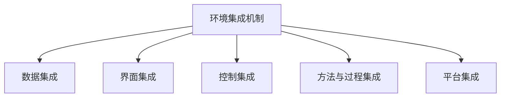
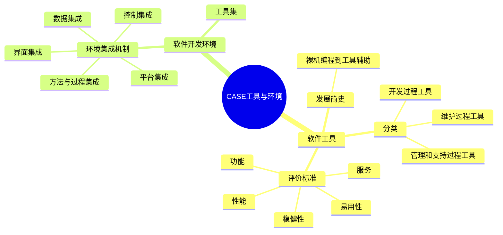

# 第1章-1.5-CASE工具与环境

## 基本信息
- **课程**：软件工程
- **章节**：第1章 概论 1.5节 CASE工具与环境
- **日期**：2026-06-30
- **标签**：#CASE #软件工具 #开发环境 #工具集成 #环境集成机制

---

## 重点内容

### ⭐⭐⭐ 核心概念
- **CASE**：计算机辅助软件工程（Computer Aided Software Engineering）
- **软件工具**：用来辅助软件开发、运行、维护、管理、支持等过程中活动的软件
- **软件开发环境**：由软件工具集和环境集成机制构成的软件系统

### ⭐⭐ 工具分类与评价
- **软件工具按过程分类**：开发过程工具、维护过程工具、管理过程和支持过程工具
- **工具评价标准**：功能、易用性、稳健性、硬件要求和性能、服务和支持

### ⭐ 环境集成机制
- **5种集成方式**：数据集成、界面集成、控制集成、方法与过程集成、平台集成

---

## 详细笔记

### 一、CASE概述

自从出现软件工程的概念以后，人们一方面着重于开发模型和开发方法的研究，以指导软件开发工作的顺利进行；另一方面着重于软件工具和环境的研究，以低成本、高效率地辅助软件的开发。于是出现了对**计算机辅助软件工程（CASE）**的研究和实践。

> 📚 **课本出处**：第1章 1.5节"CASE工具与环境"

**CASE的定义**：计算机辅助软件工程是指使用计算机及相关的软件工具辅助软件开发、维护、管理等过程中各项活动的实施，以确保这些活动能高效率、高质量地进行。

CASE研究和实践的重点集中在**CASE工具**和**软件开发环境**两个方面。

> 💡 **理解技巧**：CASE可以理解为"用软件来开发软件"的理念。工具是单个辅助手段，环境是集成化的工具体系。

---

### 二、软件工具（1.5.1）

用来辅助软件开发、运行、维护、管理、支持等过程中的活动的软件称为**软件工具**。使用软件工具可降低软件生产和维护的成本，提高软件产品的生产率和软件产品的质量。

> 📚 **课本出处**：第1章 1.5.1节"软件工具"

#### 1. 发展简史

| 阶段 | 时间 | 主要工具 |
|:----:|:----:|:---------|
| 萌芽期 | 计算机诞生头几年 | 几乎没有软件工具，裸机开发 |
| 编程辅助期 | 1950年代中期 | 编辑程序、汇编程序、编译/解释程序、连接程序、排错程序 |
| 工程化时期 | 1960年代末~ | 需求分析工具、维护工具、管理工具、结构化/面向对象工具 |
| 应用扩展期 | 1970~80年代 | 用户界面工具、多媒体开发工具、数据库应用工具 |
| 过程管理期 | 1980年代中期~ | 过程建模工具、过程评价工具 |

> 💡 **理解技巧**：工具的发展与软件工程的发展同步——从"能编程"到"能开发"到"能管理"，覆盖了软件生存周期的方方面面。

#### 2. 分类

由于大多数软件工具仅限于支持软件生存周期过程中的某些特定的活动，所以通常可以**按软件过程的活动**来进行分类。

**（1）支持软件开发过程的工具**

| 工具类型 | 说明 |
|:--------:|:-----|
| 需求分析工具 | 辅助需求的获取、分析和规约 |
| 设计工具 | 分为概要设计工具和详细设计工具 |
| 编码工具 | 辅助程序编写、编辑 |
| 排错工具 | 辅助程序调试 |
| 测试工具 | 辅助测试用例设计和执行 |

此外，还可根据工具所支持的开发方法进行分类，如结构化设计工具、面向对象分析工具等。

**（2）支持软件维护过程的工具**

| 工具类型 | 说明 |
|:--------:|:-----|
| 版本控制工具 | 管理软件版本的变更 |
| 文档分析工具 | 分析和理解现有文档 |
| 开发信息库工具 | 存储和管理开发信息 |
| 逆向工程工具 | 从已有系统提取设计信息 |
| 再工程工具 | 改造和重构已有系统 |

**（3）支持软件管理过程和支持过程的工具**

| 工具类型 | 说明 |
|:--------:|:-----|
| 项目管理工具 | 辅助进度、资源、成本管理 |
| 配置管理工具 | 管理配置项及其变更 |
| 软件评价工具 | 评估软件质量 |

> ⚠️ **常见误区**：工具分类并非严密的，有些工具可属于多类。例如版本管理工具既可属于维护工具，也可属于管理工具。从使用角度看，工具的分类并不重要，重要的是它对所需要辅助的活动是否有用。

#### 3. 工具的评价和选择

如何评价和选择适合本人、本单位、本项目的软件开发工具，可以根据以下标准：

| 评价标准 | 说明 |
|:--------:|:-----|
| 功能 | 要实现所需的功能需求，支持用户所选定的开发方法 |
| 易用性 | 友好的用户界面，可剪裁和定制，含有提示和交互操作 |
| 稳健性 | 能长期可靠使用，适应环境变化，非法操作时不致严重后果 |
| 硬件要求和性能 | 响应时间、占用存储空间等影响使用效果 |
| 服务和支持 | 提供有效的技术服务（培训、咨询、版本更新），文档齐全 |

> 📌 **考试重点**：工具评价的5个标准要记住，简答题可能考到。

> ⭐ **核心观点**：一个好的软件开发工具有时并不在于功能如何齐全，而在于它是否能有效地提高软件的开发效率和质量，减轻人的劳动，便于使用，工作可靠。价格也是很重要的决定因素。

---

### 三、软件开发环境（1.5.2）

**软件开发环境（SDE）**是支持软件产品开发的软件系统。它由**软件工具集**和**环境集成机制**构成，前者用于支持软件开发的相关过程、活动和任务；后者为工具集成和软件开发、维护和管理提供统一的支持。

> 📚 **课本出处**：第1章 1.5.2节"软件开发环境"

#### 1. 软件开发环境的特征

| 特征 | 说明 |
|:----:|:-----|
| 服务集成 | 支持平台集成、数据集成、界面集成、控制集成和过程集成 |
| 支持小组工作 | 提供配置管理，支持协作开发 |
| 支持各种开发活动 | 包括分析、设计、编程、测试、调试、编制文档等 |

#### 2. 集成型软件开发环境

集成型软件开发环境通常由**工具集**和**环境集成机制**组成。使用单个工具可以有效地提高生产率，使用集成的工具集可以获得更大的收益。

集成的主要好处：

- 可以把工具组合起来支持更加广泛的软件开发活动
- 好的集成框架允许加入新的工具而不影响原有功能
- 新工具可以复用环境中已有的元素，减少开发成本
- 工具用法相似时，可减少用户学习时间

#### 3. 环境集成机制（5种集成）

##### 📷 环境集成机制总览

**（1）数据集成**

为各种相互协作的工具提供**统一的数据模式和数据接口规范**，以实现不同工具之间的数据交换。

**（2）界面集成**

环境中的工具的界面使用**统一的风格**，采用相同的交互方式，提供一种相似的视感效果。这样可以减少用户学习不同工具的开销。

**（3）控制集成**

用于支持环境中各个工具或开发活动之间的**通信、切换、调度和协同工作**，并支持软件开发过程的描述、执行与转接。

控制集成的实现方式：利用屏蔽了系统通信机制细节的**消息服务器**。每个工具提供一个控制接口，通过该接口可以启动、暂停、恢复、调用、终止该工具。当一个工具需要另一个工具的服务时，构造消息发送给消息服务器，由服务器查询控制接口并激活相应工具。

> 💡 **理解技巧**：控制集成可以类比操作系统的进程调度——消息服务器相当于"调度器"，工具相当于"进程"，控制接口相当于"系统调用"。

**（4）方法与过程集成**

把多种开发方法、过程模型及其相关工具集成在一起。

**（5）平台集成**

在不同的硬件和系统软件之上构造**用户界面一致的开发平台**，并集成到统一的环境中。

> ⚠️ **常见误区**：不是所有开发环境都实现了全部5种集成。实际中，数据集成和界面集成是最基本和最常见的。

---

## 疑问与思考

### ❓ 待解决问题
1. 逆向工程工具和再工程工具具体有什么区别？它们在软件维护中分别起什么作用？
2. 消息服务器实现控制集成的具体机制是什么？在实际的IDE中有哪些体现？
3. 现代IDE（如IntelliJ IDEA、Visual Studio）算是完整的软件开发环境吗？它们实现了哪些集成机制？
4. 方法与过程集成和控制集成之间有什么区别和联系？
5. 在实际项目中，如何选择合适的软件开发环境？需要考虑哪些因素？

### 💡 个人理解/技巧
- **工具 vs 环境**：工具是"锤子"，环境是"工具箱+工作台"。单个工具只能辅助特定活动，环境把工具集成起来形成完整支持
- **5种集成机制的层次**：平台集成是最底层的（硬件/OS），数据集成和控制集成是中间层的（数据交换/通信），界面集成和方法集成是最上层的（用户体验/开发方法）
- **工具分类的灵活性**：不要死记硬背分类，理解工具支持的是"过程中的哪个活动"比分类更重要
- **CASE工具评价的本质**：功能齐全不等于好用，核心标准是"能否真正提高效率和质量"
- **控制集成的消息服务器模式**：类似于微服务架构中的消息中间件，工具之间通过消息通信而非直接调用

---

## 总结

### 软件工具分类表

| 分类 | 工具类型 | 举例 |
|:----:|:---------|:-----|
| 开发过程 | 需求分析、设计、编码、排错、测试工具 | UML建模工具、IDE、调试器、JUnit |
| 维护过程 | 版本控制、文档分析、逆向工程、再工程工具 | Git、SonarQube |
| 管理过程 | 项目管理、配置管理、软件评价工具 | JIRA、SVN |

### 工具评价5标准

| 标准 | 核心要点 |
|:----:|:---------|
| 功能 | 满足需求，支持开发方法，保证输出一致性 |
| 易用性 | 界面友好，可定制，有提示，能检查错误 |
| 稳健性 | 可靠使用，适应变化，非法操作不崩溃 |
| 性能 | 响应快，存储合理，硬件要求适中 |
| 服务 | 技术支持好，文档齐全，版本更新及时 |

### 环境集成机制对比

| 集成类型 | 核心作用 | 关键词 |
|:--------:|:---------|:------:|
| 数据集成 | 统一数据模式和接口 | 数据交换 |
| 界面集成 | 统一风格和交互方式 | 一致性 |
| 控制集成 | 工具间通信和协同 | 消息服务器 |
| 方法与过程集成 | 多种方法和过程模型集成 | 方法支持 |
| 平台集成 | 不同硬件/OS上构造统一平台 | 跨平台 |

### 关键要点

1. **CASE**是用计算机辅助软件工程各项活动的实施
2. **软件工具**按过程分为开发工具、维护工具、管理工具三类
3. 工具选择看5个标准：功能、易用性、稳健性、性能、服务
4. **软件开发环境** = 工具集 + 环境集成机制
5. 集成机制有5种：数据、界面、控制、方法与过程、平台
6. 控制集成通过**消息服务器**实现工具间的通信和调度

### 知识点脑图

---

## 相关链接

### 关联章节
- [第1章-概论](./第1章-概论.md)
- 第1章-1.1-计算机软件（待创建）
- 第1章-1.2-软件工程（待创建）
- [第1章-1.3-软件过程](./第1章-1.3-软件过程.md)
- 第1章-1.4-软件过程模型（待创建）

---

## 检查清单

- [x] 已理解CASE的定义和研究重点
- [x] 已掌握软件工具的分类（按过程活动分3类）
- [x] 已掌握工具评价的5个标准
- [x] 已理解软件开发环境的构成（工具集 + 集成机制）
- [x] 已掌握5种环境集成机制及其特点
- [x] 已添加课本出处标注

---

*笔记创建时间：2026-06-30*
