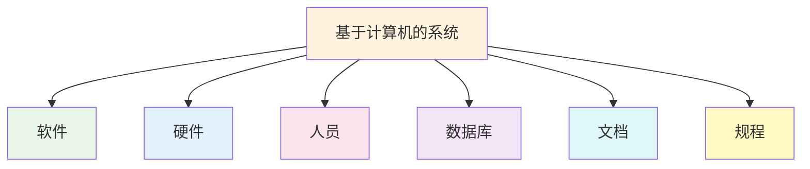
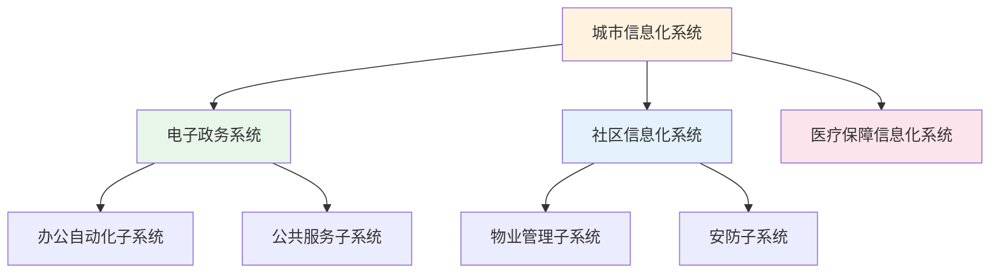

# 第2章-2.1-基于计算机的系统

## 基本信息
- **课程**：软件工程
- **章节**：第2章 2.1节 基于计算机的系统
- **日期**：2026-06-30
- **标签**：#系统工程 #基于计算机的系统 #系统元素 #层次结构

---

## 重点内容

### ⭐⭐⭐ 核心概念
- **基于计算机的系统**：通过处理信息来完成某些预定义目标而组织在一起的元素的集合或排列
- **系统六大元素**：软件、硬件、人员、数据库、文档、规程

### ⭐⭐ 重要概念
- **系统的层次结构**：一个系统可以是更大系统的宏元素（组成部分）
- **系统元素间的协作**：各元素共同协作完成系统预定义目标

### ⭐ 基础概念
- **软件在系统中的角色**：实现逻辑方法、规程或控制
- **硬件在系统中的角色**：提供计算能力、支持数据流、支持外部功能

---

## 详细笔记

### 一、系统工程的背景

一个软件通常要依赖于硬件、人员、数据库、文档、规程等其他系统元素，在一定的语境（context）中被开发和运行。

> 📚 **课本出处**：第2章 导论部分

在现实世界中，人们所要开发的系统通常是基于计算机的系统。例如，开发某政府的电子政务系统，涉及多台计算机、网络结构、通信协议、多个软件系统、数据库、使用系统的各类人员、相关的文档及规程等。

#### 业务过程工程与产品工程

系统工程过程依赖于应用领域而呈现不同的形式：

| 工程类型 | 关注领域 | 目标 | 体系结构 |
|:--------:|:--------:|:-----|:---------|
| **业务过程工程** | 业务企业 | 定义有效利用信息进行业务活动的体系结构 | 数据体系结构、应用体系结构、技术基础设施 |
| **产品工程** | 产品生产 | 将客户期望的能力转换成工作产品 | 软件、硬件、数据和数据库、人员 |

> 📚 **课本出处**：第2章 导论部分"系统工程过程"

**业务过程工程**的3种体系结构：
1. **数据体系结构**：为业务或业务功能的信息需求提供框架
2. **应用体系结构**：围绕为了某个业务目的而在数据体系结构范围内的变换对象
3. **技术基础设施**：为数据和应用体系结构提供基础，包含支持应用和数据的硬件和软件

**产品工程**的4种系统元素和支撑基础设施：
- 体系结构包含：软件、硬件、数据（和数据库）、人员
- 支撑基础设施：连接这些元素所需的技术和用于支持这些元素的信息

---

### 二、基于计算机的系统定义

基于计算机的系统是指：通过处理信息来完成某些预定义目标而组织在一起的元素的集合或排列。

> 📚 **课本出处**：第2章 2.1节"基于计算机的系统"

---

### 三、系统六大元素

组成基于计算机系统的元素主要有六大类：

#### 1. 软件

软件是指计算机程序、数据结构和一些相关的工作产品，用以实现所需的逻辑方法、规程或控制。

> 📚 **课本出处**：第2章 2.1节第1点"软件"

- 软件是系统的**核心逻辑组件**
- 不仅包括程序代码，还包括数据结构和相关工作产品

#### 2. 硬件

硬件是指提供计算能力的电子设备、支持数据流的互连设备（如网络交换器、电信设备）和支持外部功能的机电设备（如传感器、马达等）。

> 📚 **课本出处**：第2章 2.1节第2点"硬件"

硬件包括三类：
- **电子设备**：提供计算能力（如CPU、内存）
- **互连设备**：支持数据流（如网络交换器、电信设备）
- **机电设备**：支持外部功能（如传感器、马达）

#### 3. 人员

人员是指硬件和软件的使用者和操作者。

> 📚 **课本出处**：第2章 2.1节第3点"人员"

#### 4. 数据库

数据库是指通过软件访问并持久存储的大型的有组织的信息集合。

> 📚 **课本出处**：第2章 2.1节第4点"数据库"

- 强调**持久存储**和**有组织**
- 通过软件访问

#### 5. 文档

文档是指描绘系统的使用和/或操作的描述性信息（如模型、规格说明、使用手册、联机帮助文件、Web站点）。

> 📚 **课本出处**：第2章 2.1节第5点"文档"

文档的形式多样：模型、规格说明、使用手册、联机帮助文件、Web站点等。

#### 6. 规程

规程是指定义每个系统元素或其外部相关流程的具体使用步骤。

> 📚 **课本出处**：第2章 2.1节第6点"规程"

💡 **理解技巧**：规程可以理解为"操作手册"或"使用流程"，它规定了如何正确使用系统中的各个元素。

#### 六大元素总览

| 元素 | 定义 | 关键词 |
|:----:|:-----|:------:|
| 软件 | 计算机程序、数据结构和相关工作产品 | 逻辑方法、规程、控制 |
| 硬件 | 电子设备、互连设备、机电设备 | 计算能力、数据流、外部功能 |
| 人员 | 硬件和软件的使用者和操作者 | 使用、操作 |
| 数据库 | 通过软件访问并持久存储的有组织信息集合 | 持久存储、有组织 |
| 文档 | 描述系统使用和/或操作的描述性信息 | 模型、手册、帮助 |
| 规程 | 定义系统元素或其外部流程的使用步骤 | 步骤、流程 |

---

### 四、系统的层次结构

一个基于计算机的系统可以是另一个更大的基于计算机的系统的一个宏元素（组成部分）。

> 📚 **课本出处**：第2章 2.1节关于系统层次结构的描述

例如，城市信息化系统是一个基于计算机的系统，可以由：
- 政府电子政务系统
- 社区信息化系统
- 医疗保障信息化系统

等组成，而它们也都是基于计算机的系统，它们中的每一个还可以包含其他更小的基于计算机的系统。这样，基于计算机的系统可呈现一个**层次结构**。

> 💡 **理解技巧**：系统的层次结构类似于组织架构——一个部门是一个系统，但它同时也是公司这个更大系统的一个组成部分。

---

## 总结

### 关键要点

1. **基于计算机的系统**通过处理信息完成预定义目标，由六大元素组成
2. **六大元素**：软件、硬件、人员、数据库、文档、规程——缺一不可
3. **系统具有层次性**：一个系统可以是更大系统的宏元素，形成嵌套结构
4. **系统工程有两种应用领域**：业务过程工程（关注业务体系结构）和产品工程（关注产品能力转换）
5. 软件不是孤立存在的，必须在**系统语境**中被开发和运行

---

## 疑问与思考

### ❓/💡 问题与解答

**❓ 系统六大元素之间是什么关系？它们是否同等重要？**

💡 六大元素之间是**协作关系**，共同服务于系统的预定义目标，缺一不可。课本指出"通过处理信息来完成某些预定义目标而组织在一起的元素的集合或排列"，强调的是整体协作。但在不同系统中各元素的权重不同：如电子政务系统中"人员"和"规程"占主导，而嵌入式系统中"软件"和"硬件"更核心。从产品工程的视角看，体系结构包含4种核心元素（软件、硬件、数据/数据库、人员），而文档和规程属于支撑基础设施。

> 📚 课本出处：第2章 2.1节"基于计算机的系统"

**❓ 硬件和软件在系统中的比例有什么变化趋势？**

💡 从历史发展趋势看，系统中**软件的比例越来越大、硬件的比例相对缩小**。课本提到硬件包括电子设备、互连设备和机电设备，软件是实现逻辑方法的核心组件。随着硬件成本持续下降、计算能力不断提升，越来越多的功能由软件实现而非硬件实现——以前需要专用硬件完成的功能（如信号处理）现在可以用通用硬件+软件替代。这也正是软件工程成为独立学科的重要原因之一：软件在系统中的复杂度和比重不断增加。

> 📚 课本出处：第2章 2.1节"基于计算机的系统"

### 💡 个人理解/技巧
- 六大元素可以记忆为"**软硬人据文规**"——软件、硬件、人员、数据库、文档、规程
- 系统的层次结构说明：做软件开发不能只关注软件本身，还要关注它在整个系统中的位置和作用
- 业务过程工程关注"如何用信息技术优化业务"，产品工程关注"如何把需求变成产品"——前者偏战略，后者偏执行

---

## 相关链接

### 关联章节
- [第2章-系统工程](./第2章-系统工程.md)
- [第2章-2.2-系统工程的任务](./第2章-2.2-系统工程的任务.md)
- [第1章-概论](../../第1章-概论/第1章-概论.md)

---

## 检查清单

- [x] 已理解基于计算机的系统的定义
- [x] 已掌握系统六大元素的含义和区别
- [x] 已理解系统的层次结构
- [x] 已理解业务过程工程与产品工程的区别
- [x] 已添加课本出处标注

---

*笔记创建时间：2026-06-30*
