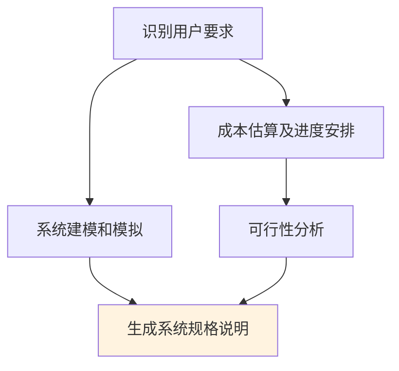

# 第2章-2.2-系统工程的任务

## 基本信息
- **课程**：软件工程
- **章节**：第2章 2.2节 系统工程的任务
- **日期**：2026-06-30
- **标签**：#系统工程 #系统建模 #需求分析 #成本估算 #系统规格说明

---

## 重点内容

### ⭐⭐⭐ 核心概念
- **系统工程的定义**：问题求解活动，分析基于计算机的系统的功能、性能要求，分配到各系统元素
- **系统工程五大任务**：识别用户要求、系统建模和模拟、成本估算及进度安排、可行性分析、生成系统规格说明

### ⭐⭐ 重要概念
- **四种系统模型**：硬件系统模型、软件系统模型、人机接口模型、数据模型
- **系统规格说明**：作为以后开发系统的依据

### ⭐ 基础概念
- **业务过程工程**：关注业务企业语境
- **产品工程**：关注产品生产过程

---

## 详细笔记

### 一、系统工程的定义

计算机系统工程是一个**问题求解的活动**，其目的是分析基于计算机的系统的功能、性能等要求，并把它们分配到基于计算机系统的各个系统元素中，确定它们的约束条件和接口。

> 📚 **课本出处**：第2章 2.2节"系统工程的任务"

> 💡 **理解技巧**：系统工程是"承上启下"的环节——上接用户需求，下接具体开发。它把用户的模糊需求转化为对每个系统元素（硬件、软件、人员等）的明确要求。

---

### 二、系统工程的五大任务

#### 1. 识别用户的要求

系统工程的第一步就是识别用户对基于计算机的系统的总体要求，标识系统的功能和性能范围，确定系统的功能、性能、约束和接口。

> 📚 **课本出处**：第2章 2.2节任务1"识别用户的要求"

关键输出：
- **功能**：系统要做什么
- **性能**：系统要做到什么程度
- **约束**：系统的限制条件（如预算、时间、技术等）
- **接口**：系统与其他系统或环境的交互方式

#### 2. 系统建模和模拟

一个基于计算机的系统通常可考虑建立以下四种模型：

> 📚 **课本出处**：第2章 2.2节任务2"系统建模和模拟"

##### （1）硬件系统模型

描述基于计算机系统中的硬件（包括计算机、受系统控制的其他硬件设备等）配置、通信协议、拓扑结构，以及确保系统的安全性、可靠性、性能等要求的措施。

##### （2）软件系统模型

基于计算机系统中的软件部分通常可分解成若干个子系统。软件系统模型描述各软件子系统的功能、性能等要求，各软件子系统在硬件系统中的部署情况，以及软件子系统之间的交互。

##### （3）人机接口模型

描述人如何与基于计算机的系统进行交互，包括用户环境、用户的活动、人机交互的语法和语义等。

##### （4）数据模型

主要描述基于计算机的系统使用了哪些数据库管理系统，如果使用多个数据库管理系统，还应描述它们之间的数据转换方式，必要时可给出主要的数据结构。

| 模型类型 | 描述内容 | 关注点 |
|:--------:|:---------|:------:|
| 硬件系统模型 | 硬件配置、通信协议、拓扑结构 | 安全性、可靠性、性能 |
| 软件系统模型 | 子系统功能、性能、部署、交互 | 子系统划分与交互 |
| 人机接口模型 | 用户环境、活动、交互语法和语义 | 用户体验 |
| 数据模型 | 数据库管理系统、数据转换、数据结构 | 数据组织与转换 |

系统模型通常可用图形描述，并加以相应的文字说明。必要时，在系统建模后可构造**原型**，进行系统模拟，以分析所建的模型能否满足整个系统的要求。

#### 3. 成本估算及进度安排

开发一个基于计算机的系统需要一定的资金投入和时间约束（交付日期），因此在系统工程阶段应对需开发的系统进行成本估算，并作出进度安排。

> 📚 **课本出处**：第2章 2.2节任务3"成本估算及进度安排"

- 需考虑**资金投入**和**时间约束**
- 成本估算的具体方法将在第16章"软件项目管理"中详细介绍

#### 4. 可行性分析

可行性分析主要从经济、技术、法律等方面分析所给出的解决方案是否可行，通常只有当解决方案可行并有一定的经济效益和/或社会效益时，才真正开始系统的开发。

> 📚 **课本出处**：第2章 2.2节任务4"可行性分析"

- 经济、技术、法律三个方面（详见2.3节）
- 只有可行才开始开发

#### 5. 生成系统规格说明

在以上各任务完成以后，应该形成一份**系统规格说明**，作为以后开发系统的依据。

> 📚 **课本出处**：第2章 2.2节任务5"生成系统规格说明"

系统规格说明的内容：
1. 描述基于计算机的系统的功能、性能和约束条件
2. 描述系统的输入输出和控制信息
3. 给出各系统元素的模型
4. 进行可行性分析
5. 给出成本估算和进度安排计划

> ⭐ **核心重点**：系统规格说明是系统工程阶段的最终产物，是后续软件开发的依据和基础。

---

## 总结

### 五大任务关系图

### 关键要点

1. **系统工程是问题求解活动**：分析功能、性能要求并分配到各系统元素
2. **五大任务形成完整流程**：从识别需求到生成规格说明
3. **四种系统模型**：硬件、软件、人机接口、数据——覆盖系统的各个维度
4. **原型模拟**：建模后可构造原型验证模型的正确性
5. **系统规格说明**是系统工程的最终交付物，是后续开发的基础

---

## 疑问与思考

### ❓/💡 问题与解答

**❓ 系统建模的四种模型之间有什么区别？是否需要按特定顺序建立？**

💡 四种模型分别从不同维度描述系统，各有侧重：**硬件系统模型**关注硬件配置、通信拓扑和安全可靠性；**软件系统模型**关注子系统划分、部署和交互；**人机接口模型**关注用户环境和交互语法语义；**数据模型**关注数据库管理系统和数据转换。它们并非严格的顺序关系，但通常硬件模型和数据模型会先建立（作为基础设施），软件模型和人机接口模型在其基础上细化。课本说"共同完成整个基于计算机系统的全部要求"，强调的是互补协作而非线性依赖。

> 📚 课本出处：第2章 2.2节任务2"系统建模和模拟"

**❓ 系统工程和软件工程是什么关系？**

💡 课本在第1章概述中指出："计算机系统工程的任务是确定待开发软件的总体要求和范围，以及该软件与其他计算机系统元素之间的关系。"也就是说，**系统工程的范围大于软件工程**——系统工程站在整个计算机系统的角度（含硬件、人员、数据库等），而软件工程是系统工程中软件部分的具体实现。从流程上看，系统工程在前（确定需求和规格说明），软件工程在后（基于系统规格说明进行软件开发）。系统工程是"承上启下"的环节，它的输出（系统规格说明）就是软件工程的输入。

> 📚 课本出处：第1章 导论部分"计算机系统工程"、第2章 2.2节"系统工程的任务"

### 💡 个人理解/技巧
- 五大任务可以记忆为"**认建成可行规**"：识别要求 -> 建模模拟 -> 成本估算 -> 可行性分析 -> 规格说明
- 四种模型分别对应2.1节中系统六大元素的不同方面：硬件模型对应硬件、软件模型对应软件、人机接口对应人员、数据模型对应数据库
- 系统工程的输出（系统规格说明）就是后续需求工程的输入——各章节之间是前后衔接的

---

## 相关链接

### 关联章节
- [第2章-系统工程](./第2章-系统工程.md)
- [第2章-2.1-基于计算机的系统](./第2章-2.1-基于计算机的系统.md)
- [第2章-2.3-可行性分析](./第2章-2.3-可行性分析.md)
- 第3章-需求工程（待创建）——需求工程是系统工程之后的下一阶段
- 第16章-软件项目管理（待创建）——成本估算的详细方法

---

## 检查清单

- [x] 已理解系统工程的定义和目的
- [x] 已掌握系统工程的五大任务
- [x] 已理解四种系统模型的区别和联系
- [x] 已理解系统规格说明的内容和作用
- [x] 已添加课本出处标注

---

*笔记创建时间：2026-06-30*
