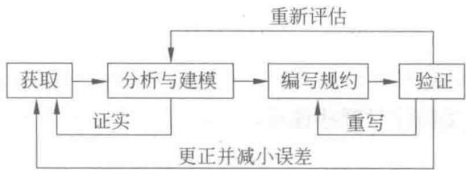
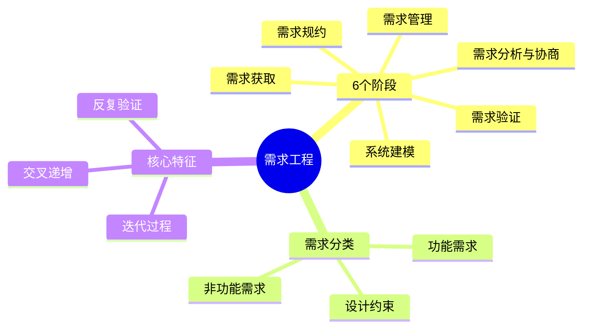

# 第3章-3.1-需求工程概述

## 基本信息
- **课程**：软件工程
- **章节**：第3章 3.1节 需求工程概述
- **日期**：2026-06-30
- **标签**：#需求工程 #需求定义 #需求阶段 #需求分类 #核心必考

---

## 重点内容

### ⭐⭐⭐ 核心概念
- **需求工程定义**：直到（但不包括）把软件分解为实际架构和构件之前的所有活动
- **需求工程6个阶段**：需求获取、需求分析与协商、系统建模、需求规约、需求验证、需求管理
- **需求开发是迭代过程**：这些活动是交叉的、递增的和反复的，不是线性顺序进行

### ⭐⭐ 重要概念
- **需求分类**：功能需求、非功能需求、设计约束
- **需求协商的必要性**：不同用户可能提出相互冲突的需求
- **需求管理的本质**：使用户与项目团队对不断变更的需求达成并保持一致

### ⭐ 基础概念
- 需求工程的历史演变：Krasner 5阶段 -> Jarke/Pohl 3阶段 -> Pressman 6步骤 -> 本书6阶段
- 需求规约作为用户和开发者之间的协议

---

## 详细笔记

### 一、需求工程的定义

#### 1. 定义

**需求工程（Requirements Engineering）**：直到（但不包括）把软件分解为实际架构和构件之前的所有活动。

> 📚 **课本出处**：第3章 3.1节"需求工程概述" — Alan Davis 的定义

需求工程是一个**不断反复**的过程，包括需求定义、文档记录、需求演进，并最终在验证的基础上冻结需求。

#### 2. 历史演变

不同学者对需求工程阶段的划分：

| 学者/模型 | 阶段划分 | 特点 |
|:---------:|:--------|:----:|
| Herb Krasner (1980s) | 需求定义和分析、需求决策、形成需求规约、需求实现与验证、需求演进管理 | 5阶段 |
| Jarke & Pohl | 获取、表示、验证 | 3阶段周期 |
| Pressman | 需求诱导、需求分析和谈判、需求规约、系统建模、需求确认、需求管理 | 6步骤 |
| Sommerville | 需求抽取、需求分析和需求协商、需求描述、系统建模、需求确认、需求管理 | 6阶段 |

> 💡 **理解技巧**：各家划分大同小异，核心思路一致：先获取需求，再分析建模，然后形成文档，最后验证管理。本书采用的6阶段划分与 Pressman 和 Sommerville 最为接近。

---

### 二、需求工程的6个阶段

> 📚 **课本出处**：第3章 3.1节 — 本书将需求工程细分为6个阶段

#### 1. 需求获取

系统分析人员通过与用户交流、观察现有系统、分析任务，确定：
- 系统或产品范围的限制性描述
- 与系统有关的人员及特征列表
- 系统的技术环境描述
- 系统功能列表及领域限制
- 不同运行条件下的应用场景

**工作产品**：为需求分析提供基础。

#### 2. 需求分析与协商

分析活动对需求进行**分类组织**，分析每个需求与其他需求的关系，检查：
- **一致性**：需求之间是否矛盾
- **重叠**：是否有重复的需求
- **遗漏**：是否有缺失的需求

根据用户需要对需求进行**排序**。

常见问题：
1. 用户提出的要求超出软件系统可以实现的范围
2. 不同的用户提出了**相互冲突的需求**

系统分析人员需要通过**谈判过程**调解冲突。

#### 3. 系统建模

通过合适的工具和符号**系统地描述需求**。

- 在用户和分析人员之间建立统一的语言和理解桥梁
- 借助建模技术分析需求信息，排除错误和弥补不足
- 确保需求文档正确反映用户的真实意图

常用建模方法：
- **面向数据流方法**（如 DFD）
- **面向数据结构方法**（如 JSP）
- **面向对象方法**（如 UML）

#### 4. 需求规约

软件需求规约是分析任务的**最终产物**，包含：
- 完整的信息描述
- 详细的功能和行为描述
- 性能需求和设计约束的说明
- 合适的验收标准

需求规约作为**用户和开发者之间的协议**，在软件工程各阶段发挥重要作用。

#### 5. 需求验证

对功能的**正确性、完整性和清晰性**进行评价，以及其他需求给予评价。

- 评审应指定**专门的人员**负责
- 按规程**严格进行**

#### 6. 需求管理

对需求工程所有相关活动的**规划和控制**：
- 获取、组织并记录系统需求的系统化方案
- 使用户与项目团队对不断变更的系统需求达成并**保持一致**的过程

---

### 三、需求开发的迭代过程

#### 📷 图3.1 需求开发是一个迭代过程

> 📚 **课本出处**：图3.1 展示了需求获取、需求分析与建模、编写需求规约、需求验证是一个交叉、递增、反复的迭代过程

> ⭐ **核心重点**：获取、分析、建模、编写规约和验证这些需求开发活动**不是线性地、顺序地进行**，而是**交叉的、递增的和反复的**。

迭代过程描述：
1. 分析员与用户交流 -> 倾听、观察（**需求获取**）
2. 处理信息，分类联系 -> 理解需求（**需求分析与建模**）
3. 编制书面文档和图解（**编写需求规约**）
4. 向用户确认文档是否正确完整（**需求验证**）
5. 纠正错误，重新迭代

---

### 四、需求分类

软件需求可以按照性质分为三大类：

#### 1. 功能需求（Functional Requirements）

描述系统**应该做什么**，即系统必须提供的功能和服务。

- 考虑系统要做什么，在何时做，在何时及如何修改或升级
- 例如：系统应能接收用户订单、计算总价、生成报表

#### 2. 非功能需求（Non-functional Requirements）

描述系统**应该具备的属性和特征**，约束系统的运行方式。

包括：
- **性能需求**：响应时间、吞吐量、存储容量等
- **可靠性需求**：故障率、恢复时间等
- **安全保密需求**：访问控制、数据隔离等
- **用户因素**：用户类型、熟练程度、训练需求等
- **环境需求**：硬件、软件运行环境等
- **文档需求**：需要哪些文档、面向哪些读者
- **资源使用需求**：运行时和开发时的资源需求

#### 3. 设计约束（Design Constraints）

对系统设计和实现施加的**限制条件**。

- 硬件限制（机型、外设等）
- 软件限制（操作系统、数据库等）
- 标准和法规限制
- 接口限制
- 采用某种开发模式

#### 需求来源

这些需求可以来自于：
- 用户（实际的和潜在的）
- 用户的规约
- 应用领域的专家
- 相关的技术标准和法规
- 原有系统及其用户
- 竞争对手的产品

---

## 总结

### 需求工程6个任务

| 序号 | 阶段 | 核心工作 | 产出 |
|:----:|:----:|:---------|:----:|
| 1 | 需求获取 | 交流、观察、分析，确定范围和功能列表 | 基础需求材料 |
| 2 | 需求分析与协商 | 分类组织、检查一致性/重叠/遗漏、排序、调解冲突 | 分析后的需求集 |
| 3 | 系统建模 | 用工具和符号系统描述需求 | 需求模型 |
| 4 | 需求规约 | 编写完整的需求文档 | 软件需求规约文档 |
| 5 | 需求验证 | 评审正确性、完整性、清晰性 | 验证后的需求 |
| 6 | 需求管理 | 规划和控制所有相关活动，管理变更 | 受控的需求基线 |

### 需求分类对比表

| 分类 | 含义 | 关注点 | 示例 |
|:----:|:----:|:------:|:----:|
| 功能需求 | 系统应该做什么 | 功能和服务 | 接收订单、计算价格 |
| 非功能需求 | 系统应该具备什么属性 | 质量、性能、约束 | 响应时间<2秒、可靠率99.9% |
| 设计约束 | 对设计的限制条件 | 限制和标准 | 必须运行在Linux上、符合GDPR |

### 知识点脑图

### 关键要点

1. **需求工程 = 架构之前的所有活动**：不包括分解为架构和构件
2. **6个阶段是迭代的**：不是线性顺序，而是交叉、递增、反复
3. **需求协商解决冲突**：不同用户需求可能相互矛盾
4. **需求规约是协议**：用户和开发者之间的正式约定
5. **需求管理贯穿始终**：管理变更，保持一致性

---

## 疑问与思考

### ❓ 待解决问题
1. 需求工程的6个阶段之间是什么关系？是否必须按顺序执行？
2. 功能需求和非功能需求在实际中如何清晰地区分？

### 💡 解答
1. 6个阶段不是严格的线性顺序，而是**交叉、递增、反复**的迭代过程。实际项目中，获取、分析、建模、编写规约和验证会同时推进、反复修正。例如，在编写需求规约时可能发现遗漏，需要回到需求获取阶段补充信息；需求验证中发现的不一致又会触发新一轮分析与协商。需求管理则贯穿所有阶段，负责控制变更。理解要点：这6个阶段描述的是**逻辑上的分工**，而非时间上的先后。
2. 功能需求描述系统"做什么"——即系统必须提供的功能和服务（如：接收订单、计算价格）；非功能需求描述系统"做得多好"——即系统应具备的属性和质量特征（如：响应时间小于2秒、可用率99.9%）。两者在实际中确实常常交织（如"系统应支持1000并发用户"既涉及功能也涉及性能），区分的关键在于：功能需求关注**行为本身**，非功能需求关注**行为的约束条件**。设计约束则是第三类，描述的是"在什么限制下做"（如必须运行在Linux上）。

### 💡 个人理解/技巧
- 需求工程6个阶段可以类比写论文：获取（调研）、分析（整理文献）、建模（构建框架）、规约（写初稿）、验证（审稿修改）、管理（版本控制）
- 需求获取是最难的阶段——用户往往"说不清楚"自己要什么，这就是为什么需要多种获取方法（详见3.2节）
- 三个分类的关系：功能需求回答"做什么"，非功能需求回答"做得多好"，设计约束回答"在什么限制下做"
- 课本列举了很多学者的不同划分，考试中记住本书的6阶段即可，但理解各家本质相同更重要

---

## 相关链接

### 本节相关图片
- [图3.1 需求开发是一个迭代过程](../../../images/ce98422642de97944edb0fd82a47f31603d82cd5593e32da8def432b046617bd.jpg)

### 关联章节
- [第3章-需求工程](./第3章-需求工程.md)
- [第3章-3.2-需求获取](./第3章-3.2-需求获取.md)
- 第3章-3.3-需求分析协商与建模（待创建）
- 第3章-3.4-需求规约与验证（待创建）
- 第3章-3.5-需求管理（待创建）

---

## 检查清单

- [x] 已理解需求工程的定义和6个阶段
- [x] 已理解需求分类（功能/非功能/设计约束）
- [x] 已插入课本原图（图3.1）
- [x] 已记录重点标记
- [x] 已添加课本出处标注
- [x] 已创建疑问与思考
- [x] 已创建总结表格和脑图

---

*笔记创建时间：2026-06-30*
