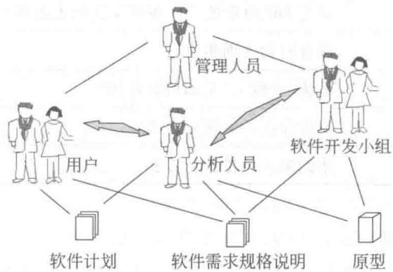
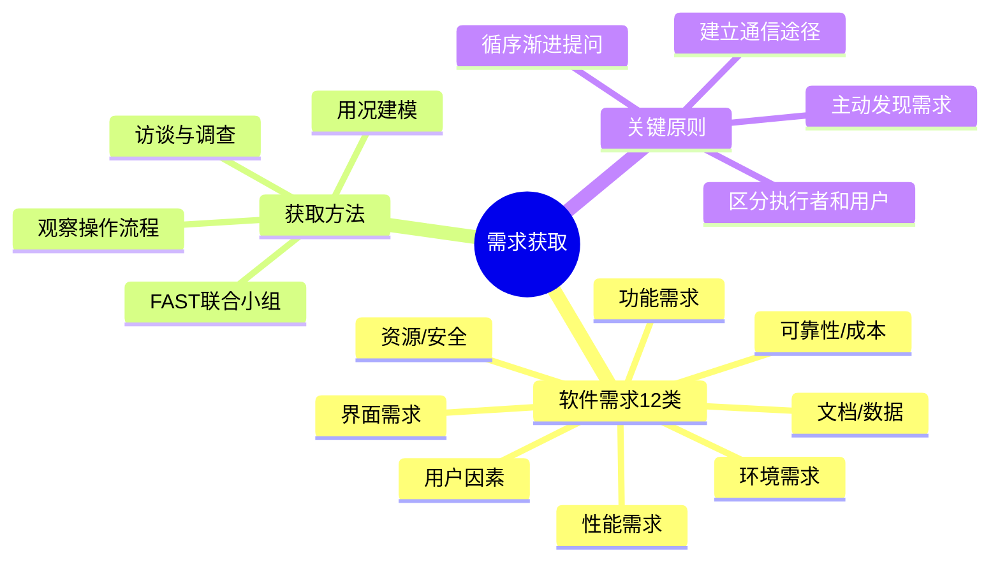

# 第3章-3.2-需求获取

## 基本信息
- **课程**：软件工程
- **章节**：第3章 3.2节 需求获取
- **日期**：2026-06-30
- **标签**：#需求获取 #软件需求 #访谈 #FAST #用况 #原型 #核心必考

---

## 重点内容

### ⭐⭐⭐ 核心概念
- **需求获取 vs 需求收集**："获取"强调主动发现，原始需求通常不完整、模糊、不一致
- **软件需求12类内容**：功能需求、性能需求、用户因素、环境需求、界面需求等
- **用况（Use Case）**：从高层次和用户角度描述系统会做什么，捕获高层次功能性需求

### ⭐⭐ 重要概念
- **FAST（便利的应用规约技术）**：用户和开发者组成联合小组共同获取需求
- **面谈分类**：结构化面谈（事先计划）vs 非结构化面谈（临场发挥），实践中通常折衷
- **观察用户操作**：不是完全模拟现有流程，要主动剔除不合理部分

### ⭐ 基础概念
- **通信途径**：需求获取的前提，在用户、分析人员、开发小组、管理人员之间建立沟通
- **执行者（Actor）与用户的区别**：一个用户可以扮演多个执行者角色，一个执行者表示一种外部实体角色

---

## 详细笔记

### 一、需求获取的含义

> 📚 **课本出处**：第3章 3.2节"需求获取"引言部分

**需求获取**与以往的"需求收集"不同：

| 概念 | 隐含含义 | 实际情况 |
|:----:|:--------|:--------|
| 需求收集 | 已有成熟需求，等待采集 | 不符合实际 |
| **需求获取** | 主动发现需求的细节 | 原始需求不完整、用户说不清楚、需求不断变动 |

> 💡 **理解技巧**：用"获取"替代"收集"，就像考古学家"获取"文物而非"收集"文物——需要挖掘、分析、鉴别，而不是简单拾取。也有人将需求获取称为**需求诱导**。

---

### 二、软件需求（3.2.1）

> 📚 **课本出处**：第3章 3.2.1节"软件需求"

**软件需求**：用户对目标软件系统在功能、行为、性能、设计约束等方面的期望。

#### 1. 功能需求

考虑系统**要做什么**，在何时做，在何时及如何修改或升级。

- 系统必须提供的功能和服务
- 描述系统的行为（输入 -> 处理 -> 输出）

#### 2. 性能需求

考虑软件开发的**技术性指标**：
- 存储容量限制
- 执行速度
- 响应时间
- 吞吐量

#### 3. 用户或人的因素

考虑**用户类型**和特征：
- 各种用户对使用计算机的熟练程度
- 需要接受的训练
- 用户理解、使用系统的难度
- 用户错误操纵系统的可能性

#### 4. 环境需求

考虑未来软件应用的**运行环境**：
- **硬件**：机型、外设、接口、地点、分布、温度、湿度、磁场干扰等
- **软件**：操作系统、网络、数据库等

#### 5. 界面需求

考虑与外部系统的**交互**：
- 来自其他系统的输入
- 到其他系统的输出
- 对数据格式的特殊规定
- 对数据存储介质的规定

#### 6. 文档需求

考虑**需要哪些文档**，文档针对哪些读者。

#### 7. 数据需求

考虑数据相关的各种要求：
- 输入、输出数据的格式
- 接收、发送数据的频率
- 数据的准确性和精度
- 数据流量
- 数据需保持的时间

#### 8. 资源使用需求

考虑软件运行和开发所需的**资源**：
- 运行时：数据、其他软件、内存空间等
- 开发时：人力、支撑软件、开发设备等

#### 9. 安全保密需求

考虑**安全控制**方面：
- 访问系统或系统信息的控制
- 隔离用户数据的方法
- 用户程序与其他程序和操作系统的隔离
- 系统备份要求

#### 10. 可靠性需求

考虑系统的**可靠性要求**：
- 系统是否必须监测和隔离错误
- 出错后重启系统允许的时间

#### 11. 软件成本消耗与开发进度需求

考虑**时间和预算约束**：
- 是否有规定的时间表
- 软硬件投资有无限制

#### 12. 其他非功能性需求

- 采用某种开发模式
- 质量控制标准
- 里程碑和评审
- 验收标准
- 各种质量要求的优先级
- 可维护性方面的需求

#### 需求来源总结

| 来源 | 说明 |
|:----:|:-----|
| 用户 | 实际用户和潜在用户 |
| 用户规约 | 用户提供的需求文档 |
| 领域专家 | 应用领域专业知识 |
| 技术标准和法规 | 相关行业标准和法律要求 |
| 原有系统 | 现有系统及其用户 |
| 竞争对手 | 竞争产品分析 |

---

### 三、需求获取方法与策略（3.2.2）

> 📚 **课本出处**：第3章 3.2.2节"需求获取方法与策略"

在与用户交流过程中，可能存在**误解、交流障碍、缺乏共同语言**等问题，导致需求不稳定、不完整甚至错误。

#### 1. 建立顺畅的通信途径

需求获取成功的**前提**是建立需求获取所必需的通信途径。

#### 📷 图3.2 软件需求分析的通信途径

> 📚 **课本出处**：图3.2 展示了用户、系统分析人员、软件开发小组、管理人员之间的沟通方式

需要在以下四方之间建立良好沟通：
- **用户**
- **系统分析人员**
- **软件开发小组**
- **管理人员**

#### 2. 访谈与调查

**面谈的分类**：

| 类型 | 特点 | 适用场景 |
|:----:|:-----|:--------:|
| 结构化面谈 | 讨论事先计划好的问题，按计划进行 | 问题明确时 |
| 非结构化面谈 | 只有粗略想法，依赖"临场发挥" | 初期探索时 |
| 折衷方法 | 适当地计划但不过于详细，允许灵活性 | **实践中常用** |

**面谈准备原则**：

1. 所提问题应该**循序渐进**：从整体方面开始，逐步细化
2. **不要限制**用户对问题的回答：可能引出原先没有注意的问题
3. 提问和回答汇总后应能**反映用户需求的全貌**

**其他调查研究方法**：
- **市场调查**：了解市场要求，调研类似系统的功能、性能、价格
- **发调查表**：制定调查提纲，向不同层次的用户发调查表
- **访问用户和领域专家**：从用户获得原始资料，从专家获得有助于理解需求的信息

#### 3. 观察用户操作流程

到用户的**实际工作环境**中观察工作流程。

注意事项：
- 了解实际的操作环境、操作过程和操作要求
- 对照用户提交的问题陈述，全面细致地认识需求
- **不是完全模拟**用户现有工作流程
- 要结合开发经验和应用经验，分析哪些环节由软件完成、哪些由人完成
- **主动剔除**现有系统不合理的部分，改进工作流程，寻找潜在需求

> 💡 **理解技巧**：观察不是"拍照"式的记录，而是"导演"式的思考——看用户怎么做，想应该怎么做，发现用户没想到的需求。

#### 4. 组成联合小组（FAST）

**FAST（Facilitated Application Specification Techniques，便利的应用规约技术）**：打破用户（需方）和开发者（供方）的界限，共同组成联合小组。

> 📚 **课本出处**：第3章 3.2.2节"组成联合小组"

**FAST团队组成**：
- 来自市场、软件和硬件工程以及制造方的代表
- 选择外来人员作为协调者

**FAST的基本原则**：
1. 在**中立的地点**举行会议
2. 建立准备和参与会议的**规则**
3. 建议足够正式的议程以便自由交流
4. 由**协调者**（用户、开发者或其他人）控制会议
5. 使用**定义机制**（工作表、图表、墙上胶黏纸或墙板）
6. **目标**：标识问题、提出解决方案要素、商议不同方法、刻画初步需求

**FAST会议的5个步骤**：

| 步骤 | 工作内容 |
|:----:|:---------|
| 步骤1 | 初步访谈后确定会议时间和地点，提前发布产品请求 |
| 步骤2 | 每位出席者列出对象列表、操作列表、约束列表、性能列表 |
| 步骤3 | 团队创建组合列表，删去冗余项，加入新思想 |
| 步骤4 | 分小组开发小型规约，提交讨论、添加、删除或精化 |
| 步骤5 | 每位出席者提交讨论结果，团队创建一致的列表 |

#### 5. 用况（Use Case）

> 📚 **课本出处**：第3章 3.2.2节"用况"

用况（Use Case，也称用例）在FAST等非正式会议收集需求后，由分析员创建一组**标识待建造系统使用场景**的描述。

**创建用况模型的主要步骤**：

| 步骤 | 工作内容 |
|:----:|:---------|
| 步骤1 | 确定谁会直接使用该系统，即**执行者（Actor）** |
| 步骤2 | 选取其中一个执行者 |
| 步骤3 | 定义该执行者希望系统做什么（每个为一个用况） |
| 步骤4 | 描述何时使用系统、通常会发生什么（基本过程） |
| 步骤5 | 描述该用况的基本过程 |

**执行者与用户的区别**：
- **用户**：一个典型用户在使用系统时可能扮演多个不同的角色
- **执行者**：表示一类外部实体，仅扮演一种角色

**用况中应包含的内容**（Jacobson）：
- 执行者完成的主要任务或功能
- 执行者将获取、生产或改变的信息
- 执行者是否必须通知系统关于外部环境的变化
- 执行者希望从系统获得什么信息
- 执行者是否希望被通知未预期的变化

> ⭐ **核心重点**：用况主要用来捕获系统的**高层次功能性需求**，从高层次和用户角度描述系统会做什么。用况不是功能分解模型，也不能捕获系统如何做每一件事。

---

## 总结

### 软件需求分类对比表

| 需求类别 | 核心关注点 | 典型问题 | 示例 |
|:--------:|:----------:|:--------:|:----:|
| 功能需求 | 系统做什么 | 系统要提供什么功能？ | 接收订单、查询库存 |
| 性能需求 | 技术指标 | 多快、多大、多高？ | 响应时间<2秒 |
| 用户因素 | 人的情况 | 用户是谁？水平如何？ | 新手需3天培训 |
| 环境需求 | 运行条件 | 在什么环境下运行？ | Windows 11 + MySQL |
| 界面需求 | 外部交互 | 和谁交换数据？ | 支持REST API |
| 文档需求 | 交付文档 | 需要什么文档？ | 用户手册、API文档 |
| 数据需求 | 数据特征 | 数据量、格式、精度？ | 每日10万条记录 |
| 资源需求 | 资源限制 | 需要什么资源？ | 8GB内存、2核CPU |
| 安全需求 | 安全控制 | 如何保护系统？ | 双因素认证 |
| 可靠性需求 | 系统稳定性 | 多可靠？出错怎么办？ | 可用率99.99% |
| 成本/进度 | 时间和预算 | 多少钱？多久？ | 6个月，50万预算 |
| 其他非功能 | 质量和约束 | 还有什么要求？ | 可维护性、可扩展性 |

### 需求获取方法对比表

| 方法 | 适用阶段 | 优点 | 缺点 | 关键要点 |
|:----:|:--------:|:----:|:----:|:---------|
| **访谈与调查** | 初期和中期 | 直接沟通、深入了解 | 耗时、可能有误解 | 循序渐进、不限制回答 |
| **观察用户操作** | 中期 | 了解真实工作流程 | 被观察者可能改变行为 | 不是模拟，要改进流程 |
| **FAST联合小组** | 初期 | 集中不同观点、即时讨论 | 需要协调者、时间集中 | 中立地点、正式议程 |
| **用况建模** | 分析阶段 | 从用户角度描述系统 | 只捕获高层次功能需求 | 区分执行者和用户 |
| **市场调查** | 初期 | 了解市场和竞争产品 | 可能与实际需求有偏差 | 调研类似系统 |
| **调查问卷** | 中期 | 覆盖面广、效率高 | 缺乏深度、回收率低 | 制定调查提纲 |

### 知识点脑图

### 关键要点

1. **"获取"不是"收集"**：原始需求通常不完整、模糊、不一致，需要主动发现
2. **软件需求涵盖12个方面**：不只是功能，还有性能、安全、可靠性等
3. **FAST打破供需界限**：用户和开发者组成联合小组共同工作
4. **用况捕获高层次功能需求**：从用户角度描述系统行为
5. **观察不是模仿**：要结合经验改进流程，发现潜在需求
6. **多种方法组合使用**：没有一种方法能满足所有需求获取要求

---

## 疑问与思考

### ❓ 待解决问题
1. 访谈（面谈）和问卷调查各有什么优缺点？分别适用于什么场景？
2. 用况建模在需求获取中起什么作用？

### 💡 解答
1. **访谈（面谈）**的优点是直接沟通、能深入了解需求细节、可追问和灵活调整；缺点是耗时耗力、受访谈者主观影响大、覆盖面有限。适用于需求复杂、需要深入理解业务逻辑的场景。**问卷调查**的优点是覆盖面广、效率高、可量化统计；缺点是缺乏深度、无法追问、回收率可能低、问题设计质量直接影响结果。适用于需要快速了解大量用户意见、收集通用性需求的场景。实践中通常两者组合使用：先用问卷大范围收集意见，再用访谈深入挖掘关键需求。
2. 用况建模的作用是从**用户角度**和**高层次**描述系统会做什么，捕获高层次功能性需求。它通过识别执行者（Actor）和用况（Use Case），将系统的使用场景形式化地表达出来。用况不是功能分解模型，也不描述系统内部如何实现，而是聚焦于"谁使用系统做什么"。其核心价值在于：帮助分析员和用户在系统功能范围上达成共识，为后续的详细分析和设计提供功能蓝图。

### 💡 个人理解/技巧
- 需求获取12类内容可以分为3组记忆：**核心需求**（功能、性能、可靠性）+ **环境需求**（用户、环境、界面、数据、资源）+ **管理需求**（文档、成本、安全、其他约束）
- 面谈中"循序渐进"的原则可以类比"剥洋葱"：先问大的、整体的问题，再一层层深入到细节
- FAST会议的5个步骤核心思想是"先发散、再收敛"：先各自列出想法，再合并讨论，最后形成共识
- 用况和功能需求的区别：功能需求是"系统做什么"的技术描述，用况是"用户怎么用"的场景描述
- 非结构化面谈的"临场发挥"不是没有准备，而是准备一个大方向，根据对话深入方向灵活调整

---

## 相关链接

### 本节相关图片
- [图3.2 软件需求分析的通信途径](../../../images/94e025c674e3d771417c6f8e6deebb4536bdb6974a77e8238bb8e56734e16c5d.jpg)

### 关联章节
- [第3章-需求工程](./第3章-需求工程.md)
- [第3章-3.1-需求工程概述](./第3章-3.1-需求工程概述.md)
- 第3章-3.3-需求分析协商与建模（待创建）
- 第3章-3.4-需求规约与验证（待创建）
- 第3章-3.5-需求管理（待创建）
- 第8章-面向对象建模（用况详细内容在第8章）

---

## 检查清单

- [x] 已理解软件需求的12类内容
- [x] 已理解需求获取5种方法（通信途径/访谈/观察/FAST/用况）
- [x] 已插入课本原图（图3.2）
- [x] 已记录重点标记
- [x] 已添加课本出处标注
- [x] 已创建疑问与思考（含功能需求vs非功能需求、获取方法对比等）
- [x] 已创建总结表格（需求分类对比表 + 获取方法对比表）
- [x] 已创建知识点脑图

---

*笔记创建时间：2026-06-30*
