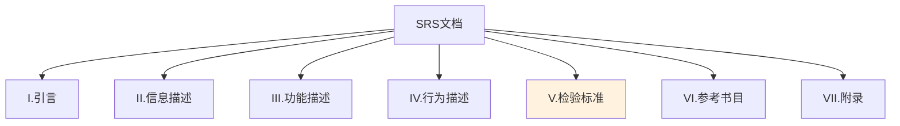

# 第3章-3.4-需求规约与验证

## 基本信息
- **课程**：软件工程
- **章节**：第3章 3.4节 需求规约与验证
- **日期**：2026-06-30
- **标签**：#需求工程 #需求规约 #需求验证 #SRS #IEEE830 #Balzer原则

---

## 重点内容

### ⭐⭐⭐ 核心概念
- **Balzer-Goldman八条规约原则**：从现实中分离功能、面向处理、包含大系统、包括运行环境、认识模型、可操作、允许不完备、局部化松耦合
- **SRS文档结构**：引言/信息描述/功能描述/行为描述/检验标准/参考书目/附录
- **需求验证方法**：需求审查、原型验证、测试用例生成、形式化验证

### ⭐⭐ 重要知识点
- **需求规约的定义**：分析任务的最终产物，包含完整信息描述、功能和行为描述、性能需求和设计约束
- **SRS文档七大组成部分**及其各自的功能
- **需求验证的七个检查内容**

### ⭐ 基本概念
- 需求规约可被视为一个"表示过程"
- 需求验证的目的是检验需求是否能够反映用户意愿
- 检验标准是"确认测试"的基础，往往最容易被忽略

---

## 详细笔记

### 一、需求规约的原则

> 📚 **课本出处**：第3章 3.4.1节"需求规约的原则"

需求规约可被视为一个表示过程，需求以最终导向软件成功实现的方式来表示。1979年，Balzer和Goldman提出了作出良好规约的**8条原则**：

1. **从现实中分离功能** —— 描述要"做什么"而不是"怎样实现"
2. **使用面向处理的规约语言** —— 讨论来自环境的各种刺激可能导致系统做出什么样的功能性反应，定义行为模型
3. **包含整个系统** —— 如果被开发软件只是一个基于计算机的系统中的一个元素，那么整个大系统也应包括在规格说明的描述之中
4. **必须包括系统运行环境**
5. **规约必须是认识模型** —— 而不是设计或实现的模型
6. **规约必须是可操作的** —— 利用它能够通过测试用例判断已提出的解决方案是否都能满足规约
7. **规约必须允许不完备性并允许扩充**
8. **规约必须局部化和松散耦合** —— 信息被修改时只需修改某个单个的段落，规约应被松散地构造以便容易加入和删去段落

> ⭐ **核心重点**：这8条原则虽然主要用于形式化规约语言，但对其他形式的规约也有参考价值，要结合实际环境来应用。

💡 **理解技巧**：8条原则可以分为三组理解——
- **内容层面**（1-4）：规定规约应该包含什么
- **性质层面**（5-7）：规定规约应该具有什么特征
- **结构层面**（8）：规定规约应该如何组织

---

### 二、需求规约

> 📚 **课本出处**：第3章 3.4.2节"需求规约"

软件需求规约是分析任务的**最终产物**，通过建立完整的信息描述、详细的功能和行为描述、性能需求和设计约束的说明、合适的验收标准，给出对目标软件的各种需求。

我国国家标准化局、IEEE以及美国国防部均已经提出了软件需求规约的候选格式。其中最知名的标准是**IEEE/ANSI 830-1993标准**。

#### SRS文档框架（IEEE/ANSI 830-1993）

| 编号 | 组成部分 | 主要内容 |
|:----:|:--------:|:---------|
| I | 引言 | A.系统参考文献 B.整体描述 C.软件项目约束 |
| II | 信息描述 | A.信息内容表示 B.信息流表示（数据流、控制流） |
| III | 功能描述 | A.功能划分 B.功能描述（处理说明、限制、性能、设计约束、支撑图） C.控制描述 |
| IV | 行为描述 | A.系统状态 B.事件和响应 |
| V | 检验标准 | A.性能范围 B.测试种类 C.期望的软件响应 D.特殊考虑 |
| VI | 参考书目 | 所有相关文档的引用 |
| VII | 附录 | 补充信息、表格数据、算法描述、图表等 |

#### 七个部分的详细说明

**1. 引言**
陈述软件目标，在基于计算机的系统语境内进行描述。

**2. 信息描述**
给出软件必须解决的问题的详细描述，记录信息内容、信息流和信息结构。

**3. 功能描述**
用以描述解决问题所需要的每个功能。其中包括：
- 为每个功能说明一个**处理过程**
- 叙述**设计约束**
- 叙述**性能特征**
- 用图形来形象地表示软件的整体结构和功能间的相互影响

**4. 行为描述**
用以描述作为外部事件和内部产生的控制特征的软件操作。

**5. 检验标准**
描述检验系统成功的标志——对系统进行什么样的测试，得到什么样的结果，就表示系统已经成功实现了。

> ⭐ **核心重点**：检验标准是"确认测试"的基础。这部分十分重要，但是往往又最容易被忽略。编制检验标准的过程隐含着对其他需求的检查，所以将时间和注意力集中到该部分内容是非常重要的。

**6. 参考书目**
包含对所有和该软件相关的文档的引用，包括其他软件工程文档、技术参考文献、厂商文献和标准。

**7. 附录**
包含规约的补充信息、表格数据、算法的详细描述、图表和其他材料。

---

### 三、需求验证

> 📚 **课本出处**：第3章 3.4.3节"需求验证"

需求验证的目的是要**检验需求是否能够反映用户的意愿**。

> ⚠️ **常见误区**：由于需求的变化往往使系统的设计和实现也跟着改变，所以由需求问题引起系统做变更的成本比修改设计或代码错误的成本大得多。因此，需求验证是必不可少的步骤。

#### 需求验证的七个检查内容

需求验证需要对需求文档中定义的需求执行多种检查。开发团队要对用户需求进行"遍访"，逐条解释需求含义。评审人员评审时往往需要检查以下内容：

1. **系统定义的目标**是否与用户的要求一致
2. **系统需求分析阶段提供的文档资料**是否齐全；文档中的描述是否完整、清晰、准确地反映了用户要求
3. 被开发项目的**数据流与数据结构**是否确定且充足
4. **主要功能**是否已包括在规定的软件范围之内，是否都已充分说明
5. 设计的**约束条件或限制条件**是否符合实际
6. 开发的**技术风险**是什么
7. 是否详细制定了**检验标准**，它们能否对系统定义进行确认

#### 需求验证的方法

| 验证方法 | 说明 | 适用场景 |
|:--------:|:-----|:---------|
| **需求审查（Review）** | 由专门人员按照规定严格检查需求文档 | 所有项目，最基本的方法 |
| **原型验证（Prototyping）** | 构建原型让用户实际体验，验证需求理解 | 需求不明确、用户难以表达时 |
| **测试用例生成** | 根据需求生成测试用例，反向检验需求的可测试性 | 确认需求是否可验证 |
| **形式化验证** | 使用数学方法证明需求的一致性和完备性 | 安全关键系统、高可靠性系统 |

> 💡 **理解技巧**：需求验证的方法可以按"严格程度"排列——需求审查（最基础） -> 原型验证（更直观） -> 测试用例生成（更系统） -> 形式化验证（最严格）。

#### 验证的参与人员

为保证软件需求定义的质量，验证应该由**专门的人员**来负责，参加人员包括：
- 分析人员
- 用户
- 开发部门的管理者
- 软件设计人员
- 实现人员
- 测试人员

评审结束应有负责人的**结论意见和签字**。

> ⚠️ **常见误区**：需求验证不可能发现所有的需求问题。用户需要描述出系统的操作过程，构想出如何让系统加入到他们的工作中去，这种抽象对于一个普通用户来说比较困难。因此，需求验证之后，对遗漏的补充以及对错误理解的更正更是不可避免的，因此需要进行**需求管理**。

---

## 总结

### Balzer-Goldman八条原则

| 类别 | 原则 | 核心含义 |
|:----:|:-----|:---------|
| 内容 | 从现实中分离功能 | 描述"做什么"而非"怎样实现" |
| 内容 | 使用面向处理的规约语言 | 定义行为模型 |
| 内容 | 包含整个系统 | 大系统应包括在描述之中 |
| 内容 | 包括运行环境 | 规约必须包括系统运行环境 |
| 性质 | 认识模型 | 不是设计或实现的模型 |
| 性质 | 可操作 | 能通过测试用例判断满足规约 |
| 性质 | 允许不完备 | 允许扩充 |
| 结构 | 局部化和松散耦合 | 修改只需改单个段落 |

### SRS文档七大组成部分

### 需求验证方法对比

| 方法 | 严格程度 | 成本 | 发现问题的能力 | 适用阶段 |
|:----:|:--------:|:----:|:--------------:|:---------|
| 需求审查 | 低 | 低 | 中 | 需求规约完成后 |
| 原型验证 | 中 | 中 | 高 | 需求获取/分析阶段 |
| 测试用例生成 | 中 | 中 | 中 | 需求规约完成后 |
| 形式化验证 | 高 | 高 | 高 | 安全关键系统 |

### 关键要点

1. **Balzer-Goldman原则**虽然源自形式化规约，但对所有需求规约都有指导意义
2. **SRS文档**是分析阶段的最终产物，其结构遵循IEEE/ANSI 830-1993标准
3. **检验标准**是最重要但也最容易被忽略的部分，编制检验标准的过程隐含着对其他需求的检查
4. **需求验证**不可发现所有问题，因此需要后续的需求管理来持续跟踪
5. 由需求问题引起的变更成本远大于设计或代码错误的变更成本，因此**早期验证至关重要**

---

## 疑问与思考

### ❓ 疑问与思考

**Q1: SRS文档七个部分各起什么作用？是否需要同等详细？**

💡 SRS文档七个部分各有侧重，不需要同等详细。**引言**明确软件目标和约束，是读者理解全文的起点；**信息描述**记录数据流和数据结构，是后续设计的基础；**功能描述**是核心，详细说明每个功能的处理过程；**行为描述**描述系统对外部事件的响应；**检验标准**为确认测试提供依据，往往最容易被忽略；**参考书目**和**附录**提供补充材料。实际项目中，**功能描述**和**检验标准**通常需要最详细的描述，附录和参考书目可适当简化。小项目的引言和行为描述也可以合并简化。

**Q2: 需求验证四种方法如何对比选择？**

💡 四种方法按严格程度递增排列：**需求审查**（最基础，由专人检查文档，成本低，适用于所有项目）；**原型验证**（构建可交互原型让用户体验，适用于需求不明确、用户难以表达时）；**测试用例生成**（根据需求生成测试用例，反向检验需求的可测试性，适用于确认需求是否可验证）；**形式化验证**（用数学方法证明一致性和完备性，成本最高，仅适用于安全关键系统）。实际项目中可根据风险和规模组合使用，多数项目以需求审查为主、原型验证为辅。

**Q3: "允许不完备性"与"可操作性"是否矛盾？如何平衡？**

💡 这两者并不矛盾，而是针对不同层面的要求。**可操作性**强调规约必须具体到能生成测试用例来检验解决方案；**允许不完备性**承认需求无法在初期完全确定，应预留扩展空间。平衡方式是：在已明确的需求部分做到可操作、可验证，在尚未确定的部分标注为待定项并预留扩展接口，随着项目推进逐步补全。这也是迭代开发的核心思想——先验证已确定的部分，再逐步完善。

### 💡 个人理解/技巧
- Balzer-Goldman八条原则的核心思想可以用"做什么而非怎么做"来概括
- SRS文档的七个部分中，"引言"和"检验标准"是最容易被低估的两个部分
- 需求验证不是一次性活动，而是一个持续过程——每次需求变更后都应重新验证
- 需求验证方法的选择取决于项目规模和风险：小项目用审查即可，安全关键系统需要形式化验证
- 课本特别强调"检验标准"，可以联想到软件测试——如果需求中没有明确的检验标准，测试时就无法判断系统是否满足需求

---

## 相关链接

### 关联章节
- [第3章-3.3-需求分析协商与建模](./第3章-3.3-需求分析协商与建模.md)
- [第3章-3.5-需求管理](./第3章-3.5-需求管理.md)
- 第13章-软件测试（确认测试的详细内容）
- 第16章-软件项目管理（配置管理技术）

---

## 检查清单

- [x] 已理解Balzer-Goldman八条规约原则
- [x] 已掌握SRS文档的七大组成部分
- [x] 已理解需求验证的目的和方法
- [x] 已掌握需求验证的七个检查内容
- [x] 已添加课本出处标注
- [x] 已记录重点标记和疑问

---

*笔记创建时间：2026-06-30*
