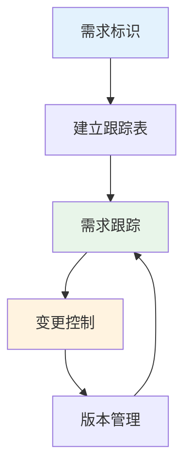
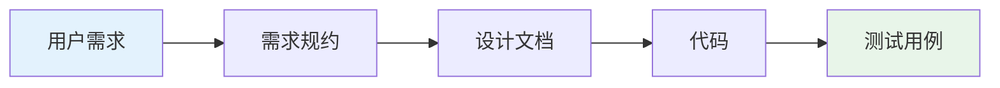
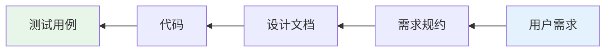
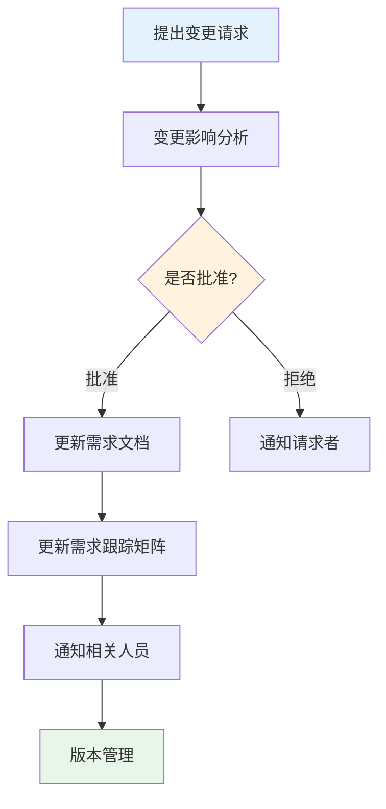

# 第3章-3.5-需求管理

## 基本信息
- **课程**：软件工程
- **章节**：第3章 3.5节 需求管理
- **日期**：2026-06-30
- **标签**：#需求工程 #需求管理 #需求跟踪 #需求变更 #版本管理 #配置管理

---

## 重点内容

### ⭐⭐⭐ 核心概念
- **需求管理的定义**：一组用于帮助项目组在项目进展中的任何时候去标识、控制和跟踪需求的活动
- **需求跟踪**：正向跟踪与逆向跟踪，建立和维护从用户需求到测试之间的一致性与完整性
- **需求跟踪矩阵**：记录需求与其他工作产品之间关系的工具

### ⭐⭐ 重要知识点
- **三种需求跟踪表**：特征跟踪表、来源跟踪表、依赖跟踪表
- **需求跟踪的两种方式**：正向跟踪（需求->后继产品）、逆向跟踪（后继产品->需求）
- **需求变更管理**：需求变更存在于开发过程和应用之后

### ⭐ 基本概念
- 每个需求被赋予**唯一标识符**
- 需求管理的很多内容和方法与**配置管理技术**相同
- 需求变更不仅存在于开发过程，还会出现在项目应用之后

---

## 详细笔记

### 一、需求管理概述

> 📚 **课本出处**：第3章 3.5节"需求管理"

软件系统的需求会变更，这些变更不仅会存在于项目开发过程，而且还会出现在项目已经付诸应用之后。

**需求管理的定义**：一组用于帮助项目组在项目进展中的任何时候去**标识、控制和跟踪**需求的活动。

> 💡 **理解技巧**：需求管理的三个关键词——"标识"（给需求编号）、"控制"（管理变更）、"跟踪"（追踪去向），构成了需求管理的核心活动。

需求管理的很多内容和方法都与本书第16章中的**配置管理技术**相同。

#### 需求管理活动流程

---

### 二、需求标识

在需求管理中，每个需求被赋予**唯一的标识符**。一旦标示出需求，就可以为需求建立跟踪表，每个跟踪表标示需求与其他需求或设计文档、代码、测试用例的不同版本间的关系。

#### 三种需求跟踪表

| 跟踪表类型 | 记录内容 | 作用 |
|:----------:|:---------|:-----|
| **特征跟踪表** | 需求如何与产品或系统特征相关联 | 追踪需求到系统特征 |
| **来源跟踪表** | 每个需求的来源 | 追溯需求的原始出处 |
| **依赖跟踪表** | 需求间如何关联 | 理解需求间的影响关系 |

---

### 三、需求跟踪

> 📚 **课本出处**：第3章 3.5节"需求管理"

这些跟踪表可以用于**需求跟踪**。在整个开发过程中，进行需求跟踪的目的是为了**建立和维护从用户需求开始到测试之间的一致性与完整性**。

#### 需求跟踪的核心目标

- 确保所有的实现都是以**用户需求为基础**
- 确保所有的输出符合**用户需求**
- 确保全面**覆盖了用户需求**

#### 两种跟踪方式

**1. 正向跟踪**

以**用户需求为切入点**，检查《需求规约》中的每个需求是否都能在后继工作产品中找到对应点。

**2. 逆向跟踪**

检查设计文档、代码、测试用例等工作产品是否都能在《需求规约》中找到**出处**。

> ⭐ **核心重点**：正向跟踪确保"需求都有实现"，逆向跟踪确保"实现都有依据"。两者结合才能保证需求的完整性和一致性。

#### 需求跟踪矩阵（RTM）

需求跟踪矩阵是实施需求跟踪的核心工具，通常包含以下信息：

| 需求ID | 需求描述 | 来源 | 设计文档 | 代码模块 | 测试用例 | 状态 |
|:------:|:---------|:-----|:---------|:---------|:---------|:----:|
| REQ-001 | 用户登录功能 | 客户访谈 | SD-001 | mod_auth | TC-001 | 已实现 |
| REQ-002 | 数据导出功能 | 竞品分析 | SD-002 | mod_export | TC-002 | 开发中 |

💡 **理解技巧**：需求跟踪矩阵就像一张"需求护照"——记录了需求从诞生到实现的全部旅程，每个阶段都能查到它的位置和状态。

---

### 四、需求变更管理

> 📚 **课本出处**：第3章 3.5节"需求管理"

软件系统的需求会变更，这些变更不仅会存在于项目开发过程，而且还会出现在项目已经付诸应用之后。

#### 变更控制流程

#### 变更控制的关键步骤

| 步骤 | 活动 | 说明 |
|:----:|:-----|:-----|
| 1 | 提出变更请求 | 任何项目相关人员均可提出 |
| 2 | 影响分析 | 评估变更对其他需求、设计、代码、测试的影响 |
| 3 | 审批决策 | 由变更控制委员会（CCB）决定是否批准 |
| 4 | 更新文档 | 批准后更新需求规约和相关文档 |
| 5 | 更新跟踪矩阵 | 同步更新需求跟踪矩阵 |
| 6 | 通知相关人员 | 确保所有受影响的人员了解变更 |

> ⚠️ **常见误区**：需求变更不是"坏事"，完全拒绝变更和无控制地接受变更都是错误的。关键在于通过规范的变更控制流程，确保变更是**可控的、可追溯的**。

#### 变更控制的必要性

- 需求变更会引起设计、代码、测试的连锁变化
- 没有变更控制，项目范围会无序膨胀（范围蔓延）
- 变更控制是保证软件质量的重要手段

---

### 五、版本管理

> 📚 **课本出处**：第3章 3.5节"需求管理"

版本管理是需求管理的重要组成部分，确保需求文档的不同版本可追溯。

#### 版本管理的核心内容

| 活动 | 说明 |
|:----:|:-----|
| **版本标识** | 每个需求规约版本有唯一的版本号 |
| **版本记录** | 记录每次变更的内容、原因和时间 |
| **版本对比** | 能够对比不同版本间的差异 |
| **版本回溯** | 能够回退到之前的版本 |

💡 **理解技巧**：版本管理可以类比Git——每个版本都有唯一的提交记录，可以查看历史、对比差异、回退版本。需求管理中的版本管理遵循同样的思想。

---

## 总结

### 需求管理核心活动

| 活动 | 目的 | 关键工具/方法 | 涉及内容 |
|:----:|:----:|:------------:|:---------|
| **需求标识** | 唯一标识每个需求 | 唯一ID编号 | 为每个需求分配唯一标识符 |
| **需求跟踪** | 维护一致性与完整性 | 跟踪矩阵 | 正向跟踪、逆向跟踪 |
| **变更控制** | 管理需求变更 | CCB审批流程 | 影响分析、审批、更新 |
| **版本管理** | 确保版本可追溯 | 版本号管理 | 版本标识、记录、对比 |

### 需求跟踪的两种方式对比

| 跟踪方式 | 起点 | 终点 | 检查目标 |
|:--------:|:----:|:----:|:---------|
| **正向跟踪** | 用户需求 | 后继工作产品 | 需求规约中的每个需求是否都有实现 |
| **逆向跟踪** | 后继工作产品 | 需求规约 | 每个工作产品是否都有需求依据 |

### 三种需求跟踪表对比

| 跟踪表 | 记录关系 | 回答的问题 |
|:------:|:---------|:-----------|
| **特征跟踪表** | 需求 <-> 系统特征 | 这个需求对应系统的哪些特征？ |
| **来源跟踪表** | 需求 <-> 来源 | 这个需求是谁提出的？从哪里来？ |
| **依赖跟踪表** | 需求 <-> 需求 | 这个需求与其他需求有什么关联？ |

### 关键要点

1. **需求管理的核心三要素**：标识（给需求编号）、控制（管理变更）、跟踪（追踪去向）
2. **需求跟踪**的目的是建立和维护从用户需求到测试的一致性与完整性
3. **正向跟踪**确保"需求都有实现"，**逆向跟踪**确保"实现都有依据"
4. **变更控制流程**是防止范围蔓延的关键手段
5. 需求管理与**配置管理**方法相通，许多内容可以复用

---

## 疑问与思考

### ❓ 疑问与思考

**Q1: RTM（需求跟踪矩阵）在实际项目中有什么作用？大规模项目如何维护？**

💡 RTM是需求管理的"中枢工具"，核心作用有三：一是**保证完整性**（正向跟踪确保每个需求都有设计、代码、测试对应）；二是**保证一致性**（逆向跟踪确保每个实现都有需求依据，没有多余功能）；三是**影响分析**（需求变更时快速定位受影响的设计、代码和测试）。大规模项目中维护成本确实较高，实践中通常采用自动化工具（如JIRA、DOORS）管理RTM，将需求ID与代码提交、测试用例自动关联，减少手工维护负担。关键是只记录到足够支撑影响分析的粒度，不必过度细化。

**Q2: 变更控制流程的关键步骤有哪些？小型项目是否需要正式的CCB？**

💡 变更控制流程包含六个步骤：（1）**提出变更请求**——任何相关人员均可提出；（2）**影响分析**——评估变更对需求、设计、代码、测试的连锁影响；（3）**审批决策**——由CCB决定是否批准；（4）**更新文档**——批准后同步更新需求规约和相关文档；（5）**更新跟踪矩阵**——确保RTM与实际一致；（6）**通知相关人员**——确保所有受影响人员了解变更。小型项目不需要正式的CCB委员会，但应指定一名负责人（如项目经理）行使审批职能，核心是确保变更**可控、可追溯**，流程可以轻量化但不能省略。

### 💡 个人理解/技巧
- 需求跟踪矩阵是需求管理的"中枢神经"——所有活动都围绕它展开
- "正向跟踪"和"逆向跟踪"可以类比为"自顶向下"和"自底向上"两种验证思路
- 变更控制流程的关键不在于"阻止变更"，而在于"让变更可控、可追溯"
- 版本管理的思想和Git非常相似——核心是可追溯性和可回退性
- 需求管理贯穿软件开发全过程，从需求获取到系统退役，是持续性的活动
- 课本指出需求验证之后"对遗漏的补充以及对错误理解的更正更是不可避免的"，这说明需求管理不是可选的，而是**必须的**

---

## 相关链接

### 关联章节
- [第3章-3.3-需求分析协商与建模](./第3章-3.3-需求分析协商与建模.md)
- [第3章-3.4-需求规约与验证](./第3章-3.4-需求规约与验证.md)
- 第16章-软件项目管理（配置管理技术的详细介绍）

---

## 检查清单

- [x] 已理解需求管理的定义和核心活动
- [x] 已掌握需求跟踪的两种方式（正向/逆向）
- [x] 已理解三种需求跟踪表的用途
- [x] 已掌握变更控制流程的步骤
- [x] 已理解版本管理的核心内容
- [x] 已添加课本出处标注
- [x] 已记录重点标记和疑问

---

*笔记创建时间：2026-06-30*
