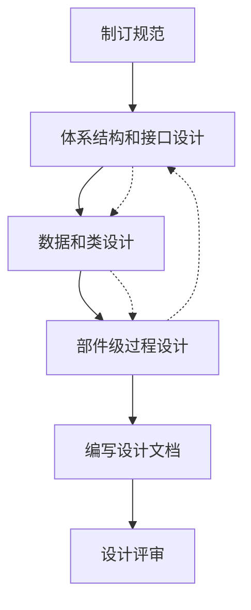
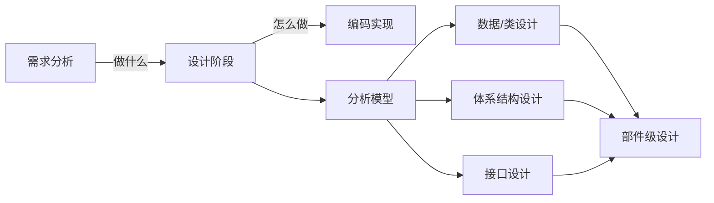

# 第4章-4.1-软件设计工程概述

## 基本信息
- **课程**：软件工程
- **章节**：第4章 4.1节 软件设计工程概述
- **日期**：2026-06-30
- **标签**：#软件设计 #设计任务 #设计目标 #设计过程 #体系结构 #接口设计

---

## 重点内容

### ⭐⭐⭐ 核心概念
- **设计的本质**：把软件需求变换成软件表示的过程，解决"怎么做"的问题
- **现代设计四大任务**：数据/类设计、体系结构设计、接口设计、部件级设计
- **设计是质量形成的阶段**：设计提供了可以用于质量评估的软件表示

### ⭐⭐ 重要概念
- **数据/类设计**：将分析模型变换成类的实现和数据结构，是设计成功的关键
- **体系结构设计**：定义软件整体结构，包括部件、属性和关系
- **接口设计**：描述软件内部、与协作系统之间、与人之间的通信方式
- **部件级设计**：将体系结构的结构性元素变换为过程性描述

### ⭐ 基础概念
- **设计目标3条**：实现所有需求、可读可理解、给出软件全貌
- **设计过程6步骤**：制订规范 -> 体系结构和接口设计 -> 数据/类设计 -> 部件级设计 -> 编写设计文档 -> 设计评审

---

## 详细笔记

### 一、软件设计的定位

软件设计开始于软件需求的分析和规约之后，位于软件工程过程中的**技术核心位置**，是把需求转化为软件系统的最重要环节。

> 📚 **课本出处**：第4章 引言部分

- **需求分析**解决"做什么"的问题
- **软件设计**解决"怎么做"的问题

早期的软件设计分为概要设计和详细设计：
- **概要设计**：将需求转换为数据结构、软件体系结构及其接口
- **详细设计**（部件级设计）：将体系结构中的结构性元素转换为软件部件的过程性描述，得到详细的数据结构和算法

现代的软件设计分为：数据/类设计、软件体系结构设计、接口设计和部件级设计。

---

### 二、软件设计的任务

软件设计的输入是**软件分析模型**。通过数据、功能和行为模型所展示的软件需求信息被传送给设计阶段，产生四种设计输出。

> 📚 **课本出处**：第4章 4.1节"软件设计的任务"

#### 1. 数据/类设计

数据/类设计将**分析类模型**变换成类的实现和软件实现所需要的**数据结构**。

- 数据来源：CRC（类-责任-协作者）、数据字典中描述的详细数据内容
- 部分数据设计与体系结构设计同时产生，更详细的数据结构在部件设计时产生

**数据设计过程**（两步）：
1. 为需求分析阶段确定的数据对象选择**逻辑表示**，对不同结构进行算法分析
2. 确定对逻辑数据结构所必需的**操作的程序模块**

> 💡 **理解技巧**：如果数据设计得好，往往能产生很好的软件系统结构，具有很强的模块独立性和较低的程序复杂性。"清晰的数据定义是软件开发成功的关键"。

#### 📷 图4.1 分析模型到软件设计的转化

> 📚 **课本出处**：图4.1 展示了分析模型中数据、功能、行为模型如何映射到数据/类设计、体系结构设计、接口设计、部件级设计

#### 2. 体系结构设计

体系结构设计定义了软件的**整体结构**，由软件部件、外部可见的属性和它们之间的关系组成。

- 可以从系统规约、分析模型和子系统交互导出
- 关于体系结构设计的概念和风格在4.3节中介绍

#### 3. 接口设计

接口设计描述了**软件内部、软件和协作系统之间以及软件同人之间**的通信方式。

接口设计包括3个方面：

| 接口类型 | 说明 |
|:--------:|:-----|
| 模块间接口 | 模块间传递的数据和程序设计语言的特性共同决定 |
| 外部接口 | 与外部实体之间的接口，起始于对每个外部实体的评估 |
| 人机接口 | 人（用户）与计算机间的交互，详见第11章 |

> ⚠️ **常见误区**：接口设计不仅是定义接口格式，还必须与模块内的数据验证和错误处理算法紧密相关。副作用往往通过程序接口传播。

#### 4. 部件级设计

部件级设计将软件体系结构的**结构性元素**变换为对软件部件的**过程性描述**。

- 从类为基础的模型、流模型、行为模型等获取信息
- 详细信息和工具在4.4节介绍

---

### 三、软件设计的目标

McGlanghlin给出了判断设计好坏的3条特征：

> 📚 **课本出处**：第4章 4.1节"软件设计的目标"

1. 设计必须实现分析模型中描述的所有**显式需求**，必须满足用户希望的所有**隐式需求**
2. 设计必须是**可读、可理解**的，使得将来易于编程、易于测试、易于维护
3. 设计应从实现角度出发，给出与数据、功能、行为相关的**软件全貌**

**衡量设计的技术标准**：

| 标准 | 说明 |
|:----:|:-----|
| 分层结构 | 建立软件成分之间的控制 |
| 模块化 | 从逻辑上将软件划分为完成特定功能或子功能的部件 |
| 数据和过程抽象 | 设计应同时包含两种抽象 |
| 独立功能特征 | 建立具有独立功能特征的模块 |
| 降低接口复杂性 | 降低模块与外部环境之间复杂连接 |
| 可驱动可重复 | 根据需求分析获取的信息，建立可驱动、可重复的方法 |

---

### 四、软件设计的过程

软件设计是一个把软件需求变换成软件表示的过程，分为**6个步骤**：

> 📚 **课本出处**：第4章 4.1节"软件设计的过程"

**步骤说明**：

1. **制订规范**：为软件开发组制订设计标准，包括阅读需求说明书、确定设计目标和优先级、选择设计方法、规定文档编制标准和命名规则等
2. **体系结构和接口设计**
3. **数据/类设计**
4. **部件级（过程）设计**
5. **编写设计文档**：编写设计文档、制订用户手册和初步的测试计划
6. **设计评审**

> 💡 **理解技巧**：步骤2-4是一个**迭代过程**。最初设计描绘可直接反映功能、数据、行为需求的软件整体框架，然后在框架中逐步填入细节，加工成非常接近于源程序的软件表示。

---

## 总结

### 设计四大任务对比

| 设计任务 | 输入 | 输出 | 关键点 |
|:--------:|:----:|:----:|:------|
| 数据/类设计 | 分析类模型、CRC | 数据结构、类实现 | "清晰的数据定义是成功的关键" |
| 体系结构设计 | 系统规约、分析模型 | 软件整体结构 | 定义部件、属性、关系 |
| 接口设计 | 外部实体评估 | 内部/外部/人机接口 | 注意数据验证和错误处理 |
| 部件级设计 | 各类分析模型 | 过程性描述 | 详细的数据结构和算法 |

### 设计过程要点

### 关键要点

1. **设计是质量形成的关键阶段**：设计提供了可以用于质量评估的软件表示
2. **概要设计与详细设计的区分**：概要设计关注整体结构，详细设计关注过程细节
3. **数据设计是基础**：好的数据设计能产生好的软件结构
4. **接口设计三方面**：模块间接口、外部接口、人机接口
5. **设计过程是迭代的**：从整体框架到逐步细化细节

---

## 疑问与思考

### ❓ 概要设计和详细设计的区别是什么？
> 💡 概要设计（对应体系结构设计）关注软件的**整体结构**——模块划分、模块间接口和数据流；详细设计（对应部件级设计）关注每个模块**内部的过程性描述**——具体的数据结构和算法。打个比方：概要设计相当于画建筑的楼层平面图（哪些房间、怎么连通），详细设计相当于每个房间的水电施工图（管道走线、接线方式）。在现代设计中，概要设计被拆分为数据/类设计、体系结构设计和接口设计三个子任务。

### ❓ 设计的4个模型之间是什么关系？
> 💡 4个设计模型都来源于**分析模型**，但各有侧重：**数据/类设计**从分析类模型出发，产出数据结构和类实现，是设计成功的基础；**体系结构设计**从系统规约和分析模型出发，定义软件整体结构（部件及其关系）；**接口设计**描述模块间、系统间、人机间的通信方式；**部件级设计**将体系结构中的结构元素细化为过程性描述。其中数据/类设计、体系结构设计、接口设计大致对应传统的概要设计阶段，部件级设计对应详细设计阶段。四者在实践中是**迭代进行**的，不是严格的先后顺序。

### 💡 个人理解/技巧
- 设计阶段的四大任务可以类比建房子：数据设计=选材、体系结构设计=画蓝图、接口设计=设计门窗管道、部件级设计=室内装修
- "需求分析=做什么，软件设计=怎么做"这个区分在考试中经常考到
- 现代设计4个任务与传统概要设计/详细设计的对应关系：数据/类设计+体系结构设计+接口设计对应概要设计，部件级设计对应详细设计
- 设计过程6步中，前4步是核心技术工作，后2步是管理保障工作

---

## 相关链接

### 本节相关图片
- [图4.1 分析模型到软件设计的转化](../../../images/9b0e4defe8a9e4c06d6bae8647e94be20b68085d808e137250acc5f71d670aca.jpg)

### 关联章节
- [第4章-设计工程](./第4章-设计工程.md)
- [第4章-4.2-软件设计原则](./第4章-4.2-软件设计原则.md)
- [第3章-需求工程](../../第3章-需求工程/第3章-需求工程.md)

---

## 检查清单

- [x] 已理解软件设计的四大任务及各自职责
- [x] 已理解设计目标的3条特征和技术标准
- [x] 已掌握设计过程的6个步骤
- [x] 已插入课本原图（图4.1）
- [x] 已记录重点标记
- [x] 已添加课本出处标注

---

*笔记创建时间：2026-06-30*
