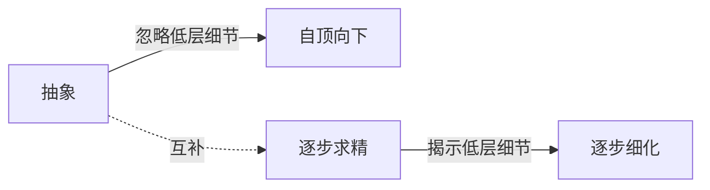
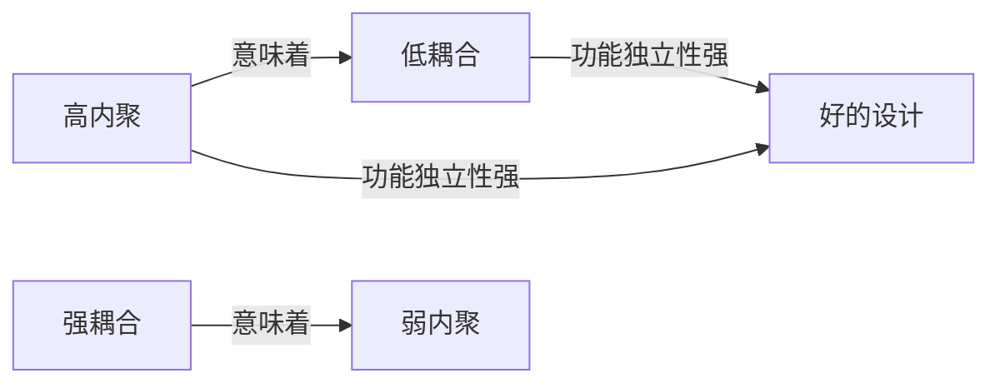

# 第4章-4.2-软件设计原则

## 基本信息
- **课程**：软件工程
- **章节**：第4章 4.2节 软件设计原则
- **日期**：2026-06-30
- **标签**：#设计原则 #抽象 #逐步求精 #模块化 #信息隐藏 #功能独立 #耦合 #内聚

---

## 重点内容

### ⭐⭐⭐ 核心概念
- **四大设计原则**：抽象与逐步求精、模块化、信息隐藏、功能独立
- **模块化核心论据**：将复杂问题分解成可管理的片断会使解决问题更加容易
- **功能独立的衡量指标**：内聚度（模块内部紧密程度）和耦合度（模块间依赖程度）
- **最优设计标准**：高内聚、低耦合

### ⭐⭐ 重要概念
- **过程抽象 vs 数据抽象**：过程抽象将操作视为单一实体，数据抽象定义类型和操作并限定取值范围
- **模块大小存在最优范围M**：过小导致接口复杂度增加，过大导致理解困难
- **信息隐藏**：模块的实现细节对其他模块隐蔽，但模块间必须交换的信息不隐藏
- **内聚7级与耦合7级**：从低到高的分类体系

### ⭐ 基础概念
- **抽象**：从特殊到一般，上层概念是下层概念的抽象
- **逐步求精**：把问题求解过程分解成若干步骤，每一步比上一步更精化

---

## 详细笔记

### 一、抽象与逐步求精

> 📚 **课本出处**：第4章 4.2.1节"抽象与逐步求精"

#### 1. 抽象

抽象是在软件设计的规模逐渐增大的情况下，**控制复杂性**的基本策略。

- "抽象"是一个心理学概念，要求人们将注意力集中在某一层次上，忽略低层次的细节
- 抽象的过程是从**特殊到一般**的过程
- 上层概念是下层概念的抽象，下层概念是上层概念的精化和细化

**软件工程中每一步都是对较高一级抽象的解进行一次具体化的描述**：

| 阶段 | 抽象级别 | 说明 |
|:----:|:--------:|:-----|
| 系统定义 | 最高 | 整个软件系统作为基于计算机系统的一个组成部分 |
| 需求分析 | 较高 | 对问题域的抽象，使用问题域中的术语 |
| 体系结构设计 | 中等 | 将需求映射到软件结构 |
| 部件级设计 | 较低 | 细化到具体部件 |
| 编码 | 最低 | 生成源代码 |

**两种主要抽象手段**：

- **过程抽象**（功能抽象）：任何一个完成明确定义功能的操作都可被使用者当作单个实体看待，尽管它实际上是由一系列更低级的操作来完成的
- **数据抽象**：定义数据类型和施加于该类型对象的操作，并限定了对象的取值范围，只能通过这些操作修改和观察数据

> 💡 **理解技巧**：Ada的程序包机制是对数据抽象和过程抽象的双重支持。过程抽象是"把复杂操作当一个黑盒"，数据抽象是"把数据和操作封装在一起"。

#### 2. 逐步求精

逐步求精是人类解决复杂问题的基本技术之一。

- 把问题的求解过程分解成若干步骤或阶段
- 每一步都比上一步更精化，更接近问题的解法
- 为了能集中精力解决主要问题而尽量推迟问题细节的考虑

**抽象与逐步求精的关系**：

- **抽象**使得设计者能够描述过程和数据而忽略低层细节
- **逐步求精**有助于设计者在设计过程中揭示低层细节
- 二者是**一对互补的概念**

---

### 二、模块化

> 📚 **课本出处**：第4章 4.2.2节"模块化"

在计算机软件领域中，几乎所有的软件结构设计技术都是以**模块化**为基础的。

**模块化的定义**：把软件按照规定原则，划分为一个个较小的、相互独立的但又相互关联的部件。模块化实际上是**系统分解和抽象**的过程。

**模块的含义**：数据说明、可执行语句等程序对象的集合，是单独命名的，可以通过名字来访问。例如：对象类、构件、过程、函数、子程序、宏等。

#### 模块的特征

| 特征 | 说明 |
|:----:|:-----|
| 外部特征 | 名字、参数、功能 |
| 内部特征 | 完成模块功能的程序代码和模块内部数据 |

> 💡 **理解技巧**：对使用者来说，最感兴趣的是模块的功能和接口，而不必理解模块内部的结构和原理。这就是"信息隐藏"的思想基础。

#### 模块化的数学论据

设 $C(x)$ 是描述问题 $x$ 复杂性的函数，$E(x)$ 是解决问题 $x$ 所需工作量的函数。

> 📚 **课本出处**：第4章 4.2.2节"模块化"

**核心不等式**：

$$
C(p_1 + p_2) > C(p_1) + C(p_2) \tag{4.2}
$$

这意味着 $p_1$ 和 $p_2$ 组合后的复杂性比单独考虑每个问题时的复杂性要大。由此推出：

$$
E(p_1 + p_2) > E(p_1) + E(p_2) \tag{4.3}
$$

📌 **考试重点**：不等式(4.3)表达了一个对于模块化和软件具有十分重要意义的结论 -- **将复杂问题分解成可以管理的片断会使解决问题更加容易**。这就是模块化的论据。

#### 模块大小的最优范围

模块不是越小越好。随着模块数量的增长，模块之间的接口复杂程度和集成模块所需的工作量也在增长。

#### 📷 图4.2 模块大小、模块数目与费用的关系

> 📚 **课本出处**：图4.2 展示了存在一个模块数量的范围M可以导致最小的开发成本，但无法确切地预测M

**关键结论**：
- 当模块变得越小，每个模块花费的工作量越低
- 当模块数增加时，模块间的联系增加，连接这些模块的工作量也增加
- 存在一个模块数量的范围 $M$ 可以导致最小的开发成本
- 无法确切地预测 $M$

#### 模块化的好处

- 程序错误通常局限在有关的模块及它们之间的接口中
- 模块化使软件容易调试和测试，有助于提高软件的**可靠性**
- 变动往往只涉及少数几个模块，提高软件的**可修改性**
- 使软件结构清晰，易于阅读和理解

---

### 三、信息隐藏

> 📚 **课本出处**：第4章 4.2.3节"信息隐藏"

**核心思想**：每个模块的实现细节对于其他模块来说应该是隐蔽的。

由Parnas提倡的信息隐蔽原则：

- 模块中所包含的信息（包括数据和过程）**不允许**其他不需要这些信息的模块使用
- 有效的模块化通过定义一组独立的模块来实现，这些模块相互间的通信仅使用**必要的信息**
- 应该隐藏的不是模块的一切信息，而是**模块的实现细节**

**信息隐蔽的价值**：

- 通过抽象，帮助人们确定组成软件的过程或信息实体
- 通过信息隐蔽，定义和实施对模块的过程细节和局部数据结构的**存取限制**
- 软件在整个生存期内要经过多次修改，信息隐蔽使得修改时引入的错误局限在一个或几个模块内部

> ⚠️ **常见误区**：信息隐藏不是说模块的所有信息都不让其他模块知道，而是隐藏实现细节。模块之间必须交换的功能性信息是正常暴露的。

---

### 四、功能独立

> 📚 **课本出处**：第4章 4.2.4节"功能独立"

功能独立是指模块的功能独立性：在设计程序模块时，使得模块实现**独立的功能**并且与其他模块的**接口简单**，符合信息隐蔽原则，模块间关联和依赖程度尽可能小。

**功能独立的来源**：是模块化、抽象概念和信息隐藏的**直接结果**。

**功能独立的衡量指标**：

| 指标 | 含义 | 理想状态 |
|:----:|:-----|:--------:|
| 内聚度 | 同一模块内部各元素彼此结合的紧密程度 | 越高越好 |
| 耦合度 | 不同模块彼此间相互依赖的紧密程度 | 越低越好 |

功能独立的模块的优点：
- 功能被分隔，接口简单，易于实现
- 功能单一，符合信息隐蔽原则，与其他模块关联和依赖程度小，易于维护
- 修改代码而引起的副作用小

---

### 五、内聚（Cohesion）

> 📚 **课本出处**：第4章 4.2.4节"功能独立-内聚"

内聚是一个模块内部各个元素彼此结合的紧密程度的度量。一个内聚程度高的模块应当**只做一件事**。

#### 📷 图4.3 内聚的种类

> 📚 **课本出处**：图4.3 展示了7种内聚类型的从低到高的层级关系，高端最好，中端可接受，低端一般不能使用

**7种内聚类型（从低到高）**：

| 类型 | 说明 | 评价 |
|:----:|:-----|:----:|
| 巧合内聚（偶然内聚） | 将几个模块中没有明确表现出独立功能的相同代码段独立出来 | 很不好 |
| 逻辑内聚 | 完成一组逻辑相关任务的模块，调用时由控制型参数确定执行哪种功能 | 很不好 |
| 时间内聚 | 模块中所有任务必须在同一时间段内执行（如初始化模块、终止模块） | 可接受 |
| 过程内聚 | 模块完成多个任务，这些任务必须按指定的过程执行 | 可接受 |
| 通信内聚 | 模块内所有处理元素都集中在某个数据结构的一块区域中 | 可接受 |
| 顺序内聚 | 模块完成多个功能，这些功能必须顺序执行 | 较好 |
| 功能内聚 | 模块中各个部分都是为完成一项具体功能而协同工作，紧密联系，不可分割 | 最好 |

📌 **考试重点**：一般情况下应追求**功能内聚**，至少应达到**通信内聚**以上。巧合内聚和逻辑内聚一般不能使用。

---

### 六、耦合（Coupling）

> 📚 **课本出处**：第4章 4.2.4节"功能独立-耦合"

耦合是模块之间的相对独立性（互相连接的紧密程度）的度量。耦合取决于：
- 各个模块之间**接口的复杂程度**
- **调用模块的方式**
- 通过接口的**信息类型**

#### 📷 图4.4 耦合的种类

> 📚 **课本出处**：图4.4 展示了7种耦合类型从低到高的层级关系，非直接耦合最好，内容耦合最差

**7种耦合类型（从高到低，从差到好）**：

| 类型 | 说明 | 评价 |
|:----:|:-----|:----:|
| 内容耦合 | 一个模块直接访问另一个模块内部数据；或不通过正常入口转到另一模块内部；或代码重叠；或多个入口 | 最差 |
| 公共耦合 | 一组模块都访问同一个公共数据环境（全局数据结构、共享通信区、公共覆盖区等） | 很差 |
| 外部耦合 | 模块间通过软件之外的环境联结（如I/O将模块耦合到特定设备、格式、协议） | 较差 |
| 控制耦合 | 一个模块传送给另一个模块的参数中包含控制信息，用于控制接收模块的执行逻辑 | 较差 |
| 标记耦合 | 两个模块之间通过参数表传递一个数据结构的一部分（如子结构） | 可接受 |
| 数据耦合 | 两个模块之间仅通过参数表传递简单数据 | 较好 |
| 非直接耦合 | 两个模块之间没有直接关系，任何一个都不依赖于另一个而能独立工作 | 最好 |

📌 **考试重点**：设计时应追求**非直接耦合**或**数据耦合**，尽量避免**内容耦合**和**公共耦合**。

---

### 七、内聚与耦合的关系

> 📚 **课本出处**：第4章 4.2.4节末尾

模块之间的连接越紧密、联系越多，耦合性就越高，功能独立性就越弱。

一个模块内部各个元素之间的联系越紧密，内聚性就越高，与其他模块之间的耦合性就会降低，功能独立性就越强。

**关键结论**：
- 功能独立性比较强的模块应是**高内聚低耦合**的模块
- 耦合与内聚都是功能独立性的定性标准
- **耦合是直接的主导因素**，内聚则辅助耦合共同对功能独立性进行衡量

---

## 总结

### 内聚7级分类表

| 级别 | 内聚类型 | 定义 | 评价 |
|:----:|:--------:|:-----|:----:|
| 1 | 巧合内聚 | 无明确独立功能的相同代码段 | 很不好 |
| 2 | 逻辑内聚 | 一组逻辑相关任务，由参数控制 | 很不好 |
| 3 | 时间内聚 | 同一时间段内执行的任务 | 可接受 |
| 4 | 过程内聚 | 按指定过程执行的多个任务 | 可接受 |
| 5 | 通信内聚 | 处理元素集中在同一数据结构区域 | 可接受 |
| 6 | 顺序内聚 | 必须顺序执行的多个功能 | 较好 |
| 7 | 功能内聚 | 为完成一项功能协同工作 | 最好 |

### 耦合7级分类表

| 级别 | 耦合类型 | 定义 | 评价 |
|:----:|:--------:|:-----|:----:|
| 1 | 非直接耦合 | 无直接关系，可独立工作 | 最好 |
| 2 | 数据耦合 | 仅传递简单数据 | 较好 |
| 3 | 标记耦合 | 传递数据结构的一部分 | 可接受 |
| 4 | 控制耦合 | 传递控制信息，影响执行逻辑 | 较差 |
| 5 | 外部耦合 | 通过外部环境联结 | 较差 |
| 6 | 公共耦合 | 访问同一公共数据环境 | 很差 |
| 7 | 内容耦合 | 直接访问内部数据或代码 | 最差 |

### 设计原则对比

| 原则 | 核心思想 | 解决的问题 | 实现手段 |
|:----:|:--------:|:----------:|:--------:|
| 抽象与逐步求精 | 从特殊到一般，逐步细化 | 控制复杂性 | 过程抽象、数据抽象 |
| 模块化 | 分而治之，分解为独立模块 | 降低理解难度 | 合理划分模块 |
| 信息隐藏 | 隐藏实现细节 | 降低修改影响 | 限制存取权限 |
| 功能独立 | 高内聚低耦合 | 提高可维护性 | 优化内聚度和耦合度 |

### 关键要点

1. **抽象与逐步求精是互补的**：抽象忽略细节，求精揭示细节
2. **模块化存在最优规模M**：不是越小越好，需平衡开发成本和接口成本
3. **信息隐藏保护实现细节**：使修改错误的影响局限在模块内部
4. **内聚和耦合是衡量功能独立性的两个维度**：内聚看模块内部，耦合看模块之间
5. **耦合是主导因素**：在功能独立性衡量中，耦合是直接的主导因素
6. **最终目标**：高内聚、低耦合的设计

---

## 疑问与思考

### ❓ 耦合和内聚的7级排序是怎样的？
> 💡 **内聚7级（从低到高）**：巧合内聚 -> 逻辑内聚 -> 时间内聚 -> 过程内聚 -> 通信内聚 -> 顺序内聚 -> 功能内聚。功能内聚最好（模块只做一件事），巧合内聚最差（随机拼凑）。**耦合7级（从低到高）**：非直接耦合 -> 数据耦合 -> 标记耦合 -> 控制耦合 -> 外部耦合 -> 公共耦合 -> 内容耦合。非直接耦合最好（无直接关系），内容耦合最差（直接访问内部数据）。记忆口诀：内聚看"模块做的事是否相关"，耦合看"模块间传递的东西有多复杂"。设计目标是**高内聚、低耦合**。

### ❓ 模块大小怎么判断？
> 💡 课本指出存在一个模块数量的**最优范围M**使总开发成本最低（见图4.2），但无法确切预测M。实际开发中的经验准则：一个函数/方法建议控制在**30-50行代码**以内（多数编码规范的建议），超过100行应考虑拆分。不同语言有差异：Python/JavaScript倾向更短的函数（因为动态类型需要更清晰的职责划分），Java/C++因为类型声明较多可以稍长。判断模块大小是否合适的核心标准是：**模块是否只做一件事**（功能内聚）以及**能否用一句话描述模块的功能**。

### ❓ 信息隐藏和封装有什么区别和联系？
> 💡 **信息隐藏**是一个**设计原则**（由Parnas提出），强调模块的实现细节应对其它模块隐蔽，只暴露必要的接口。**封装**是面向对象语言中实现信息隐藏的**技术手段**，通过`private`/`protected`等访问修饰符来限制外部对内部数据和方法的访问。简单说：信息隐藏是"应该隐藏什么"的原则，封装是"如何隐藏"的实现机制。封装一定是信息隐藏的一种实现方式，但信息隐藏不限于OOP封装——C语言通过模块化设计和`static`关键字也能实现信息隐藏。OOP的封装比传统信息隐藏更进一步，因为它把**数据和操作绑定**在一起。

### 💡 个人理解/技巧
- 内聚的7个级别可以按"模块做的事情是否相关"来记忆：巧合=随机拼凑、逻辑=分类选择、时间=同一时刻、过程=有顺序、通信=同一数据、顺序=先后依赖、功能=只做一件事
- 耦合的7个级别可以按"模块间传递的东西有多复杂"来记忆：非直接=没有连接、数据=传个值、标记=传个结构、控制=传个信号、外部=传到外部、公共=用同一个、内容=直接打开
- 耦合和内聚的关系可以理解为：模块内部越团结（高内聚），对外依赖就越少（低耦合），就像一个自给自足的社区
- 信息隐藏 vs 封装：信息隐藏是原则（应该隐藏什么），封装是实现手段（如何隐藏）。OOP中的private关键字就是封装机制，它实现了信息隐藏原则
- 模块化的数学论据（不等式4.3）常出现在考试中，要记住：组合后的复杂性大于单独复杂性之和
- 实际开发中，大多数系统在数据耦合到标记耦合之间、通信内聚到顺序内聚之间是可接受的

---

## 相关链接

### 本节相关图片
- [图4.2 模块大小、模块数目与费用的关系](../../../images/6bd9903ba75e884a01bde218c57fc3a46da1b4a6758cfed85bba528c66d49607.jpg)
- [图4.3 内聚的种类](../../../images/014befc0dcecff2a4bcde18009e8958e796804d0eadc58918cc135205f8d4ca2.jpg)
- [图4.4 耦合的种类](../../../images/464edb9482a8222f326715694ac30aacbbb46ad7d70a4614cf4b3ed611483163.jpg)

### 关联章节
- [第4章-设计工程](./第4章-设计工程.md)
- [第4章-4.1-软件设计工程概述](./第4章-4.1-软件设计工程概述.md)
- 第4章-4.3-软件体系结构设计（待创建）
- 第7章-面向对象方法基础（待创建）

---

## 检查清单

- [x] 已理解抽象与逐步求精的概念及其互补关系
- [x] 已掌握模块化的数学论据和最优规模概念
- [x] 已理解信息隐藏的核心思想
- [x] 已掌握内聚7级分类及各自的定义
- [x] 已掌握耦合7级分类及各自的定义
- [x] 已理解内聚与耦合的关系
- [x] 已插入课本原图（图4.2、图4.3、图4.4）
- [x] 已记录重点标记
- [x] 已添加课本出处标注

---

*笔记创建时间：2026-06-30*
