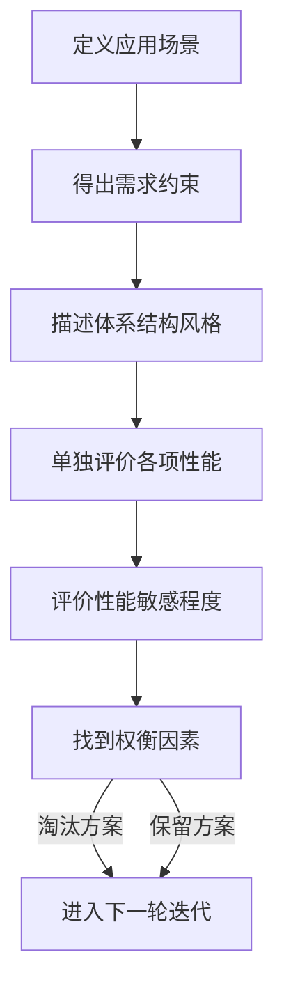

# 第4章-4.3-软件体系结构设计

## 基本信息
- **课程**：软件工程
- **章节**：第4章 4.3节 软件体系结构设计
- **日期**：2026-06-30
- **标签**：#软件体系结构 #架构风格 #C/S #B/S #管道过滤器 #层次式

---

## 重点内容

### ⭐⭐⭐ 核心概念
- **软件体系结构定义**：包含软件部件、部件的对外可见性质及它们之间的关系
- **体系结构重要性3个关键理由**（Bass）：方便交流、前期决策、可传递的抽象
- **体系结构风格**：管道-过滤器、数据为中心、调用返回、面向对象、层次式

### ⭐⭐ 重要概念
- **结构发展过程**：单主机 -> C/S -> B/S（3层/多层）
- **B/S结构三层**：客户层、服务器层、数据层
- **ATAM评估方法**：体系结构权衡分析法，迭代评价过程

### ⭐ 基础概念
- 体系结构不是可运行的软件，是一种更高层次的分析表示
- 每种风格包含4个要素：功能部件、连接件、系统约束、语义模型

---

## 详细笔记

### 一、体系结构概述

软件体系结构关注系统的一个或多个结构，包含**软件部件**、这些部件的**对外可见的性质**以及它们之间的**关系**。

> 📚 **课本出处**：第4章 4.3节"软件体系结构设计"

**体系结构重要性的3个关键理由**（Bass提出）：

| 序号 | 理由 | 说明 |
|:----:|:----:|:-----|
| 1 | 方便利益相关人员的交流 | 借助体系结构进行理解、协商、达成共识 |
| 2 | 有利于系统设计的前期决策 | 对竞争问题进行优先级分析，影响后续所有工程工作 |
| 3 | 建立系统的可传递抽象 | 相对较小、易于理解掌握的模型，描述系统构成和部件协作 |

> 💡 **理解技巧**：如果把软件比作楼房，体系结构设计就如同设计楼房的类型（高层还是多层）、电梯的位置、房间朝向等。体系结构并非是可运行的软件，而是使设计师能在更高层次分析"设计"是否满足需求的一种表示。

---

### 二、体系结构发展过程（4.3.1）

> 📚 **课本出处**：第4章 4.3.1节"体系结构发展过程"

#### 1. 单主机结构

- 客户界面、数据和程序集中在主机上
- 通常只支持一个用户操作
- 不需要考虑多用户并发问题，结构简单

#### 2. 客户/服务器（C/S）结构

- 应用程序处理由客户机和服务器分担
- 处理请求通常被关系型数据库处理
- 客户机接收数据后实现显示和业务逻辑
- 系统支持模块化开发，通常有GUI界面

**优点**：灵活性强，应用广泛

**不足**：客户端程序需要在每个客户机上部署，系统扩展性存在不足

#### 3. 浏览器/服务器（B/S）结构 —— 3层/多层计算

| 层次 | 名称 | 功能 | 典型应用 |
|:----:|:----:|:-----|:---------|
| 客户层 | Client Tier | 处理用户接口和用户请求 | 网络浏览器 |
| 服务器层 | Server Tier | 处理Web服务和运行业务代码 | Web应用服务器 |
| 数据层 | Data Tier | 处理关系型数据库和其他后端数据资源 | Oracle、SAP R/3 |

> ⭐ **核心重点**：3层结构中，客户（请求信息）、程序（处理请求）和数据（被操作）被**物理地隔离**。

**3层结构的优势**：

- 把显示逻辑从业务逻辑中分离出来，业务代码独立
- 业务逻辑层处于中间层，不需要关心由谁显示数据
- 更好的**移植性**，可跨不同平台工作
- 允许用户请求在多个服务器间进行**负载平衡**
- **安全性**更易实现，应用程序已同客户隔离

---

### 三、软件体系结构风格（4.3.2）

> 📚 **课本出处**：第4章 4.3.2节"软件体系结构的风格"

绝大多数系统可归类为相对小数量的体系结构风格之一。每种风格描述一种系统范畴，包含4个要素：

1. 实现系统所需的**功能部件**（如数据库、计算模块）
2. 连接部件的**连接件**（通信、协调和合作）
3. 定义部件整合方式的**系统约束**
4. 使设计者理解整个系统属性的**语义模型**

#### 1. 数据为中心的体系结构

一些数据（文件或数据库）保存在结构的中心，被其他部件频繁使用、添加、删除、修改。

#### 📷 图4.5 数据为中心的体系结构

> 📚 **课本出处**：图4.5 展示了以数据为中心的体系结构，数据存储位于中心，多个客户端部件围绕数据存储进行读写操作

**变种**：将存储中心变换为"黑板"，当数据变化时由黑板向客户端部件发送通知。

**特点**：现有客户端部件可以被修改，新的数据可以方便地加入系统而无需考虑其他客户。

#### 2. 数据流风格的体系结构（管道-过滤器）

适用于输入数据被一系列计算或处理部件变换成输出数据的场景。

#### 📷 图4.6 数据流风格的体系结构

> 📚 **课本出处**：图4.6 展示了由管道和过滤器组成的数据流风格体系结构，过滤器之间由传送数据的管道联通

**核心特征**：

| 组件 | 角色 | 说明 |
|:----:|:----:|:-----|
| 过滤器 | 处理部件 | 接收特定形式的预期数据输入，产生数据输出 |
| 管道 | 连接件 | 在过滤器之间传送数据 |

- 每个过滤器在上下管道间**独立工作**
- 过滤器不需要知道相邻过滤器如何工作
- 如果数据流退化成一条流水线变换，就叫做**连续批处理**

#### 3. 调用和返回风格的体系结构

使设计者设计出非常容易修改和扩充的体系结构。包含两种子风格：

**（1）主程序/子程序风格**

面向结构化分析与设计方法，把功能分解为控制层次，反映模块的相互调用关系。

#### 📷 图4.7 主程序/子程序风格体系结构

> 📚 **课本出处**：图4.7 展示了主程序/子程序的层次调用关系，顶层模块调用下层模块，逐层分解

**（2）远程过程调用风格**

是主程序/子程序风格的扩展，被主程序调用的部件分布在网络上不同的计算机中。

#### 4. 面向对象风格的体系结构

- 系统部件**封装数据和操作数据的方法**
- 部件之间的交互和协调通过**消息传递**来实现

#### 5. 层次式风格的体系结构

#### 📷 图4.8 层次式风格的体系结构

> 📚 **课本出处**：图4.8 展示了层次式风格的体系结构，每层完成相对外层更靠近机器指令的操作

**核心特征**：

- 定义不同的层次，每层完成相对外层更靠近机器指令的操作
- 最外层：向用户提供**接口操作**
- 最内层：使用**系统接口**
- 每个中间层都是对内层接口的**封装**

> 💡 **理解技巧**：层次式体系结构的经典实例就是操作系统和网络协议栈（如TCP/IP协议栈），每一层只需要知道相邻层的接口。

> 📌 **考试重点**：多种风格可以**组合使用**。例如，一个层次式体系结构可以被组合到以数据为中心的体系结构中。

---

### 四、评估可选的体系结构（4.3.3）

> 📚 **课本出处**：第4章 4.3.3节"评估可选的体系结构"

对于同一个软件需求，由于设计方法原理不同，会导出不同的软件结构。

#### 📷 图4.9 同一问题的不同软件结构

> 📚 **课本出处**：图4.9(a) 同一问题的不同软件组织结构之一

> 📚 **课本出处**：图4.9(b) 同一问题的不同软件组织结构之二

> 📚 **课本出处**：图4.9(c) 同一问题的不同软件组织结构之三

#### ATAM（体系结构权衡分析法）

卡耐基-梅隆大学软件工程研究所（SEI）建立的迭代评价过程，6个步骤：

| 步骤 | 内容 | 说明 |
|:----:|:-----|:-----|
| 1 | 定义应用场景 | 通过use case图从用户角度表现系统 |
| 2 | 得出需求、约束和环境描述 | 确定所有客户方关心的问题 |
| 3 | 描述体系结构风格 | 能处理上述场景和需求的风格 |
| 4 | 单独评价各项性能 | 可靠性、安全性、可维护性、灵活性、可测试性、可移植性、可重用性、互操作性 |
| 5 | 评价性能敏感程度 | 通过小变更确定**敏感点**（sensitive point） |
| 6 | 找到权衡因素 | 确定**权衡点**（trade-off point），改变该项系统很多性能会发生敏感变化 |

> ⭐ **核心重点**：6个步骤代表ATAM的第一轮迭代。经过第5步和第6步分析，一些备选方案被淘汰，剩下的进入下一轮迭代。

**内聚与耦合**：

- 模块内聚度和耦合度是判断结构好坏的主要标准
- 设计初步结构后应审查分析，通过模块分解或合并，力求**降低耦合、提高内聚**
- 多个模块公有的子功能可独立成一个模块，由这些模块调用
- 通过分解或合并模块可减少信息传递，降低接口复杂性

---

## 总结

### 体系结构发展过程

| 结构 | 特点 | 优势 | 不足 |
|:----:|:-----|:-----|:-----|
| 单主机 | 集中在主机，单用户 | 结构简单 | 不支持并发 |
| C/S | 客户机/服务器分担处理 | 灵活，模块化，GUI | 需在每台客户机部署 |
| B/S（3层） | 客户层/服务器层/数据层 | 移植性好，负载均衡，安全性好 | — |

### 体系结构风格对比表

| 风格 | 核心特征 | 连接方式 | 典型场景 | 优势 |
|:----:|:---------|:---------|:---------|:-----|
| 数据为中心 | 数据存储在中心 | 共享数据 | 数据库应用 | 新客户可方便加入 |
| 管道-过滤器 | 数据流依次变换 | 管道 | 数据处理、编译 | 过滤器独立，易扩展 |
| 过程调用 | 层次调用关系 | 过程调用 | 传统程序 | 结构清晰，易修改 |
| 面向对象 | 封装数据和方法 | 消息传递 | OO系统 | 封装性好，复用性强 |
| 层次式 | 分层封装 | 层间接口 | 操作系统、协议栈 | 层间独立，易维护 |

### ATAM评估流程

### 关键要点

1. **体系结构不是可运行软件**：是更高层次的设计表示
2. **Bass的3个关键理由**：交流、前期决策、可传递抽象
3. **3层B/S结构的优势**：显示逻辑与业务逻辑分离，移植性好，安全性好
4. **5种主要风格**：数据为中心、管道-过滤器、调用返回、面向对象、层次式
5. **ATAM迭代评估**：通过敏感点和权衡点筛选方案，多轮迭代
6. **风格可组合使用**：如层次式+数据为中心

---

## 疑问与思考

### ❓ 5种体系结构风格各自适合什么场景？如何对比选择？
> 💡 **数据为中心**适合数据频繁共享的场景（如数据库应用），优势是新客户端可自由加入而无需改动其他部分；**管道-过滤器**适合数据流依次变换的场景（如编译器、Unix shell管道），过滤器独立工作易扩展，但不擅长交互式应用；**调用返回（主程序/子程序）**适合传统结构化程序，层次调用结构清晰；**面向对象**适合需要高复用和灵活扩展的系统，封装性好但对象间消息传递可能带来性能开销；**层次式**适合需要分层抽象的系统（如OS、协议栈），每层只依赖相邻层接口。选择时需考虑：数据是共享还是流转、是否需要并行处理、系统规模和变更频率。实际中多种风格常**组合使用**。

### ❓ ATAM评估方法的6个步骤具体是怎样的？
> 💡 ATAM（Architecture Tradeoff Analysis Method）是卡耐基-梅隆大学SEI提出的体系结构评估方法，6个步骤为：
> 1. **定义应用场景**：通过use case从用户角度描述系统行为
> 2. **得出需求、约束和环境描述**：明确客户关心的所有问题
> 3. **描述体系结构风格**：说明候选架构采用的风格及其组合
> 4. **单独评价各项性能**：逐项评估可靠性、安全性、可维护性、灵活性等8个质量属性
> 5. **评价性能敏感程度**：通过小规模变更识别**敏感点**（对某个性能影响特别大的设计决策）
> 6. **找到权衡因素**：识别**权衡点**（修改后会导致多个性能同时变化的设计决策）
>
> 6步完成后是**第一轮迭代**，淘汰不满足条件的方案，保留的方案进入下一轮迭代进一步细化评估。核心价值在于通过敏感点和权衡点的分析，在多个互相矛盾的质量属性间做出合理取舍。

### 💡 个人理解/技巧
- 体系结构风格的本质是对系统组件组织方式的"约定"，选择哪种风格取决于需求特征和约束条件
- C/S到B/S的演变本质上是**客户端的瘦化**：从胖客户端（C/S）到瘦客户端（B/S），把业务逻辑从客户端移到服务器
- 层次式风格的最大好处是**封装**：每层只需知道相邻层的接口，修改某层不影响其他层
- ATAM是迭代的：第一轮筛选后，对剩余方案进行进一步设计修改，再评估，逐步逼近最佳方案

---

## 相关链接

### 本节相关图片
- [图4.5 数据为中心的体系结构](../../../images/50caacc95013e2c3a4afc61b40c4de378421f87037e832145b02c3d6084e60e6.jpg)
- [图4.6 数据流风格的体系结构](../../../images/855672bffdcb9bacd560ffde8de40544c8231c79efedbca9e35c258e4475c469.jpg)
- [图4.7 主程序/子程序风格体系结构](../../../images/88a7ef2620d182c56f4eea1e946248cc75c6e44e96aa261a6b53391bfe0e7631.jpg)
- [图4.8 层次式风格的体系结构](../../../images/efc7a512f910f2bf270f7d63dcde6db7368dd5b64a1f219e8a287af781cd5968.jpg)
- [图4.9 同一问题的不同软件结构(a)](../../../images/d1c79482ea25b58fa0820952612c909f41c6730c03883dab50cd7b3aae4b0e7f.jpg)
- [图4.9 同一问题的不同软件结构(b)](../../../images/77b27841aaca2b2bd6829e7e87a090f4c6322cae65ef4e0dcf710c1c318ddcc4.jpg)
- [图4.9 同一问题的不同软件结构(c)](../../../images/67c0ba99c7b70700d0465d50861db348fa5f1e045f6f7e6fc1dd04a6af218eba.jpg)

### 关联章节
- 第4章-4.1-设计工程概述（待创建）
- 第4章-4.2-软件体系结构设计（待创建）
- [第4章-4.4-部件级设计技术](./第4章-4.4-部件级设计技术.md)
- [第4章-4.5-设计规约与设计评审](./第4章-4.5-设计规约与设计评审.md)

---

## 检查清单

- [x] 已理解体系结构的定义和3个关键理由
- [x] 已理解单主机/C/S/B/S三种结构的发展过程
- [x] 已掌握5种主要体系结构风格
- [x] 已理解ATAM评估方法的6个步骤
- [x] 已插入课本原图（图4.5~图4.9）
- [x] 已记录重点标记
- [x] 已添加课本出处标注
- [x] 已创建疑问与思考
- [x] 已创建总结表格和脑图

---

*笔记创建时间：2026-06-30*
