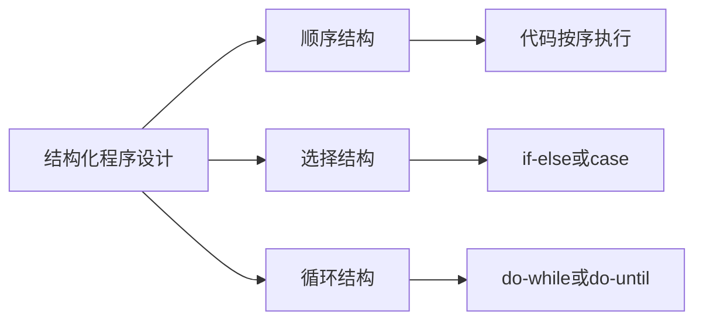
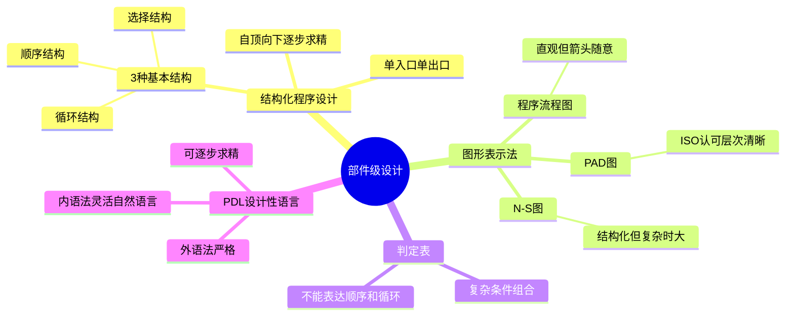

# 第4章-4.4-部件级设计技术

## 基本信息
- **课程**：软件工程
- **章节**：第4章 4.4节 部件级设计技术
- **日期**：2026-06-30
- **标签**：#部件级设计 #结构化程序设计 #流程图 #N-S图 #PAD图 #判定表 #PDL

---

## 重点内容

### ⭐⭐⭐ 核心概念
- **结构化程序设计**：只用顺序、选择、循环3种基本控制结构，每个代码块单入口单出口
- **3种图形表示法**：程序流程图、N-S图（盒图）、PAD图
- **判定表**：清晰表达复杂条件组合与动作的对应关系
- **PDL设计性语言**：具有关键字外语法和自然语言内语法的伪码

### ⭐⭐ 重要概念
- **结构化程序设计的实质**：不是无goto编程，而是使代码容易阅读和理解
- **Dijkstra的贡献**：程序质量和goto语句数量成反比
- **3种图形表示法各有优劣**：流程图直观但箭头随意，N-S图结构化但复杂时很大，PAD图层次清晰

### ⭐ 基础概念
- 部件级设计是编码的先导，直接影响程序质量
- 5种基本控制结构：顺序、选择、先判定循环、后判定循环、多情况选择

---

## 详细笔记

### 一、部件级设计概述

> 📚 **课本出处**：第4章 4.4节"部件级设计技术"

在不同分析设计方法中，**部件**对应不同的名称：

| 开发方法 | 部件名称 |
|:--------:|:--------:|
| 结构化分析和设计 | 模块 |
| 面向对象分析和设计 | 类 |
| 基于构件的开发 | 构件 |

**部件级设计的任务**：在软件体系结构设计基础上，考虑"怎样实现"系统，对每个部件给出足够详细的**过程性描述**。

部件级设计主要完成的3项工作：

1. 为每个部件确定采用的**算法**，编写详细的过程性描述
2. 确定每一部件内部使用的**数据结构**
3. 把结果写入**部件级设计说明书**，通过复审形成正式文档

> ⭐ **核心重点**：部件级设计是编码的先导，设计文档的质量直接影响程序质量。对于功能较简单的系统，可以跳过部件级设计直接编码。

---

### 二、结构化程序设计方法（4.4.1）

> 📚 **课本出处**：第4章 4.4.1节"结构化程序设计方法"

#### 1. 历史背景

| 时间 | 人物 | 贡献 |
|:----:|:----:|:-----|
| 1965年 | E.W. Dijkstra | 提出"可以从高级语言中消除goto语句"，"程序质量和goto语句数量成反比" |
| 1966年 | Bohm & Jacopomo | 证明只用3种基本控制结构就能实现任何单入口单出口程序 |
| 1972年 | Mills | 补充了"程序应该只有一个人口和一个出口" |

#### 2. 结构化程序设计的定义

> ⭐⭐⭐ **核心定义**：如果一个程序的代码块仅仅通过**顺序、选择和循环**这3种基本控制结构进行联结，并且每个代码块**只有一个入口和一个出口**，则称这个程序是结构化的。

**3种基本控制结构**：



**实质理解**：

- 结构化程序设计的实质**并不是**无goto语句的编程方法
- 而是一种使程序代码**容易阅读、容易理解**的编程方法
- 采用**自顶向下、逐步求精**的设计方法
- 符合抽象和分解的原则

**优缺点**：

| 优点 | 缺点/注意事项 |
|:-----|:-------------|
| 提高可读性 | 可能多占用时间和空间资源 |
| 提高可维护性 | 随着硬件发展，这点消耗已微不足道 |
| 提高可验证性 | 对效率要求严格的系统可做适当修正 |
| 提高软件生产率 | 更现实的途径可能是自顶向下与自底向上结合 |

---

### 三、图形表示法（4.4.2）

> 📚 **课本出处**：第4章 4.4.2节"图形表示法"

描述部件执行过程的3种方式：**图形描述**、**语言描述**和**表格描述**。

图形描述包括：程序流程图、盒图（N-S图）、问题分析图（PAD）。

#### 1. 程序流程图

**特点**：独立于任何程序设计语言，比较直观、清晰、易于学习和掌握。

**缺点**：

- 使用符号不够规范，常常使用习惯性用法
- 表示控制流程的箭头可以不受约束、随意转移控制

> ⚠️ **常见误区**：为了描述结构化程序，必须限制流程图只能使用5种基本控制结构，不允许随意画出不规范的流程图。

#### 📷 图4.10 流程图的5种基本控制结构


> 📚 **课本出处**：图4.10(a) 顺序型控制结构


> 📚 **课本出处**：图4.10(b) 选择型控制结构


> 📚 **课本出处**：图4.10(c) 先判定型循环（do-while），先判断条件再执行循环体


> 📚 **课本出处**：图4.10(d) 后判定型循环（do-until），先执行循环体再判断条件


> 📚 **课本出处**：图4.10(e) 多情况选择型（case型），根据表达式值选择执行分支

#### 📷 图4.11 嵌套构成的流程图实例


> 📚 **课本出处**：图4.11 展示了由5种基本控制结构组合和嵌套构成的程序流程图实例

#### 2. N-S图（盒图）

由 Nassi 和 Shneiderman 提出，符合结构化程序设计原则的图形描述工具。

#### 📷 图4.12 N-S图的5种基本控制结构


> 📚 **课本出处**：图4.12(a) N-S图的顺序型控制结构


> 📚 **课本出处**：图4.12(b) N-S图的选择型控制结构


> 📚 **课本出处**：图4.12(c) N-S图的先判定型循环


> 📚 **课本出处**：图4.12(c) N-S图的先判定型循环结构补充


> 📚 **课本出处**：图4.12(d) N-S图的后判定型循环


> 📚 **课本出处**：图4.12(e) N-S图的多分支选择型

#### 📷 图4.13 N-S图的实例


> 📚 **课本出处**：图4.13 将图4.11的流程图转换为N-S图表示

**N-S图的特点**：

- 任何N-S图都是5种基本控制结构相互组合与嵌套的结果
- 当问题很复杂时，N-S图可能很大

#### 3. PAD图（Problem Analysis Diagram）

由日本日立公司提出，由程序流程图演化而来，已被**ISO认可**。

#### 📷 图4.14 PAD的基本控制结构


> 📚 **课本出处**：图4.14(a) PAD的顺序型控制结构


> 📚 **课本出处**：图4.14(b) PAD的选择型控制结构


> 📚 **课本出处**：图4.14(c) PAD的先判定型循环（对应do-while）


> 📚 **课本出处**：图4.14(c) PAD先判定型循环补充


> 📚 **课本出处**：图4.14(d) PAD的后判定型循环（对应do-until）


> 📚 **课本出处**：图4.14(e) PAD的多分支选择型

#### 📷 图4.15 PAD实例


> 📚 **课本出处**：图4.15 将图4.11程序用PAD表示，层次关系表现在纵线上

**PAD图的特点**：

- PAD所描述程序的**层次关系表现在纵线上**
- 每条纵线表示一个层次，PAD图从左到右展开
- 随着程序层次增加，PAD逐渐**向右展开**
- 执行顺序：从最左主干线的上端开始，自上而下执行；遇到判断或循环则自左而右进入下一层

---

### 四、判定表（4.4.3）

> 📚 **课本出处**：第4章 4.4.3节"判定表"

当算法中包含**多重嵌套的条件选择**时，用流程图、N-S图或PAD都不易清楚描述，而判定表能清晰表达复杂的条件组合与应做动作之间的对应关系。

#### 📷 图4.16 不包含多分支结构的流程图实例


> 📚 **课本出处**：图4.16 将多分支判断改为二分支判断后的流程图实例

#### 📷 图4.17 反映程序逻辑的判定表


> 📚 **课本出处**：图4.17 展示了与图4.16流程图对应的判定表

**判定表的结构**：

| 区域 | 内容 | 说明 |
|:----:|:-----|:-----|
| 左上 | 条件桩 | 列出所有条件 |
| 右上 | 条件项 | 列出所有条件组合的取值（T/F/空白） |
| 左下 | 动作桩 | 列出所有可能的动作 |
| 右下 | 动作项 | 在各条件组合下需执行的动作（Y/空白） |

> ⭐ **核心重点**：判定表右半部的每一列实质上是一条**规则**，规定了与特定条件组合取值相对应的动作。

**判定表的优点**：能够**简洁、无二义性**地描述所有的处理规则。

**判定表的局限**：

- 表示的是**静态逻辑**，不能表达加工的顺序
- 不能表达**循环结构**
- 因此不能成为一种通用的设计工具

---

### 五、设计性语言PDL（4.4.4）

> 📚 **课本出处**：第4章 4.4.4节"设计性语言PDL"

**PDL（Program Design Language）**：一种用于描述功能部件的算法设计和处理细节的语言，是一种**伪码**。

**PDL的语法结构**：

| 语法类型 | 特点 | 内容 |
|:--------:|:-----|:-----|
| 外语法 | 严格的关键字 | 定义控制结构和数据结构，关键字一律大写 |
| 内语法 | 灵活自由 | 使用自然语言词汇描述实际操作和条件 |

**PDL示例**：

```
PROCEDURE spellcheck IS          ;查找错拼的单词
BEGIN
  split document into single words    ;把整个文档分离成单词
  load up words in dictionary         ;在字典中查这些单词
  display words which are not in dictionary  ;显示字典中查不到的单词
  create a new dictionary             ;造一新字典
END spellcheck
```

> 📚 **课本出处**：第4章 4.4.4节 PDL使用示例

**PDL的特点**：

1. 有固定的**关键字外语法**，提供全部结构化控制结构、数据说明和部件特征
2. **内语法使用自然语言**，只要写清楚即可，利于把精力放在描述算法逻辑上
3. 有**数据说明机制**，包括简单的（标量和数组）与复杂的（链表和层次结构）数据结构
4. 有**子程序定义与调用机制**，用以表达各种方式的接口说明

**PDL的优势**：

- 可做到**逐步求精**：从比较概括和抽象的PDL程序起，逐步写出更详细更精确的描述
- 有些情况下可利用软件工具将PDL自动转换成某种程序语言的源程序

---

## 总结

### 3种图形表示法对比表

| 特性 | 程序流程图 | N-S图（盒图） | PAD图 |
|:----:|:----------:|:------------:|:-----:|
| **发明者/来源** | 传统方法 | Nassi & Shneiderman | 日本日立公司 |
| **是否结构化** | 需限制为5种结构 | 天然结构化 | 天然结构化 |
| **直观性** | 直观、清晰 | 较直观 | 层次清晰 |
| **可读性** | 好（简单时） | 复杂时很大 | 从左到右展开 |
| **控制流程** | 箭头可随意（缺点） | 无箭头，嵌套表示 | 纵线表示层次 |
| **嵌套表示** | 用虚线辅助 | 天然嵌套 | 向右展开 |
| **ISO标准** | 否 | 否 | 是 |
| **适合场景** | 快速草图、简单逻辑 | 中等复杂度 | 复杂层次结构 |
| **主要缺点** | 箭头不受约束 | 复杂时图很大 | 不太直观 |

### 判定表适用场景

| 场景 | 是否适用 | 说明 |
|:-----|:--------:|:-----|
| 多重嵌套条件选择 | 适用 | 最能发挥优势 |
| 复杂条件组合与动作对应 | 适用 | 简洁无二义性 |
| 需要表达加工顺序 | 不适用 | 判定表不能表达顺序 |
| 需要表达循环结构 | 不适用 | 判定表不能表达循环 |
| 通用设计 | 不适用 | 是静态逻辑，非通用工具 |

### 知识点脑图



### 关键要点

1. **部件级设计 = 编码的先导**：设计文档质量直接影响程序质量
2. **3种基本控制结构**：顺序、选择、循环，实现任何单入口单出口程序
3. **流程图箭头不受约束**是最大缺点；N-S图天然结构化但复杂时很大；PAD图层次清晰且被ISO认可
4. **判定表适合复杂条件组合**，但不能表达顺序和循环
5. **PDL = 严格外语法 + 灵活内语法**，支持逐步求精和自动转换

---

## 疑问与思考

### ❓ 流程图、N-S图、PAD图三者的核心区别是什么？
> 💡 三者最本质的区别在于**对控制流的约束方式**：流程图用箭头连接，最自由但也最容易画出非结构化的"面条代码"；N-S图用嵌套方框，天然强制结构化但复杂时图会很大且无法局部修改；PAD图用纵线表示层次，从左到右展开，兼具结构化约束和良好的层次可读性，且已被ISO认可。选择建议：流程图适合快速沟通草图，N-S图适合教学中理解结构化思想，PAD图适合复杂层次结构的详细设计文档。

### ❓ 判定表的适用场景是什么？为什么不能替代流程图？
> 💡 判定表最适合描述**多重嵌套的条件选择**——当条件组合很多时，流程图/N-S图/PAD图都会变得很复杂，而判定表能简洁、无二义性地列出所有条件组合与对应动作。但判定表的局限在于：它是**静态逻辑**，不能表达加工的**顺序**和**循环结构**，因此不能成为通用的设计工具。实际使用中，判定表通常与流程图配合：用判定表描述复杂的条件判断逻辑，用流程图描述整体的处理流程和顺序。

### ❓ PDL与普通伪代码有什么本质区别？
> 💡 PDL与普通伪代码的关键区别在于PDL有**严格的关键字外语法**（如PROCEDURE、BEGIN、END、IF-THEN-ELSE等一律大写），而普通伪代码没有统一语法规范。严格外语法的价值在于：（1）可被工具解析，支持**自动转换**为实际程序代码；（2）正文结构清晰，便于阅读和分割；（3）支持**逐步求精**——从概括性的PDL描述逐步细化为精确的实现。内语法则使用自然语言，让设计者把精力放在算法逻辑而非语法细节上。这种"外严内松"的设计使PDL成为设计到编码之间的理想过渡工具。

### 💡 个人理解/技巧
- 三种图形表示法的本质区别在于**对控制流的约束方式**：流程图用箭头（最自由），N-S图用嵌套框（最严格），PAD图用纵线层次（中间）
- 判定表最大的优势是"无二义性"——每个条件组合对应什么动作一目了然，不存在歧义
- PDL的"外语法+内语法"设计很巧妙：外语法保证结构清晰可解析，内语法保证描述灵活易编写
- 结构化程序设计的思想远比"去掉goto"更深刻——核心是**逐步求精、自顶向下**的分解方法

---

## 相关链接

### 本节相关图片
- [图4.10 流程图的5种基本控制结构](../../../images/7edf0b4445d78947587109c811ce9bff40da176963e0b090b06c54168cad365f.jpg)
- [图4.11 嵌套构成的流程图实例](../../../images/9f51219d2b36a7ff951aed7f9f3a5784e8bed28f7a9db98bfabd6cbd63595aa6.jpg)
- [图4.12 N-S图的5种基本控制结构](../../../images/938c7980faff129c16be4f10815763b5fab275d6f35e600cc4855b553eb0a91b.jpg)
- [图4.13 N-S图的实例](../../../images/3b6dd5723fcbbde8e7243e7122b12b81c819a006531b074357baa3b4b92aca4a.jpg)
- [图4.14 PAD的基本控制结构](../../../images/93ac220f45dc81c8de3ccbe2716d782b1b6d11b0b2664a12c940a0310b0f298e.jpg)
- [图4.15 PAD实例](../../../images/e9275aa2fdbfc2ff114dd6950deea599de60dfa3ec4b31cc6e4a4ace1e90af7f.jpg)
- [图4.16 不包含多分支结构的流程图实例](../../../images/b7095b7be1ecb3b3b38176b93582f9ce74f28e3d9c3e9076ad4b26a207063430.jpg)
- [图4.17 反映程序逻辑的判定表](../../../images/f7abdb8c5a35afa556d4a6ad361b3cf7421bd8695bb4fb49e93253dc035aa19a.jpg)

### 关联章节
- [第4章-4.3-软件体系结构设计](./第4章-4.3-软件体系结构设计.md)
- [第4章-4.5-设计规约与设计评审](./第4章-4.5-设计规约与设计评审.md)

---

## 检查清单

- [x] 已理解结构化程序设计的定义和3种基本控制结构
- [x] 已掌握流程图、N-S图、PAD图三种表示法
- [x] 已理解判定表的结构和优缺点
- [x] 已理解PDL外语法与内语法的特点
- [x] 已插入课本原图（图4.10~图4.17）
- [x] 已记录重点标记
- [x] 已添加课本出处标注
- [x] 已创建疑问与思考
- [x] 已创建总结表格和脑图

---

*笔记创建时间：2026-06-30*
