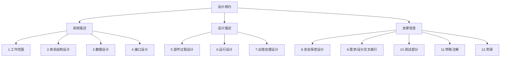

# 第4章-4.5-设计规约与设计评审

## 基本信息
- **课程**：软件工程
- **章节**：第4章 4.5节 设计规约与设计评审
- **日期**：2026-06-30
- **标签**：#设计规约 #设计评审 #文档 #评审标准 #正式评审 #非正式评审

---

## 重点内容

### ⭐⭐⭐ 核心概念
- **设计规约**：软件设计阶段的主要输出，包含12个部分的大纲结构
- **设计评审10项内容**：可追溯性、接口、风险、实用性、技术清晰度、可维护性、质量、选择方案、限制、其他具体问题
- **正式评审 vs 非正式评审**：正式评审邀请用户代表和领域专家，采用答辩形式

### ⭐⭐ 重要概念
- **设计规约框架**（表4.1）：工作范围、体系结构设计、数据设计、接口设计、部件过程设计、运行设计、出错处理、安全保密、交叉索引、测试、注解、附录
- **最佳方案**：在所有候选方案中，就节省费用、降低消耗、缩短时间等条件选择最优

### ⭐ 基础概念
- 设计规约需要逐步完成各章节内容
- 设计评审目的是防止问题遗留到开发后期阶段

---

## 详细笔记

### 一、设计规约（4.5.1）

> 📚 **课本出处**：第4章 4.5.1节"设计规约"

软件设计阶段的主要输出是**设计规约**。我国国家标准局和IEEE都提出了软件设计规约（以及其他软件工程文档）的候选格式。

#### 设计规格说明大纲（表4.1）

> 📚 **课本出处**：表4.1 软件设计规格说明的大纲

| 编号 | 部分名称 | 子内容 |
|:----:|:--------:|:-------|
| 1 | 工作范围 | A.系统目标 B.运行环境 C.主要软件需求 D.设计约束/限制 |
| 2 | 体系结构设计 | A.数据流与控制流复审 B.导出的程序结构 C.功能与程序交叉索引 |
| 3 | 数据设计 | A.数据对象与形成的数据结构 B.文件和数据库结构（逻辑结构、逻辑记录描述、访问方式） C.全局数据 D.文件/数据与程序交叉索引 |
| 4 | 接口设计 | A.人机界面规格说明 B.人机界面设计规则 C.外部接口设计（外部数据接口、外部系统或设备接口） D.内部接口设计规则 |
| 5 | 各部件的过程设计 | A.处理与算法描述 B.接口描述 C.设计语言描述 D.使用的部件 E.内部程序逻辑描述 F.注释/约束/限制 |
| 6 | 运行设计 | A.运行部件组合 B.运行控制 C.运行时间 |
| 7 | 出错处理设计 | A.出错处理信息 B.出错处理对策（设置后备、性能降级、恢复和再启动） |
| 8 | 安全保密设计 | — |
| 9 | 需求/设计交叉索引 | — |
| 10 | 测试部分 | A.测试方针 B.集成策略 C.特殊考虑 |
| 11 | 特殊注解 | — |
| 12 | 附录 | — |

> 💡 **理解技巧**：设计规约的大纲可以分为3大块理解：
> - **前4部分**（工作范围、体系结构、数据、接口）描述系统"做什么"和"怎么组织"
> - **中间3部分**（部件过程设计、运行设计、出错处理）描述系统"怎么运行"
> - **后5部分**（安全、索引、测试、注解、附录）是支撑和补充信息

> ⭐ **核心重点**：设计人员在细化软件设计时，应逐步完成各章节内容的编写，而不是一次性写完。每完成一个设计决策，就记录到对应的章节中。

**设计规约各部分详解**：

#### 1. 工作范围

描述软件系统的基本边界和目标：

- **系统目标**：软件要达到的总体目标
- **运行环境**：硬件、软件、网络等环境要求
- **主要软件需求**：从需求规约中提取的关键需求
- **设计约束/限制**：对设计施加的限制条件

#### 2. 体系结构设计

将需求转化为软件结构：

- **数据流与控制流复审**：检查数据和控制信息的流向
- **导出的程序结构**：从分析模型导出的模块结构
- **功能与程序交叉索引**：功能需求与程序模块的对应关系

#### 3. 数据设计

定义系统中使用的数据：

- **数据对象与形成的数据结构**：定义主要数据对象及其组织方式
- **文件和数据库结构**：包括逻辑结构、逻辑记录描述和访问方式
- **全局数据**：跨模块共享的数据定义
- **文件/数据与程序交叉索引**：数据与使用它们的程序的对应关系

#### 4. 接口设计

描述系统与外界的交互：

- **人机界面**：用户界面规格说明和设计规则
- **外部接口**：与外部系统或设备的数据接口
- **内部接口**：模块之间的接口设计规则

#### 5. 各部件的过程设计

每个部件的详细设计（这是部件级设计的核心输出）：

- 处理与算法描述、接口描述、设计语言描述
- 使用的部件、内部程序逻辑描述
- 注释/约束/限制

#### 6-7. 运行设计与出错处理

- **运行设计**：运行部件组合、运行控制、运行时间
- **出错处理**：出错信息和处理对策（设置后备、性能降级、恢复和再启动）

#### 8-12. 补充部分

安全保密设计、需求/设计交叉索引、测试部分、特殊注解和附录。

---

### 二、设计评审（4.5.2）

> 📚 **课本出处**：第4章 4.5.2节"设计评审"

软件设计的最终目标是要取得**最佳方案**。"最佳"是指在所有候选方案中，就节省开发费用、降低资源消耗、缩短开发时间等条件，选择能够赢得较高的生产率、较高的可靠性和可维护性的方案。

> ⭐ **核心重点**：各个时期的设计结果需要经过一系列的设计质量评审，以便**及时发现和及时解决**在软件设计中出现的问题，**防止把问题遗留到开发的后期阶段**。

#### 设计评审10项内容

| 序号 | 评审内容 | 关注点 |
|:----:|:--------:|:-------|
| 1 | 可追溯性 | 设计是否覆盖所有需求，每成分是否可追溯到某项需求 |
| 2 | 接口 | 内部/外部接口是否明确定义，是否满足高内聚低耦合 |
| 3 | 风险 | 在现有技术和预算条件下是否能按时实现 |
| 4 | 实用性 | 对需求的解决方案是否实用 |
| 5 | 技术清晰度 | 设计是否以易于翻译成代码的形式表达 |
| 6 | 可维护性 | 是否考虑了方便未来的维护 |
| 7 | 质量 | 是否表现出良好的质量特征 |
| 8 | 各种选择方案 | 是否考虑过其他方案，比较标准是什么 |
| 9 | 限制 | 对软件的限制是否现实，是否与需求一致 |
| 10 | 其他具体问题 | 文档、可测试性、设计过程等的评估 |

> 💡 **理解技巧**：10项评审内容可以归纳为3个维度：
> - **需求满足维度**：可追溯性、实用性、限制（设计是否满足需求）
> - **设计质量维度**：接口、技术清晰度、可维护性、质量（设计本身质量如何）
> - **项目管理维度**：风险、选择方案、其他问题（从项目角度评估可行性）

#### 评审方式

| 评审方式 | 特点 | 参与人员 | 形式 |
|:--------:|:-----|:---------|:-----|
| **正式评审** | 正式、规范 | 软件开发人员 + 用户代表 + 领域专家 | 答辩形式 |
| **非正式评审** | 同行切磋 | 软件开发人员（同行） | 不拘泥于时间和形式 |

**正式评审流程**：

1. 设计人员对设计方案进行**详细说明**
2. 答复与会者的**问题**
3. 记下各种重要的**评审意见**
4. 根据评审意见修改设计

**非正式评审**：

- 有些同行切磋的性质
- 不拘泥于时间和形式
- 适合日常开发中的快速反馈

---

## 总结

### 设计规约12部分结构

### 设计评审3个维度

| 维度 | 包含的评审项 | 核心问题 |
|:----:|:------------|:---------|
| 需求满足 | 可追溯性、实用性、限制 | 设计是否满足了需求？ |
| 设计质量 | 接口、技术清晰度、可维护性、质量 | 设计本身质量如何？ |
| 项目管理 | 风险、选择方案、其他问题 | 项目可行吗？还有别的方案吗？ |

### 关键要点

1. **设计规约是设计阶段的主要输出**：包含12个部分，逐步编写完成
2. **交叉索引是关键**：需求/设计交叉索引、功能/程序交叉索引确保可追溯性
3. **设计评审的目的是防患于未然**：防止问题遗留到开发后期
4. **正式评审用答辩形式**：邀请用户和专家参与，比非正式评审更严格
5. **最佳方案是权衡的结果**：费用、资源、时间、质量等多因素综合考量

---

## 疑问与思考

### ❓ 设计规约的12个部分各自的作用是什么？哪些最重要？
> 💡 设计规约12个部分可分三大块理解：**前4部分**（工作范围、体系结构设计、数据设计、接口设计）描述系统"做什么"和"怎么组织"；**中间3部分**（部件过程设计、运行设计、出错处理设计）描述系统"怎么运行"；**后5部分**（安全保密、交叉索引、测试、注解、附录）是支撑和补充信息。其中最核心的是第2（体系结构）、3（数据）、4（接口）、5（部件过程设计）这4部分，它们是设计决策的主体。交叉索引（第2部分的功能/程序索引、第9部分的需求/设计索引）则确保设计的可追溯性——当需求变更时能快速定位受影响的设计模块。

### ❓ 正式评审和非正式评审有什么区别？各自适用什么场合？
> 💡 **正式评审**：邀请用户代表和领域专家参与，设计人员以**答辩形式**详细说明设计方案，答复与会者问题，记录评审意见后修改设计。规范严格，适合在里程碑节点（如设计完成时）使用。**非正式评审**：仅由开发团队的同行参与，性质类似于**同行切磋**，不拘泥于时间和形式，适合日常开发中的快速反馈。两者不是二选一的关系，而是配合使用：日常用非正式评审保持设计质量，关键节点用正式评审严格把关。正式评审的核心价值在于引入**用户和专家视角**，防止设计偏离实际需求。

### 💡 个人理解/技巧
- 设计规约可以类比建筑的"施工图纸"——不是建筑本身，但必须足够详细以便施工（编码）
- 表4.1的12个部分中，最核心的是**2（体系结构）、3（数据）、4（接口）、5（部件过程设计）**这4部分，其他部分是围绕它们展开的
- 设计评审的核心价值是"早期发现问题"——在设计阶段修复问题的成本远低于在测试或运维阶段
- 正式评审和非正式评审不是二选一的关系，而是在项目不同阶段配合使用：日常开发中多用非正式评审快速反馈，在里程碑节点使用正式评审严格把关

---

## 相关链接

### 关联章节
- [第4章-4.3-软件体系结构设计](./第4章-4.3-软件体系结构设计.md)
- [第4章-4.4-部件级设计技术](./第4章-4.4-部件级设计技术.md)

---

## 检查清单

- [x] 已理解设计规约的12部分大纲结构
- [x] 已理解设计评审的10项内容
- [x] 已理解正式评审与非正式评审的区别
- [x] 已记录重点标记
- [x] 已添加课本出处标注
- [x] 已创建疑问与思考
- [x] 已创建总结表格和脑图

---

*笔记创建时间：2026-06-30*
