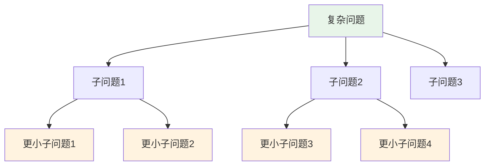
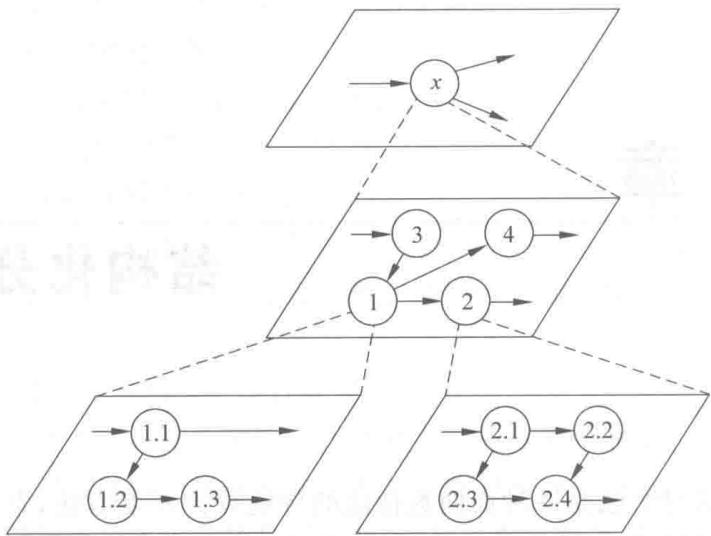
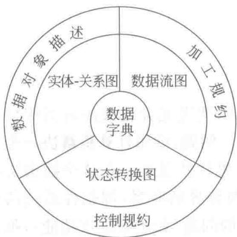

# 第5章-5.1-结构化分析方法概述

## 基本信息
- **课程**：软件工程
- **章节**：第5章 5.1节 结构化分析方法概述
- **日期**：2026-06-30
- **标签**：#结构化分析 #抽象与分解 #分析模型 #SA方法

---

## 重点内容

### ⭐⭐⭐ 核心概念
- **抽象与分解**：处理复杂问题的两个基本手段，结构化方法的理论基础
- **分析模型三要素**：数据流图（DFD）+ 数据字典 + 加工说明
- **结构化分析4步骤**：物理模型 -> 逻辑模型 -> 目标逻辑模型 -> 补充完善

### ⭐⭐ 结构化方法的历史
- 20世纪60年代末~70年代初，Yourdon等人提出结构化设计的图形符号
- 1979年De Marco在《结构化分析和系统规约》中正式命名
- 20世纪80年代中期，Ward/Mellor和Hatley/Pirbhai扩展至实时系统

### ⭐ 分析模型组成
- **数据流图**：功能建模，描述数据变换过程
- **实体-关系图（E-R图）**：数据建模，描述数据间关系
- **状态转换图**：行为建模，描述系统状态迁移

---

## 详细笔记

### 一、抽象与分解

> 📚 **课本出处**：第5章 5.1节"抽象和分解"

"抽象"和"分解"是处理任何复杂问题的两个基本手段。

**抽象（Abstraction）**：忽略一个问题中与当前目标无关的方面，以便更充分地关注与当前目标有关的方面。

**分解（Decomposition）**：将一个大而复杂的问题分解成若干个较小的问题（如子系统或功能），每个较小的问题又可继续分解，直至每个最底层的问题都足够简单为止。

> 💡 **理解技巧**：自顶向下的过程是**分解**的过程，自底向上的过程是**抽象**的过程。随着分解层次的增加，抽象级别越来越低，越来越接近问题的解。

#### 📷 图5.1 抽象与分解

> 📚 **课本出处**：图5.1 展示了自顶向下逐层分解的层次结构，顶层是整体问题，底层是足够简单的子问题

---

### 二、结构化分析的过程

> 📚 **课本出处**：第5章 5.1节"结构化分析的过程"

结构化分析的过程分为4个步骤：

1. **理解当前的现实环境**，获得当前系统的具体模型（物理模型）
2. **从当前系统的具体模型抽象出当前系统的逻辑模型**
3. **分析目标系统与当前系统逻辑上的差别**，建立目标系统的逻辑模型
4. **为目标系统的逻辑模型作补充**

> 💡 **理解技巧**：这4个步骤体现了"先理解现状，再构建目标"的思路。不是直接设计新系统，而是从现有系统出发，逐步推导出目标系统。

---

### 三、结构化分析模型的描述形式

> 📚 **课本出处**：第5章 5.1节"结构化分析模型的描述形式"

#### 📷 图5.2 结构化分析模型的结构

> 📚 **课本出处**：图5.2 展示了结构化分析模型的组成：数据字典居中，三种图（DFD、E-R图、状态转换图）围绕其分布

**分析模型的三大组成**：

| 建模类型 | 工具 | 用途 | 规约 |
|:--------:|:----:|:----:|:----:|
| **功能建模** | 数据流图（DFD） | 描述数据变换过程 | 加工规约（加工小说明） |
| **数据建模** | 实体-关系图（E-R图） | 描述数据间关系 | 数据对象描述 |
| **行为建模** | 状态转换图 | 描述状态迁移 | 控制规约 |

**数据字典**是模型的核心，包括对软件使用和产生的所有数据的描述。

**各模型之间的关系**：
- 数据流图中的数据流、文件、数据项、加工都应在**数据字典**中描述
- **加工规约**是对数据流图中的加工的说明，用"小说明"作为加工规约
- **E-R图**描述数据字典中数据之间的关系
- **状态转换图**描述系统接收的外部事件及状态迁移

**分析结果**：一套分层的数据流图 + 一本数据字典（含E-R图）+ 一组加工规约 + 其他补充材料（如非功能性需求）

---

## 总结

### 结构化分析方法要点

| 要点 | 内容 |
|:----:|:-----|
| **理论基础** | 抽象与分解（自顶向下逐层分解） |
| **分析步骤** | 环境理解 -> 物理模型 -> 逻辑模型 -> 差异分析 -> 目标模型 -> 补充 |
| **功能建模** | 数据流图（DFD） |
| **数据建模** | E-R图 |
| **行为建模** | 状态转换图 |
| **数据描述** | 数据字典（模型核心） |
| **加工描述** | 加工规约（小说明） |

### 关键要点

1. **抽象与分解是核心思想**：所有结构化方法都基于这两个基本手段
2. **分析模型由三部分构成**：DFD（功能）+ E-R图（数据）+ 状态转换图（行为），以数据字典为核心
3. **结构化分析是渐进过程**：从理解现有系统到构建目标系统，逐步推导
4. **结构化方法** = SA（分析）+ SD（设计）+ SP（程序设计），构成完整的开发方法体系

---

## 疑问与思考

### ❓/💡 疑问与思考

❓ **结构化分析方法与面向对象分析方法（OOA）的核心区别是什么？各自适用于什么类型的系统？**
💡 结构化分析面向**数据流**，以DFD为核心，将系统看作一系列数据变换过程，适合数据处理密集的系统（如管理信息系统、批处理系统）。面向对象分析以**对象**为核心，将系统看作一组互相协作的对象，适合交互密集、业务逻辑复杂的系统（如GUI应用、实时系统）。核心分歧在于"以功能为中心"还是"以数据/对象为中心"。

❓ **当目标系统是全新系统（没有"当前系统"）时，结构化分析的4个步骤如何调整？**
💡 步骤1和2可以简化：因为没有现有系统，不需要从物理模型抽象逻辑模型。可以改为：（1）理解用户需求和业务环境，直接建立初始逻辑模型；（2）与用户反复确认和细化；（3）在此基础上补充非功能性需求。本质上跳过了"从现实到逻辑"的抽象过程，但"从逻辑到目标"的差异分析仍然适用（此时是对初始模型的完善）。

❓ **E-R图和状态转换图在分析模型中分别对应数据建模和行为建模，它们与DFD之间的具体交互关系是什么？**
💡 三者互补而非替代：DFD描述"数据怎么流动和被变换"，E-R图描述"数据之间的结构关系"（如学生和课程的多对多关系），状态转换图描述"系统对事件的响应行为"（如订单状态从待付款到已付款）。数据字典是三者的"粘合剂"，DFD中的数据流和文件都在数据字典中有定义，E-R图中的实体和状态转换图中的事件也与数据字典中的数据项对应。

❓ **Ward/Mellor和Hatley/Pirbhai对结构化方法的扩展具体增加了哪些元素来适应实时系统？**
💡 Ward/Mellor扩展了控制流建模，增加了**控制转换**（类似数据转换但处理的是控制信号）和**控制存储**等概念，以描述实时系统的定时和事件驱动行为。Hatley/Pirbhai则引入了**控制规约**和**物理系统模型**，明确区分了数据处理部分和控制部分。两者都解决了原版SA方法无法描述系统"何时做"（时序/事件）的问题。

### 💡 个人理解/技巧
- 结构化分析的核心就是"分而治之"，把大问题拆成小问题，逐个击破
- 分析模型可以用一句话概括：用DFD描述"做什么"，用数据字典描述"用什么数据"，用加工说明描述"怎么做"
- 数据字典之所以是核心，因为它是DFD、E-R图、加工规约之间的"粘合剂"
- 结构化分析面向数据流，而面向对象分析面向对象，这是两种方法论的根本分歧

---

## 相关链接

### 关联章节
- [第5章-结构化分析与设计](./第5章-结构化分析与设计.md)
- [第5章-5.2-数据流图](./第5章-5.2-数据流图.md) — DFD的详细内容
- [第5章-5.3-分层数据流图的审查](./第5章-5.3-分层数据流图的审查.md) — DFD的审查方法
- [第3章-需求工程](../第3章-需求工程/第3章-需求工程.md) — 需求分析是结构化分析的前置阶段
- [第4章-设计工程](../第4章-设计工程/第4章-设计工程.md) — 设计原则基础

---

## 检查清单

- [x] 已理解抽象与分解的基本概念
- [x] 已掌握结构化分析的4个步骤
- [x] 已理解分析模型的组成（DFD + 数据字典 + 加工说明）
- [x] 已插入课本原图（图5.1、图5.2）
- [x] 已记录重点标记
- [x] 已添加课本出处标注

---

*笔记创建时间：2026-06-30*
