# 第5章-5.3-分层数据流图的审查

## 基本信息
- **课程**：软件工程
- **章节**：第5章 5.3节 分层数据流图的审查
- **日期**：2026-06-30
- **标签**：#DFD审查 #一致性 #完整性 #分解程度 #数据守恒

---

## 重点内容

### ⭐⭐⭐ 核心概念
- **一致性检查**：父图与子图平衡、数据守恒、局部文件处理、输出流不与输入流同名
- **完整性检查**：每个加工有输入输出、文件有读写、数据流和文件都命名、基本加工有加工规约
- **7加减2原则**：每个加工分解的子加工数量控制在5~9个

### ⭐⭐ 关键检查项
- **父图与子图平衡**：子图边界上的输入输出数据流必须与父图对应加工一致
- **数据守恒**：加工的输出数据必须能从输入数据直接获得或通过加工产生
- **局部文件**：只与某加工内部逻辑相关的文件不应画在父图中

### ⭐ 构造DFD注意事项
- 适当命名、画数据流而非控制流、避免加工过多数据流、分解均匀

---

## 详细笔记

### 一、分层数据流图的一致性和完整性

> 📚 **课本出处**：第5章 5.3.1节"分层数据流图的一致性和完整性"

**一致性**：分层DFD中不存在矛盾和冲突。

**完整性**：分层DFD是否有遗漏的数据流、加工等元素。

> ⚠️ **常见误区**：图本身的正确性并不意味着分析模型的正确性。分析模型的正确性要根据模型是否满足用户的需求来判断。

---

### 二、一致性检查

#### （1）父图与子图平衡

> 📚 **课本出处**：第5章 5.3.1节"(1) 父图与子图平衡"

**定义**：任何一张DFD子图边界上的输入输出数据流必须与其父图中对应加工的输入输出数据流保持一致。

子图是被分解加工的细化，应保证可以画到父图中替代被分解的加工。

**不平衡的实例**：

#### 📷 图5.11 父图与子图不平衡的实例

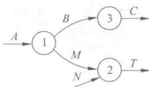

> 📚 **课本出处**：图5.11(a) 父图中加工2有输入M和N，输出T

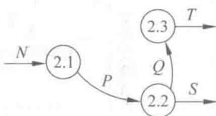

> 📚 **课本出处**：图5.11(b) 子图边界输入为N，输出为S和T，与父图加工2的输入MN和输出T不一致，所以不平衡

**平衡的特殊情形 -- 数据流分解**：

如果父图中某加工的一个数据流，对应子图中几个数据流，而子图中这些数据流的数据项全体正好等于父图中的数据流，则仍算是平衡的。

#### 📷 图5.12 父图与子图平衡的实例

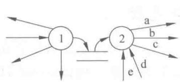

> 📚 **课本出处**：图5.12(a) 父图中加工2的输出为"b:统计分析表"

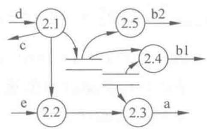

> 📚 **课本出处**：图5.12(b) 子图中对应输出为"b1:分类统计表"和"b2:难度分析表"。因为统计分析表=分类统计表+难度分析表，所以仍算平衡

其中：a=考生通知单，b=统计分析表，b1=分类统计表，b2=难度分析表，c=错误成绩清单，d=成绩清单，e=合格标准

> 💡 **理解技巧**：父图与子图平衡是画DFD的**重要原则**。如果只分别关注单张图的合理性，忽略父图与子图之间的关系，就很容易造成不平衡的错误。

---

#### （2）数据守恒

> 📚 **课本出处**：第5章 5.3.1节"(2) 数据守恒"

数据守恒包括两种情况：

**情况一：加工的输出数据必须能从输入数据获得**

一个加工所有输出数据流中的数据，必须能从该加工的输入数据流中直接获得，或者能通过该加工的处理而产生。

#### 📷 图5.13 数据不守恒的实例

> 📚 **课本出处**：图5.13 展示了一个数据不守恒的加工，缺少产生输出所需的某些数据

**不守恒的原因分析**：

| 数据流 | 数据组成 |
|:------:|:---------|
| 正式成绩清单 | 准考证号+考试级别+考试成绩+合格标志 |
| 考生通知单 | 准考证号+姓名+通信地址+考试级别+考试成绩+合格标志 |

"正式成绩清单"缺少"考生通知单"中的姓名和通信地址，这些数据加工自身无法产生，因此不满足数据守恒。

**解决方案**：加工2.3必须读"考生名册"文件来获取姓名和通信地址。

> 💡 **理解技巧**：这个例子说明数据流的组成对DFD有影响。如果不分析数据流的组成，很难发现此类错误。构建DFD与建立数据字典应**交替进行**。

**情况二：加工未使用输入数据流中的某些数据项**

如果加工未使用其输入数据流中的某些数据项，说明这些数据项是多余的。这不一定就是错误，但常常隐含潜在问题：加工功能描述不完整、遗漏或不完整的输出数据流等。

---

#### （3）局部文件

> 📚 **课本出处**：第5章 5.3.1节"(3) 局部文件"

#### 📷 图5.14 局部文件

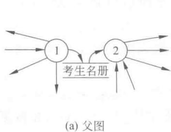

> 📚 **课本出处**：图5.14(a) 简化父图，加工2中不包含"试题得分清单"文件

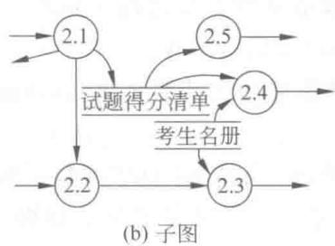

> 📚 **课本出处**：图5.14(b) 加工2的子图中出现了"试题得分清单"文件

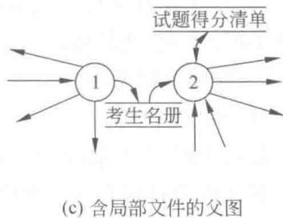

> 📚 **课本出处**：图5.14(c) 如果在父图中画出"试题得分清单"则不正确，因为它是局部文件

**局部文件的处理规则**：

| 情况 | 处理方式 |
|:----:|:---------|
| 文件在多个加工之间共享（一个写、另一个读） | 应画出 |
| 文件仅与一个加工进行读写操作且祖先图中未出现 | 不应画出（局部文件） |
| 文件一旦在某张DFD中画出 | 在子孙图中应根据平衡原则画出 |

**重要补充**：任何一个文件都应有写该文件的数据流和读该文件的数据流，否则该文件没有存在的必要（除非由其他系统建立或使用）。

---

#### （4）输出数据流不能与输入数据流同名

> 📚 **课本出处**：第5章 5.3.1节"(4)"

同一个加工的输出数据流和输入数据流，即使组成成分相同，也应取不同的名字。例如"报名单"和"合格报名单"。

允许一个加工有两个相同的数据流分别流向两个不同的加工。

---

### 三、完整性检查

> 📚 **课本出处**：第5章 5.3.1节"2. 分层数据流图的完整性"

| 序号 | 检查项 | 说明 |
|:----:|:------:|:-----|
| 1 | 每个加工至少有一个输入和一个输出数据流 | 没有输入或输出的加工通常无意义 |
| 2 | 每个文件至少有一个加工读、另一个加工写 | 只写不读或只读不写通常无意义 |
| 3 | 每个数据流和文件都命名 | 流入/流出文件的数据流除外，且与数据字典一致 |
| 4 | 每个基本加工都有加工规约 | 加工规约描述加工的功能和处理流程 |

> ⚠️ **常见误区**：关于文件读写的检查是对**整套DFD**而言的。对某一张DFD来说，文件可以只写不读或只读不写。

---

### 四、构造分层DFD时需要注意的问题

> 📚 **课本出处**：第5章 5.3.2节"构造分层DFD时需要注意的问题"

#### 1. 适当命名

| 对象 | 命名方式 | 好例子 | 坏例子 |
|:----:|:--------:|:------:|:------:|
| 数据流 | 名词或形容词+名词 | 取款单、合格的报名单 | 数据 |
| 加工 | 动词或及物动词+宾语 | 计算工资、统计成绩 | 处理 |
| 文件 | 名词 | 学生名册 | 信息 |
| 源/宿 | 人员身份/组织名称 | 学生、教师 | 用户 |

**命名注意事项**：
1. 名字应反映整个对象，不是仅反映某一部分
2. 避免空洞的、含义不清的名字
3. 难以命名时往往是DFD分解不当的征兆，应考虑重新分解

#### 2. 画数据流而不是画控制流

区分方法：简单地问"这条线上是否有数据流过？"有则为数据流，没有则为控制流。

#### 3. 避免一个加工有过多的数据流

当一个加工有许多数据流时，说明分解不合理。**重新分解的步骤**：

1. 把需要重新分解的图的所有子图连接成一张图
2. 把连接后的图重新划分成几个部分，使各部分间联系最小
3. 重新定义父图（每个部分作为一个加工）
4. 重新建立各子图（每个部分作为一张子图）
5. 为所有加工重新命名并编号

#### 📷 图5.15 数据流图的重新分解

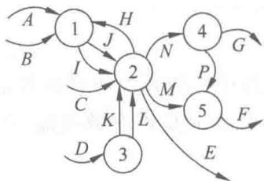

> 📚 **课本出处**：图5.15(a) 原父图中加工2有9条数据流，过于复杂

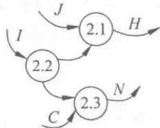

> 📚 **课本出处**：图5.15(b) 原加工2的子图

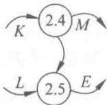

> 📚 **课本出处**：图5.15(c) 将子图合并后用虚线框标识重新划分

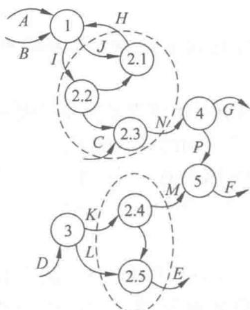

> 📚 **课本出处**：图5.15(d) 重新划分后的父图，数据流数量更合理

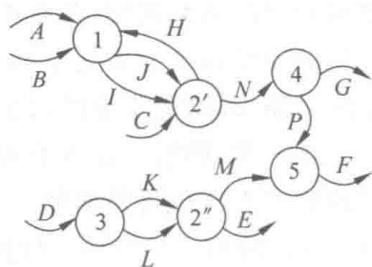

> 📚 **课本出处**：图5.15 重新分解后的子图

#### 4. 分解尽可能均匀

理想分解是将一个问题分解成大小均匀的若干个子问题。任何一张DFD中，任何两个加工的分解层数之差不超过1。如果在同一张图中，某些加工已停止分解而另一些仍需分解若干层，则分解不均匀，应重新分解。

#### 5. 先考虑稳定状态，忽略琐碎的枝节

构建DFD时应集中精力考虑稳定状态下的各种问题，暂时不考虑启动、结束、出错处理及性能等问题，这些在分析阶段后期的需求规约中说明。

#### 6. 随时准备重画

复杂的DFD很难一次绘制成功，需要反复重画和修改。分析阶段的错误到后期要花费几十到几百倍的代价来纠正。

> ⭐ **考试重点**：分析阶段的错误纠正成本远低于开发后期，因此在分析阶段多花时间重画DFD是值得的。

---

### 五、分解的程度

> 📚 **课本出处**：第5章 5.3.3节"分解的程度"

自顶向下画DFD时，分解层数的把握原则：

| 原则 | 说明 |
|:----:|:-----|
| **7加减2** | 每个加工分解的子加工数量控制在5~9个 |
| **分解自然** | 概念上合理、清晰 |
| **适当增加子加工** | 不影响易理解性的前提下，减少层数 |
| **上快下慢** | 上层分解快（多分解几个加工），下层分解慢（少分解几个加工） |
| **分解均匀** | 各分支的分解深度尽量一致 |

> 💡 **理解技巧**：7加减2原则来源于George Miller的论文《神奇的数字7加减2》，指出人的短期记忆限制在5~9个信息块。分解DFD时遵循这一原则，可以保证每层图的可理解性。

---

## 总结

### 一致性检查要点

| 检查项 | 检查内容 | 判断标准 |
|:------:|:---------|:---------|
| 父图与子图平衡 | 子图边界的输入输出数据流 | 必须与父图对应加工一致（允许数据流分解） |
| 数据守恒(1) | 输出数据的来源 | 必须能从输入数据直接获得或通过加工产生 |
| 数据守恒(2) | 未使用的输入数据项 | 存在未使用的数据项时需警惕潜在错误 |
| 局部文件 | 文件的绘制范围 | 仅与某加工内部相关的不应画在父图 |
| 输出不与输入同名 | 同一加工的数据流命名 | 即使组成相同也必须用不同名字 |

### 完整性检查要点

| 检查项 | 要求 |
|:------:|:-----|
| 加工 | 每个加工至少有一个输入和一个输出数据流 |
| 文件 | 整套DFD中每个文件至少有一个写和一个读 |
| 命名 | 每个数据流和文件都必须命名，与数据字典一致 |
| 加工规约 | 每个基本加工都应有加工规约（小说明） |

### 构造DFD六项注意

1. **适当命名**：避免空洞含糊的名字
2. **画数据流**：不要画控制流
3. **避免过多数据流**：必要时重新分解
4. **分解均匀**：各分支深度尽量一致
5. **先考虑稳定状态**：忽略启动、结束等枝节
6. **随时准备重画**：DFD很难一次成功

### 分解程度五原则

1. 7加减2
2. 分解自然合理
3. 适当增加子加工以减少层数
4. 上层分解快，下层分解慢
5. 分解要均匀

---

## 疑问与思考

### ❓/💡 疑问与思考

❓ **在实际项目中，如果发现父图与子图不平衡，应该如何高效地定位和修复问题？是否有工具辅助检查？**
💡 高效定位的方法：（1）先列出子图边界上的所有输入输出数据流，再与父图对应加工的输入输出逐一比对；（2）常见不平衡模式包括遗漏数据流、多出数据流、数据流名字不一致；（3）修复时优先检查是否是命名差异（如同一数据流在父子图中用了不同名字），再检查是否遗漏。工具方面，专业的CASE工具（如Rational Rose、Enterprise Architect）支持部分一致性自动检查，但大多数项目仍依赖人工审查和走查（walkthrough）。

❓ **"数据守恒"要求输出数据必须从输入数据获得，那么对于需要访问数据库中已有数据的加工，这种数据应该如何在DFD中表示？**
💡 数据库中的已有数据应通过**文件**来表示。在DFD中，文件就是数据存储的抽象。如果加工需要从数据库获取额外数据来生成输出，应该画一条从文件到该加工的数据流，表示加工读取了该文件。例如课文中"加工2.3需要读考生名册获取姓名和通信地址"的例子，就是通过增加文件读取来解决数据不守恒的问题。关键是确保所有输出数据的来源都能追溯到输入数据流或文件读取。

❓ **7加减2原则是基于人的认知限制，但在使用计算机辅助工具查看DFD时，这个限制是否还有必要严格遵守？**
💡 即使有计算机工具，7加减2原则仍然有实际意义：（1）DFD的最终读者不仅是分析师，还包括客户、开发人员、测试人员，他们不都使用同样的工具；（2）打印出的文档、PPT汇报等场景下仍然受认知限制约束；（3）过大的单张图会增加沟通和审查的难度。不过在实际项目中，这个原则可以灵活掌握，如果团队成员都觉得清晰可理解，9~10个加工也可接受，但超过12个就应考虑重新分解。

❓ **课本提到"分析阶段遗漏下来的错误，到开发后期要花费几十到几百倍的代价来纠正"，这个比例在现代敏捷开发实践中是否仍然成立？**
💡 比例可能有所缩小但原则仍然成立。敏捷开发通过短迭代和持续交付大大降低了错误的积累周期，使得问题能更早暴露。但如果不加注意，需求分析阶段的误解仍然会传导到架构设计、编码和测试中。敏捷不是跳过分析，而是把分析分散到整个迭代周期中，通过持续反馈来降低代价。对于大型系统和关键安全系统，分析阶段的遗漏代价仍然非常高昂。

❓ **当同一个源或宿在DFD的不同位置重复画出时，如何避免读者误认为它们是不同的实体？**
💡 教材中的标准做法是使用**相同的名字**标注同一个实体，读者看到相同名字就能理解它们代表同一对象。在实践中还可以：（1）在DFD图例或文档约定中说明"同名实体代表同一对象，可出现在不同位置以提高可读性"；（2）使用统一的图形样式（如相同颜色、边框粗细）来视觉上暗示是同一实体；（3）在首次出现时加注"（同图X.X中的XXX）"。

### 💡 个人理解/技巧
- 数据守恒是最容易出错的检查项，需要结合数据字典来验证，不能只看DFD图
- 局部文件的规则体现了一个重要原则：**抽象层次要匹配**。父图是高层次抽象，不应包含子图的实现细节
- 重新分解的步骤很像代码重构中的"先合并再拆分"策略，先看到全局再合理划分
- 分解程度的五条原则可以简化为一句话：**每个图看起来舒服就行**，太复杂就拆，太不均匀就调整
- 审查DFD时建议打印出来，用不同颜色标注一致性检查结果，比在屏幕上逐个检查更直观

---

## 相关链接

### 本节相关图片
- [图5.11 父图与子图不平衡的实例](../../../images/c80e86d2d71efc2f57b7d6d578c844e4735addfbf0d821e0cbdb77f562f42a33.jpg)
- [图5.11 子图](../../../images/f3a884fe0dc5dd508252497309a8b77648867814dd745356c97d42f34f5f21c2.jpg)
- [图5.12 父图与子图平衡的实例](../../../images/f55b2aefe7711f8109796ba8d37cf08e41d0c6446e9ae29efd51acc69f77d220.jpg)
- [图5.12 子图](../../../images/12d7072b14e856fd67e7f1d1ed93ddf1af07a96c3f2719c4e4f3823393ae4002.jpg)
- [图5.13 数据不守恒的实例](../../../images/90a7e0c7eb3d3fc342130d5a1277f6851e4654b1bb004f812064555f8980f0ee.jpg)
- [图5.14 局部文件](../../../images/85bc77cab6949c136de483e483c4afbc155e1bf46f54bbdadc3bcb3d17a73509.jpg)
- [图5.14 子图](../../../images/fae6220312b78d275d4452fdf76463c9872198e857105cc1facde54f36cc1aa7.jpg)
- [图5.14 不正确的父图](../../../images/c19837628e1affbed585de75fef72efad66ff4e3c2180427baf86eaa688623bf.jpg)
- [图5.15 数据流图的重新分解](../../../images/df3c87d926bfc01eeaa3c8929299cabb24ebac7eaf9dbae0c437a89dd813c792.jpg)
- [图5.15(b) 原加工2子图](../../../images/679bf906335093c8c23e63a7a76a3db804f01429feea6b08912f966b35b57eb0.jpg)
- [图5.15(c) 合并](../../../images/71536e64583c637882e292c61861c304bc1ce93336c5e6ff8199ac64a0930491.jpg)
- [图5.15(d) 重新分解后](../../../images/eab4504d5adada77daa31eca3c47d70660f0fca87d61f624a9f26850f40ef7c3.jpg)

### 关联章节
- [第5章-结构化分析与设计](./第5章-结构化分析与设计.md)
- [第5章-5.2-数据流图](./第5章-5.2-数据流图.md) — DFD的画法基础
- 第5章-5.4-数据字典（待创建） — 数据流和文件的详细描述
- 第5章-5.5-描述基本加工的小说明（待创建） — 加工规约

---

## 检查清单

- [x] 已理解一致性检查的四个方面
- [x] 已理解完整性检查的四个要求
- [x] 已掌握父图与子图平衡的判断方法
- [x] 已理解数据守恒的两种情况
- [x] 已掌握局部文件的处理规则
- [x] 已掌握构造DFD的六项注意事项
- [x] 已理解7加减2原则和分解程度的五条原则
- [x] 已插入课本原图（图5.11~图5.15）
- [x] 已记录重点标记
- [x] 已添加课本出处标注

---

*笔记创建时间：2026-06-30*
