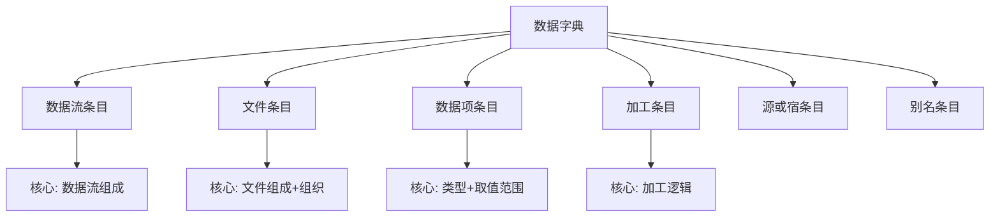

# 第5章-5.4-数据字典

## 基本信息
- **课程**：软件工程（第3版）
- **章节**：第5章 5.4节 数据字典
- **日期**：2026-06-30
- **标签**：#数据字典 #数据流图 #描述符号 #字典条目 #结构化分析

---

## 重点内容

### ⭐⭐⭐ 核心概念
- **数据字典与DFD的关系**：数据流图与数据字典密不可分，两者结合构成软件的逻辑模型（分析模型）
- **字典条目种类**：数据流、文件、数据项、加工、源或宿，共5类
- **描述符号**：`=`（定义为）、`+`（与）、`[]`（或）、`{}`（重复）、`()`（可选）、`""`（基本数据元素）

### ⭐⭐ 字典条目
- **数据流条目**：核心是"数据流组成"，用描述符号列出数据项
- **文件条目**：核心是"文件组成"和"文件组织"
- **数据项条目**：核心是"数据类型"和"取值范围"
- **加工条目**：核心是"加工逻辑"（基本加工用小说明描述）

### ⭐ 关键要点
- 数据字典可以按条目种类分类组织
- 采用软件工具可以维持DFD与数据字典的一致性
- 数据字典可分几次填写完成

---

## 详细笔记

### 一、字典条目的种类及描述符号

#### 1. 字典条目的种类

> 📚 **课本出处**：第5章 5.4.1节"字典条目的种类及描述符号"

数据字典由字典条目组成，每个条目描述DFD中的一个元素。字典条目分成以下5类：

| 条目种类 | 说明 |
|:--------:|:-----|
| 数据流 | 描述DFD中数据流的组成 |
| 文件 | 描述DFD中数据存储的组成和组织 |
| 数据项 | 组成数据流和文件的最小数据单位 |
| 加工 | 描述加工的逻辑（基本加工用小说明描述） |
| 源或宿 | 描述系统外部的人员或组织 |

#### 2. 数据字典使用的描述符号

> 📚 **课本出处**：第5章 5.4.1节，表5.1"数据字典使用的描述符号"

| 符号 | 名称 | 含义 | 举例 |
|:----:|:----:|:-----|:-----|
| `=` | 定义为 | 表示左边的元素由右边的组成 | `x=…` 表示x由...组成 |
| `+` | 与 | 表示"和"的关系 | `a+b` 表示a和b |
| `[...\|...]` | 或 | 表示从中选择一个 | `[a\|b]` 表示a或b |
| `{...}` | 重复 | 表示重复0次或多次 | `{a}` 表示a重复0或多次 |
| `{...}m` | 重复m次 | 表示重复指定次数 | `{a}8/3` 表示a重复3到8次 |
| `(...)` | 可选 | 表示可出现0次或1次 | `(a)` 表示a可有可无 |
| `"..."` | 基本数据元素 | 表示不可再分的数据 | `"a"` 表示a是基本数据 |

> 💡 **理解技巧**：6种描述符号可以这样记忆——`=`用于定义结构，`+`连接并列项，`[]`表示多选一，`{}`表示循环重复，`()`表示可有可无，`""`标记叶子节点（不可再分）。

---

### 二、字典条目

> 📚 **课本出处**：第5章 5.4.2节"字典条目"

DFD中的每个元素都对应一个数据字典条目。字典条目中的描述内容主要包括：DFD元素的基本信息（名称、别名、简述、注解）、定义（数据类型、数据组成）、使用特点（取值范围、使用频率、激发条件）、控制信息（来源、去向、访问权限）等。

#### 1. 数据流条目

数据流条目的描述内容包括：

- **名称**：数据流名（中文名或英文名）
- **别名**：名称的另一个名字
- **简述**：对数据流的简单说明
- **数据流组成**：描述数据流由哪些数据项组成（核心内容）
- **数据流来源**：从哪个加工或源流出
- **数据流去向**：流入哪个加工或宿
- **数据量**：系统中该数据流的总量
- **峰值**：某时段处理的最大数量（与性能相关）
- **注解**：其他补充说明

**别名说明**：
- 名称用中文时，对应英文名作为别名
- 名称用英文时，英文缩写作为别名
- 旧系统改造中，旧名称即为新名称的别名

**峰值的性能意义**：例如每天处理80000张表单，但可能9:00~11:00集中处理60000张，系统应以30000张/小时设计。

**数据流组成示例**：

```
培训报名单 = 姓名 + 单位 + 课程
```

```
运动员报名单 = 队名 + 姓名 + 性别 + {参赛项目}1^3
```

表示"运动员报名单"由队名、姓名、性别以及1至3个参赛项目组成。

**复杂数据流的分解**：

```
课程 = 课程名 + 任课教师 + 教材 + 时间地点
时间地点 = {星期几 + 第几节 + 教室}
```

**数据流组合复用**：

```
合格报名单 = 姓名 + 性别 + 年龄 + 文化程度 + 职业 + 考试级别 + 通信地址
正式报名单 = 准考证号 + 合格报名单
```

当数据流A的组成包含数据流B的所有数据项时，可在A中用B代替这些项。

#### 📷 图5.16 发票示意图


> 📚 **课本出处**：图5.16 展示了一张发票的示意图，营业员可有可无，一张发票最多描述5件商品的购买记录

**发票数据流描述**：

```
发票 = 单位名称 + {商品名 + 数量 + 单价 + 金额}1^5 + 总金额 + 日期 + (营业员)
```

---

#### 2. 文件条目

文件条目的描述内容包括：

- **名称**：文件名
- **别名**：同数据流条目
- **简述**：对文件的简单说明
- **文件组成**：描述文件的记录由哪些数据项组成
- **写文件的加工**：哪些加工写文件
- **读文件的加工**：哪些加工读文件
- **文件组织**：文件的存储方式（顺序、索引），排序的关键字
- **使用权限**：各类用户对文件读、写、修改的使用权限
- **数据量**：文件的最大记录个数
- **存取频率**：对该文件的读写频率
- **注解**：其他补充说明

**文件条目示例**：

> 文件名：试题得分清单
>
> 文件组成：准考证号 + 考试级别 + {试题号 + {小分序号 + 小分}1^5 + 试题分}1^8 + 总分
>
> 文件组织：顺序文件，按第一关键字准考证号升序，第二关键字试题号升序排序
>
> 注解：每道试题的"小分"之和等于"试题分"，"试题分"之和等于"总分"

---

#### 3. 数据项条目

数据项条目的描述内容包括：

- **名称**：数据项名
- **别名**：同数据流条目
- **简述**：对数据项的简单描述
- **数据类型**：整型、实型、字符串等
- **计量单位**：公斤、吨等
- **取值范围**：数据项允许的值域
- **编辑方式**：外部表示的编辑方式，如 `23,345.67`
- **与其他数据项的关系**：可用于数据校验
- **注解**：其他补充说明

**数据项示例**：

```
账号 = 00000..99999
```

表示"账号"由5位无符号整数组成，取值范围是00000..99999。

```
颜色 = {红 | 黄 | 绿}
```

表示"颜色"的值只能是红、黄或绿。

**数据校验关系**：例如发票中的 `数量 * 单价 = 金额`。

---

#### 4. 加工条目

加工条目的描述内容包括：

- **名称**：加工名
- **别名**：同数据流条目
- **加工号**：加工在DFD中的编号
- **简述**：对加工功能的简要说明
- **输入数据流**：加工的输入数据流，包括读哪些文件
- **输出数据流**：加工的输出数据流，包括写哪些文件
- **加工逻辑**：简要描述加工逻辑，或对加工规约的索引（核心内容）
- **异常处理**：可能出现的异常情况及处理方式
- **加工激发条件**：执行加工的条件
- **执行频率**：加工的执行频率
- **注解**：其他补充说明

> ⚠️ **常见误区**：加工分为**基本加工**（无DFD子图的加工）和**非基本加工**（有DFD子图的加工）。只有基本加工才需要写小说明（见5.5节），非基本加工的加工逻辑已通过DFD子图反映。

---

#### 5. 源或宿条目

由于源或宿表示系统外的人员或组织，名字本身已比较清楚，开发人员常常不将其放入数据字典。为保证完整性，仍可保留：

- **名称**：外部实体名
- **别名**：同数据流条目
- **简要描述**：指明是"源"、"宿"还是"既是源又是宿"
- **输入数据流**：源向系统提供的输入数据流
- **输出数据流**：系统向宿提供的输出数据流
- **注解**：其他补充说明

#### 6. 别名条目

并非所有别名都要有别名条目，只有需要补充说明的才给出：

- **别名**：别名的名字
- **类型**：属于哪个种类（数据流、文件、数据、加工、源或宿）
- **基本名**：别名的正式名称（原名）
- **简述**：同正式名称的简述
- **说明**：对别名的补充说明

**别名条目示例**：

> 别名：开设日期
>
> 类型：数据项
>
> 基本名：开户日期
>
> 简述：客户建立账户的日期
>
> 说明：1986年以后不再使用此别名

---

### 三、字典条目实例

> 📚 **课本出处**：第5章 5.4.3节"字典条目实例"

以5.2.2节中的考务处理系统为例：

#### 数据流条目

```
报名单 = 地区 + 序号 + 姓名 + 文化程度 + 职业 + 考试级别 + 通信地址
合格报名单 = 报名单
正式报名单 = 准考证号 + 合格报名单
准考证 = 地区 + 序号 + 姓名 + 准考证号 + 考试级别 + 考场
考生名单 = {准考证号 + 考试级别}
成绩清单 = 准考证号 + 考试级别 + 考试成绩
正确成绩清单 = 成绩清单
正式成绩清单 = 合格标记 + 正确成绩清单
考生通知单 = 准考证号 + 姓名 + 通信地址 + 考试级别 + 考试成绩 + 合格标志
合格标准 = {考试级别 + 合格分}
统计分析表 = 分类统计表 + 难度分析表
```

#### 文件条目

```
考生名册 = 正式报名单
文件组织：顺序文件，按准考证号升序排序。
```

```
试题得分清单 = 准考证号 + 考试级别 + {试题号 + {小分序号 + 小分}1^5 + 试题分}1^8 + 总分
文件组织：顺序文件，按第一关键字准考证号升序，第二关键字试题号升序排序
注解：每道试题的"小分"之和等于"试题分"，"试题分"之和等于"总分"
```

---

### 四、数据字典的实现

> 📚 **课本出处**：第5章 5.4.4节"数据字典的实现"

#### 实现方式

| 方式 | 说明 | 优点 |
|:----:|:-----|:-----|
| 专用软件工具 | 使用CASE工具或常用实用程序（如正文编辑程序、电子表格）建立电子文档 | 便于检索、管理和维护 |
| DFD辅助工具自动产生 | 绘制DFD时自动产生字典条目 | 可检查DFD一致性和完整性 |
| 人工制作卡片 | 为每个条目制作卡片，按种类分类成册 | 简单直观 |

**人工卡片管理**：
- 按字典条目种类分类成册
- 每类按约定排序（汉字部首排序、英文字母排序、加工号排序）
- 必要时制作字典目录

---

## 总结

### 数据字典的核心结构



### 描述符号对比表

| 符号 | 名称 | 含义 | 使用场景 |
|:----:|:----:|:-----|:---------|
| `=` | 定义为 | 左边元素由右边组成 | 每个条目的定义开头 |
| `+` | 与 | 表示"和"，并列连接 | 数据流中多个数据项的连接 |
| `[...\|...]` | 或 | 从多个选项中选一个 | 数据项可能有多种取值 |
| `{...}` | 重复 | 重复0次或多次 | 变长的列表/数组 |
| `{...}n^m` | 限定重复 | 重复n到m次 | 有上下限的重复 |
| `(...)` | 可选 | 出现0次或1次 | 非必须的成分 |
| `"..."` | 基本数据元素 | 不可再分的最小单位 | 条目定义的叶子节点 |

### 6种字典条目对比

| 条目种类 | 描述核心 | 必填内容 |
|:--------:|:--------:|:---------|
| 数据流 | 数据流组成 | 名称、简述、组成、来源、去向 |
| 文件 | 文件组成+文件组织 | 名称、简述、组成、读写加工、组织 |
| 数据项 | 数据类型+取值范围 | 名称、简述、数据类型、取值范围 |
| 加工 | 加工逻辑 | 名称、加工号、简述、输入/输出、加工逻辑 |
| 源或宿 | 外部实体描述 | 名称、简要描述、输入/输出数据流 |
| 别名 | 正式名映射 | 别名、类型、基本名 |

### 关键要点

1. **数据字典与DFD的关系**：两者密不可分，共同构成软件的逻辑模型（分析模型）
2. **描述符号是核心工具**：掌握6种符号才能正确书写字典条目
3. **数据流条目最重要**：数据流组成是数据流条目的核心，也是理解DFD的基础
4. **基本加工vs非基本加工**：只有基本加工需要小说明，非基本加工通过DFD子图反映
5. **可分步填写**：画DFD时填名称和数据组成，数据建模时填数据量、类型等
6. **软件工具优先**：使用工具可以维持DFD与数据字典的一致性

---

## 疑问与思考

### ❓/💡 疑问与思考

❓ **6种描述符号中，`[]`（或）的两种写法 `[a,b]` 和 `[a|b]` 在实际使用中有什么区别？什么情况下用逗号，什么情况下用竖线？**
💡 课本中`[]`的标准写法使用竖线`|`分隔选项，表示"从中选择一个"。逗号写法在某些教材或工具中出现，含义相同但不推荐，因为逗号容易与`+`（与）混淆。建议统一使用竖线`[a|b|c]`来表示"或"关系，保持书写规范的一致性。

❓ **数据字典和DFD的关系是什么？为什么说"两者结合构成软件的逻辑模型"？只画DFD不写字典行不行？**
💡 DFD描述了数据在系统中的流动和变换过程（"做什么"），但不描述数据本身的结构和细节。数据字典补充了每个数据流、文件、数据项的具体定义（"数据长什么样"）。两者结合才能完整描述系统的逻辑模型。只画DFD不写字典会导致：（1）数据流的含义模糊，不同人有不同理解；（2）无法进行数据守恒检查；（3）后续设计时缺乏数据结构参考。数据字典是DFD的必要补充，缺一不可。

❓ **加工条目中"加工激发条件"和"执行频率"有什么区别？激发条件是每次触发的条件，执行频率是统计规律吗？**
💡 是的，两者有本质区别。**激发条件**是加工被触发的前提，是一个布尔条件，满足时加工才执行（如"收到报名单时""到达统计时间点时"），每次触发都会判断。**执行频率**是统计性的描述，反映加工在一定时间内的平均执行次数（如"每天约200次""每小时最多60次"），用于性能评估和资源规划。激发条件决定"能不能做"，执行频率决定"做多少次"。

❓ **在实际项目中，字典条目应该填写得多详细？课本说"可对内容进行筛选或补充"，那最小集是什么？**
💡 最小必填集取决于项目规模和文档需求，但核心字段是：数据流条目必须有**名称**和**数据流组成**（这是理解DFD的基础）；文件条目必须有**名称**、**文件组成**和**文件组织**；数据项条目必须有**名称**、**数据类型**和**取值范围**；加工条目必须有**加工号**和**加工逻辑**。其他字段如峰值、存取频率、权限等可在需要时补充。小型项目可适当简化，大型项目或安全关键系统则应尽可能完整。

### 💡 个人理解/技巧
- 数据字典本质上是DFD的"图例说明书"，DFD画出了数据如何流动，字典解释了每个流动的数据"长什么样"
- 描述符号可以类比正则表达式：`+` 类似连接、`[]` 类似 `[abc]`、`{}` 类似 `*`、`()` 类似 `?`
- 字典条目可以自底向上填写：先写数据项（最小单位），再写数据流（由数据项组成），最后写文件（由数据流/数据项组成）
- "峰值"概念容易被忽略，但它直接影响系统性能设计，考试中可能会考到

---

## 相关链接

### 本节相关图片
- [图5.16 发票示意图](../../../images/e7366b7e1e8ab6f8e158907956176237c8768f2b41039b29cf261a417ab922f1.jpg)

### 关联章节
- [第5章-结构化分析与设计](./第5章-结构化分析与设计.md)
- [第5章-5.2-数据流图（待创建）](./第5章-5.2-数据流图.md)
- [第5章-5.3-分层数据流图的审查（待创建）](./第5章-5.3-分层数据流图的审查.md)
- [第5章-5.5-描述基本加工的小说明](./第5章-5.5-描述基本加工的小说明.md)

---

## 检查清单

- [x] 已理解数据字典与DFD的关系
- [x] 已掌握6种描述符号的含义和用法
- [x] 已理解5类字典条目的描述内容
- [x] 已掌握数据流条目的组成描述
- [x] 已理解基本加工与非基本加工的区别
- [x] 已插入课本原图（图5.16）
- [x] 已记录重点标记
- [x] 已添加课本出处标注

---

*笔记创建时间：2026-06-30*
