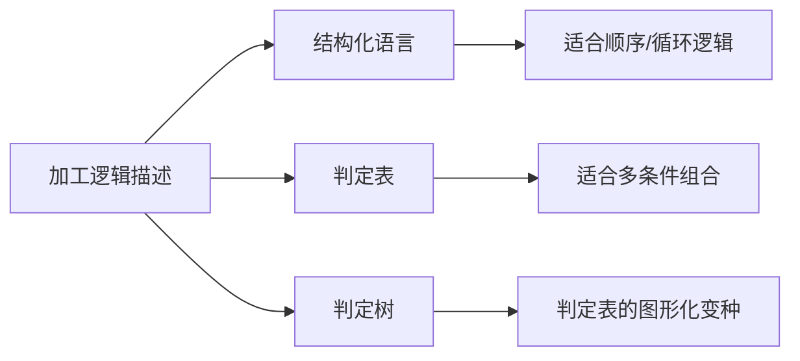
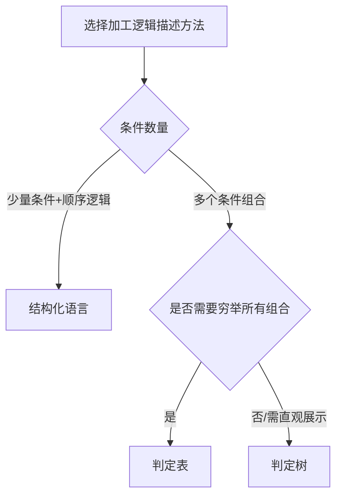

# 第5章-5.5-描述基本加工的小说明

## 基本信息
- **课程**：软件工程（第3版）
- **章节**：第5章 5.5节 描述基本加工的小说明
- **日期**：2026-06-30
- **标签**：#小说明 #结构化语言 #判定表 #判定树 #加工逻辑 #结构化分析

---

## 重点内容

### ⭐⭐⭐ 核心概念
- **小说明的定义**：基本加工的加工规约，精确描述加工"做什么"
- **小说明只对基本加工书写**：非基本加工通过DFD子图反映
- **三种描述方法**：结构化语言、判定表、判定树

### ⭐⭐ 结构化语言
- 介于自然语言和形式语言之间的半形式语言
- 外层使用严格的控制结构（IF-THEN-ELSE、WHILE-DO等）
- 内层使用自然语言描述

### ⭐⭐ 判定表
- 四部分组成：条件桩、条件条目、动作桩、动作条目
- 适用于多条件组合的加工逻辑
- 可以简化合并相同动作的条件组合

### ⭐ 判定树
- 判定表的变种，本质相同，表示形式不同
- 用树形图形表示条件组合和动作

---

## 详细笔记

### 一、小说明概述

> 📚 **课本出处**：第5章 5.5节"描述基本加工的小说明"

#### 1. 什么是小说明

DFD中每个**基本加工**都用一条小说明进行描述。小说明就是基本加工的加工规约，应精确地描述用户要求一个加工"做什么"，包括：

- **加工的激发条件**：何时触发该加工
- **加工逻辑**：输出数据流与输入数据流之间的逻辑关系（最基本部分）
- **优先级**
- **执行频率**
- **出错处理**

> ⭐ **核心重点**：需求分析是解决"做什么"的问题，不是描述"怎么做"。所以加工逻辑不是对加工的设计，不涉及数据结构、算法实现、编程语言等与设计和实现有关的细节。

#### 2. 基本加工 vs 非基本加工

| 类型 | 定义 | 小说明 |
|:----:|:-----|:------:|
| 基本加工 | 无DFD子图的加工 | 需要写小说明 |
| 非基本加工 | 有DFD子图的加工 | 不需要写，通过子图反映 |

**非基本加工的理解方式**：通过自底向上的过程 -- 子图中每个基本加工的小说明 + 子图所描述的数据流、文件、加工之间的关系 = 父加工的加工规约描述。

#### 3. 加工逻辑的三种描述方法



---

### 二、结构化语言

> 📚 **课本出处**：第5章 5.5.1节"结构化语言"

#### 1. 为什么需要结构化语言

| 方法 | 优点 | 缺点 |
|:----:|:-----|:-----|
| 自然语言 | 符合习惯，容易理解 | 不够精确，可能含有二义性 |
| 形式语言 | 精确、无歧义 | 不易被人理解 |
| **结构化语言** | **兼具两者优点** | **不如形式语言精确，但足够实用** |

结构化语言是介于自然语言和形式语言之间的**半形式语言**。根据使用语种不同，可以有结构化英语、结构化汉语等。

#### 2. 结构化语言的结构

结构化语言分为内外两层：

- **外层**：严格的控制结构，描述程序逻辑
  - `IF-THEN-ELSE`（选择结构）
  - `WHILE-DO`（当型循环）
  - `REPEAT-UNTIL`（直到型循环）
  - `FOR-DO`（计数循环）
  - `CASE`（多分支选择）
- **内层**：使用自然语言描述具体操作

允许嵌套使用。

#### 3. 结构化英语示例

> 📚 **课本出处**：第5章 5.5.1节，"计算信用度"加工逻辑

```txt
Select the case which applies:
Case 1 (No Bounced-Checks in Customer Record):
    Write Exemplary-Customer-Citation to Annual-Summary.
Case 2 (One Bounced-check):
    If Yearly-Average-Balance exceeds $1000.
        Remove Bounced-Check from Customer-Record.
    Otherwise.
        Reduce Credit-Limit by 10%.
Case 3 (Multiple Bounced-Checks):
    For each Bounced-Check.
        Reduce Credit-Limit by 15%.
        Set Credit-Rating to Deadbeat.
        Write Scathing-Comment to Annual-Summary.
        Write Customer-Name-and-Address to IRS-Enemies-List.
```

#### 4. 使用结构化语言的注意事项

| 序号 | 规则 | 说明 |
|:----:|:-----|:-----|
| 1 | 语句力求精炼 | 避免冗长 |
| 2 | 易读、易理解、无二义 | 可理解性优先 |
| 3 | 主要使用祈使句 | 动词要明确表达要执行的动作 |
| 4 | 所有名字必须在数据字典中有定义 | 保持一致性 |
| 5 | 不使用形容词、副词等修饰语 | 避免模糊 |
| 6 | 不使用含义相同的动词 | 如不混用"修改"、"修正"、"改变" |
| 7 | 可使用常用的算术和关系运算符 | 保持精确性 |

> 📌 **考试重点**：结构化语言的7条注意事项是常见考点，尤其注意"使用祈使句"和"不使用修饰语"。

> 💡 **理解技巧**：结构化语言的外层相当于程序的"骨架"（控制结构），内层相当于"血肉"（具体操作）。这样既保证了逻辑的清晰，又保持了描述的可读性。

---

### 三、判定表

> 📚 **课本出处**：第5章 5.5.2节"判定表"

#### 1. 适用场景

当加工逻辑包含**多个条件**，且不同的条件组合需做**不同的动作**时，适宜用判定表。

#### 2. 判定表的组成

> 📚 **课本出处**：第5章 5.5.2节，表5.2"判定表的组成"

判定表由4个部分组成：

```
+----------+----------+
|  条件桩   |  条件条目 |
+----------+----------+
|  动作桩   |  动作条目 |
+----------+----------+
```

| 组成部分 | 英文名 | 说明 |
|:--------:|:------:|:-----|
| **条件桩** | Condition Stub | 列出各种条件的对象，每行一个条件，次序无关 |
| **条件条目** | Condition Entry | 各条件对象的取值，每列表示一个可能的条件组合 |
| **动作桩** | Action Stub | 列出所有可能采取的动作，每行一个动作 |
| **动作条目** | Action Entry | 各种条件组合下应采取的动作 |

#### 3. 判定表示例："审批发货单"

> 📚 **课本出处**：第5章 5.5.2节，表5.3

**加工逻辑**：
- 发货单金额 > 500元，且赊欠未还天数 <= 60天 --> 发出批准书和发货单
- 发货单金额 > 500元，且赊欠未还天数 > 60天 --> 发不批准通知
- 发货单金额 <= 500元 --> 发出批准书和发货单；若赊欠天数 > 60天，加发赊欠报告

**完整判定表**：

|  | 列1 | 列2 | 列3 | 列4 |
|:--|:--:|:--:|:--:|:--:|
| **发货单金额** | >500 | >500 | <=500 | <=500 |
| **赊欠天数** | >60 | <=60 | >60 | <=60 |
| 发不批准通知 | v |  |  |  |
| 发出批准书 |  | v | v | v |
| 发出发货单 |  | v | v | v |
| 发出赊欠报告 |  |  | v |  |

#### 4. 判定表的简化

当多种条件组合具有相同动作时，可合并简化：

|  | 列1 | 列2 | 列3 |
|:--|:--:|:--:|:--:|
| **发货单金额** | >500 | <=500 | - |
| **赊欠天数** | >60 | >60 | <=60 |
| 发不批准通知 | v |  |  |
| 发出批准书 |  | v | v |
| 发出发货单 |  | v | v |
| 发出赊欠报告 |  | v |  |

> 符号"-"表示该条件可取任何值（即不论金额多少，只要赊欠天数<=60天，动作相同）。

#### 5. 判定表的其他形式

条件桩中也可以列出完整的条件（如"发货单金额>500"），条件条目中用0/1表示真/假：

|  | 列1 | 列2 | 列3 | 列4 |
|:--|:--:|:--:|:--:|:--:|
| 发货单金额<=500 | 0 | 0 | 1 | 1 |
| 发货单金额>500 | 1 | 1 | 0 | 0 |
| 赊欠天数<=60 | 0 | 1 | 0 | 1 |
| 赊欠天数>60 | 1 | 0 | 1 | 0 |
| 发不批准通知 | v |  |  |  |
| 发出批准书 |  | v | v | v |
| 发出发货单 |  | v | v | v |
| 发出赊欠报告 |  |  | v |  |

> 💡 **理解技巧**：两种形式本质相同。简化前的形式更直观（直接看条件取值），0/1形式更规整（适合条件很多时的机械化填写）。考试中两种都可能考到。

---

### 四、判定树

> 📚 **课本出处**：第5章 5.5.3节"判定树"

判定树是判定表的变种，本质上与判定表相同，只是表示形式不同 -- 用**树形图形**来表示。

#### 📷 图5.17 "审批发货单"加工逻辑的判定树


> 📚 **课本出处**：图5.17 用判定树表示"审批发货单"的加工逻辑，从根节点开始，按条件分支选择不同的动作

**判定树的结构**：
- **根节点**：第一个判断条件
- **中间节点**：后续判断条件
- **叶节点**：最终执行的动作

> 💡 **理解技巧**：判定树可以看作是判定表的"展开图"。判定表用表格压缩了所有条件组合，判定树则把每个分支路径都画出来，更直观但可能更占空间。

---

## 总结

### 三种小说明描述方法对比表

| 对比项 | 结构化语言 | 判定表 | 判定树 |
|:------:|:----------:|:------:|:------:|
| **表示形式** | 文字描述 | 表格 | 图形（树） |
| **核心结构** | 外层控制结构 + 内层自然语言 | 条件桩/条目 + 动作桩/条目 | 条件节点 + 动作叶节点 |
| **适用场景** | 顺序、循环为主的加工逻辑 | 多条件组合的加工逻辑 | 多条件组合（需直观展示） |
| **优点** | 读起来像程序，易理解 | 一目了然所有条件组合 | 直观形象，适合展示 |
| **缺点** | 条件多时描述冗长 | 条件很多时表格太大 | 条件多时树太宽/深 |
| **精确度** | 中（半形式化） | 高（穷举所有组合） | 高（与判定表等价） |
| **可简化性** | 不好简化 | 可合并相同动作的列 | 可合并相同后缀的分支 |
| **本质关系** | 三种方法互相等价，可互相转换 |||

### 加工逻辑描述方法选择指南



### 关键要点

1. **小说明只对基本加工书写**：非基本加工通过DFD子图反映其加工逻辑
2. **需求分析是"做什么"不是"怎么做"**：加工逻辑不涉及实现细节
3. **结构化语言是半形式化的**：外层严格控制结构 + 内层自然语言
4. **判定表由四部分组成**：条件桩、条件条目、动作桩、动作条目
5. **判定表可简化**：合并相同动作的条件组合，用"-"表示任意值
6. **判定树是判定表的图形变种**：本质相同，表示形式不同
7. **三种方法可以互相转换**：实际使用中可根据需要灵活选择

---

## 疑问与思考

### ❓ 疑问1：结构化语言和伪代码有什么区别？
课本说结构化语言是"介于自然语言和形式语言之间的半形式语言"，那伪代码算不算结构化语言？

💡 结构化语言与伪代码的区别在于定位不同：结构化语言更偏"规格说明"（面向需求），伪代码更偏"程序设计"（面向实现）。结构化语言的内层用自然语言描述操作，不涉及具体数据结构和算法实现；伪代码的内层用近似编程语言的语法，更接近实际代码。伪代码可以看作结构化语言的一种特例，但两者在软件工程中的使用阶段和目的不同。

### ❓ 疑问2：判定表和判定树的选择标准具体是什么？
课本说"判定树是判定表的变种"，那什么时候该用表、什么时候该用树？

💡 判定表适合条件数量较多、需要穷举所有条件组合以验证完整性的情况，因为它能一目了然地展示所有组合及其对应动作。判定树适合条件数量较少（<=3个）且需要直观展示逻辑分支路径的情况，它用树形图使决策过程更加形象。实际项目中，判定表便于机械化检查（是否有遗漏的组合），判定树便于与非技术人员沟通。

### ❓ 疑问3：条件数量很多时判定表是否还适用？
当条件数量很多（比如超过6个）时，判定表会有2^6=64列，这是否意味着判定表不适合复杂条件？实际项目中怎么处理？

💡 条件数量很多时确实会导致判定表规模爆炸。实际处理方式包括：(1) 对判定表进行简化，合并相同动作的条件组合（用"-"表示任意值），可以大幅减少列数；(2) 将复杂逻辑分解为多个子判定表，每个处理一个相对独立的判断；(3) 对于特别复杂的条件组合，可以考虑用结构化语言描述整体流程，在关键分支处插入简化后的判定表。简化是判定表的核心技巧，也是考试重点。

### ❓ 疑问4：分析阶段的"加工逻辑"和设计阶段的"算法描述"边界在哪里？
小说明中强调"加工逻辑不是对加工的设计"，那如何区分两者？

💡 两者的核心区别在于抽象层次：分析阶段的加工逻辑描述"做什么"——用业务语言描述输入到输出的逻辑关系（如"如果金额大于500且赊欠超过60天，则不批准"），不涉及数据结构、循环实现、函数调用等；设计阶段的算法描述"怎么做"——需要考虑用什么数据结构存储、用什么算法处理、函数接口如何定义等。边界标志是：如果描述中出现了编程概念（变量类型、数组、循环变量、函数签名等），就已经进入了设计阶段。

---

## 相关链接

### 本节相关图片
- [图5.17 "审批发货单"加工逻辑的判定树](../../../images/b078d749fb4667214663cdc33957a2a4963937ddbafbd01809bd3cdad132cdc0.jpg)

### 关联章节
- [第5章-结构化分析与设计](./第5章-结构化分析与设计.md)
- [第5章-5.4-数据字典](./第5章-5.4-数据字典.md)
- [第5章-5.6-结构化设计概述（待创建）](./第5章-5.6-结构化设计概述.md)
- [第4章-4.4-部件级设计技术](../第4章-设计工程/第4章-4.4-部件级设计技术.md)

---

## 检查清单

- [x] 已理解小说明的定义和作用
- [x] 已区分基本加工与非基本加工
- [x] 已掌握结构化语言的内外层结构
- [x] 已掌握判定表的四部分组成
- [x] 已理解判定表的简化方法
- [x] 已理解判定树与判定表的关系
- [x] 已插入课本原图（图5.17）
- [x] 已记录重点标记
- [x] 已添加课本出处标注

---

*笔记创建时间：2026-06-30*
