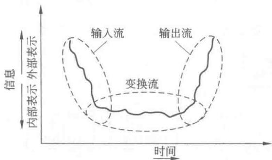
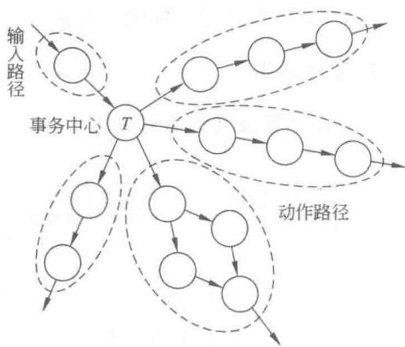
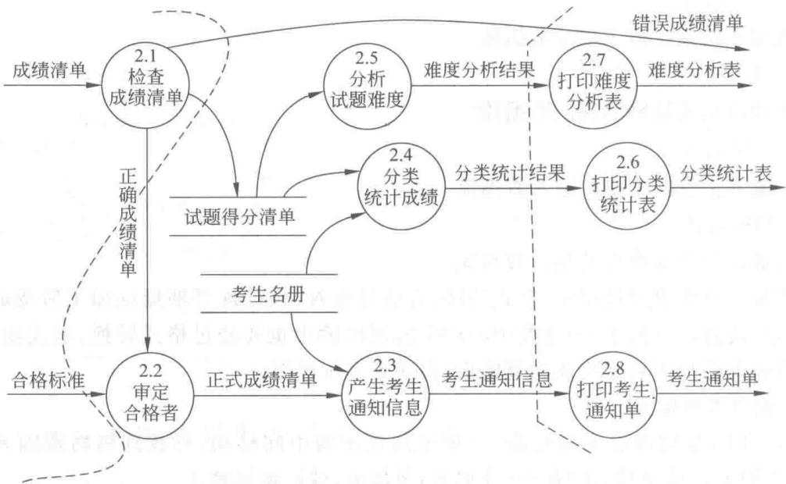
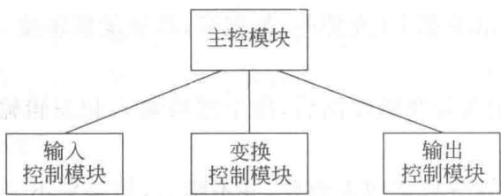
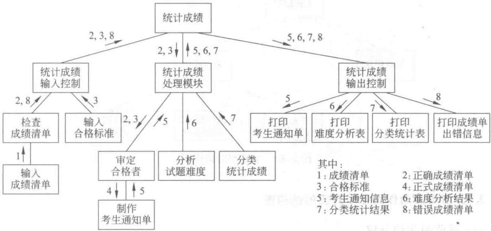
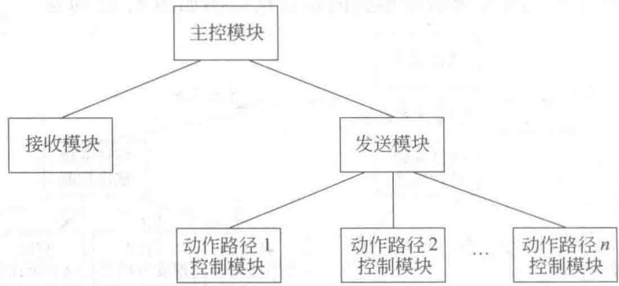
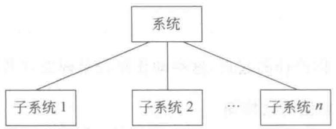
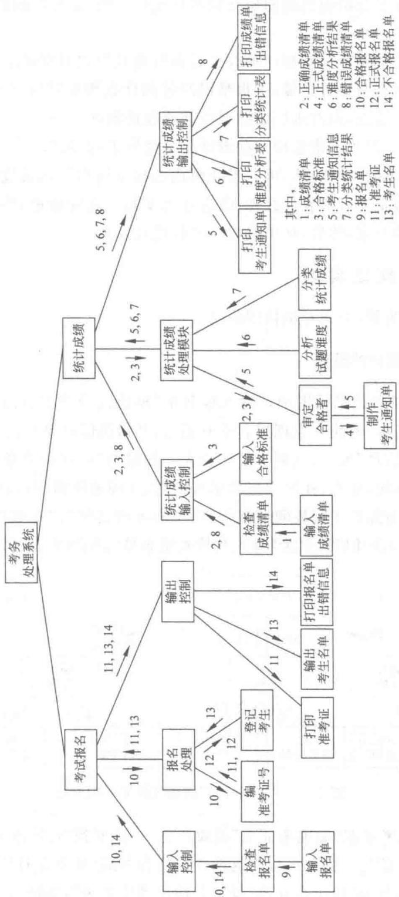

# 第5章-5.7-DFD到体系结构的映射

## 基本信息
- **课程**：软件工程
- **章节**：第5章 5.7节 数据流图到软件体系结构的映射
- **日期**：2026-06-30
- **标签**：#DFD映射 #变换分析 #事务分析 #信息流 #体系结构

---

## 重点内容

### ⭐⭐⭐ 核心概念
- **变换流**：DFD可明显分为输入、变换、输出三部分的信息流
- **事务流**：数据到达事务中心后根据类型选择一条动作路径执行
- **变换分析**：将变换型DFD映射成初始结构图的方法
- **事务分析**：将事务型DFD映射成初始结构图的方法

### ⭐⭐ 映射步骤
- 复审精化DFD -> 确定流类型 -> 映射成初始结构图 -> 改进结构图
- 变换分析：划定边界确定变换中心 -> 第一级分解 -> 第二级分解 -> 标注信息
- 事务分析：确定事务中心 -> 映射成事务型结构图 -> 分解每条动作路径

### ⭐ 关键区别
- 变换流是"顺序处理"模式，事务流是"分支选择"模式
- 复杂DFD可能同时包含变换流和事务流

---

## 详细笔记

### 一、5.7.1 信息流

结构化设计是将结构化分析的结果（DFD）映射成软件的体系结构（结构图）。根据信息流的特点，可将DFD分为**变换型数据流图**和**事务型数据流图**，对应的映射分别称为**变换分析**和**事务分析**。

> 📚 **课本出处**：第5章 5.7节开头

信息流可分为**变换流**和**事务流**两种类型。

---

#### 1. 变换流（Transform Flow）

变换流类型的数据流图可明显地分成**输入、变换、输出**三个部分：

1. 信息沿着输入路径进入系统
2. 输入信息的外部形式经过编辑、格式转换、合法性检查、预处理等辅助性加工后变成**内部形式**
3. 内部形式的信息通过**变换中心**的处理
4. 沿着输出路径经过格式转换、组成物理块、缓冲处理等辅助性加工后变成输出信息送到系统外

> 📚 **课本出处**：第5章 5.7.1节"变换流"

#### 📷 图5.27 变换流

> 📚 **课本出处**：图5.27 展示了变换流的典型结构：输入->变换中心->输出

---

#### 2. 事务流（Transaction Flow）

事务流类型的数据流图具有如下特征：数据流沿着输入路径到达一个**事务中心**，事务中心根据输入数据的类型在若干条**动作路径（action path）**中选择一条来执行。

> 📚 **课本出处**：第5章 5.7.1节"事务流"

**事务中心的任务**：
1. 接收输入数据（即事务）
2. 分析每个事务的类型
3. 根据事务类型选择执行一条动作路径

#### 📷 图5.28 事务流

> 📚 **课本出处**：图5.28 展示了事务流的典型结构：输入到达事务中心后分出多条动作路径

---

### 二、5.7.2 数据流图映射到结构图的步骤

从DFD映射到结构图的总体步骤如下：

> 📚 **课本出处**：第5章 5.7.2节"数据流图映射到结构图的步骤"

| 步骤 | 操作 | 说明 |
|:----:|:-----|:-----|
| **1** | 复审和精化数据流图 | 确保顶层图输入输出符合需求，复审分层DFD确保符合功能需求 |
| **2** | 确定数据流图的类型 | 根据信息流特征判断是变换型还是事务型 |
| **3** | 将DFD映射成初始结构图 | 采用变换分析（5.7.3）或事务分析（5.7.4）技术 |
| **4** | 改进初始结构图 | 根据设计准则和启发式策略改进（详见5.8节） |

> 💡 **理解技巧**：步骤1~2是准备工作，步骤3是核心操作，步骤4是优化过程。整个流程体现了"先粗后精"的思想。

---

### 三、5.7.3 变换分析

变换分析的任务是将变换型DFD映射成初始的结构图。

> 📚 **课本出处**：第5章 5.7.3节"变换分析"

#### 步骤1：划定输入流和输出流的边界，确定变换中心

变换型DFD的特征是可明显分成输入、变换和输出三部分。第一步骤是划定输入流和输出流的边界，从而确定变换中心。

**相关概念**：

| 概念 | 定义 |
|:----:|:-----|
| **物理输入** | 系统输入端的数据流 |
| **物理输出** | 系统输出端的数据流 |
| **逻辑输入** | 变换中心的输入数据流 |
| **逻辑输出** | 变换中心的输出数据流 |

**确定方法**：

- **确定逻辑输入**：从物理输入端开始，一步步向系统中间移动，找到离物理输入端最远但仍可被看作系统输入的数据流
- **确定逻辑输出**：从物理输出端开始，一步步向系统中间移动，找到离物理输出端最远但仍可被看作系统输出的数据流
- **确定变换中心**：逻辑输入和逻辑输出之间的部分就是变换中心

> ⚠️ **常见误区**：这种划分可能因人而异，并不唯一，但差别不会太大，并可通过以后的结构图改进进行调整。有时物理输入就是逻辑输入（无须预处理），物理输出就是逻辑输出。

#### 📷 图5.29 统计成绩子图的输入、输出流边界

> 📚 **课本出处**：图5.29 考务处理系统"统计成绩"子图，虚线指出了输入流和输出流的边界，"合格标准"既是物理输入又是逻辑输入

---

#### 步骤2：进行第一级分解

第一级分解是将DFD映射成变换型的程序结构。

#### 📷 图5.30 变换型的结构图

> 📚 **课本出处**：图5.30 变换型结构图的标准形态

**第一级分解产生四个模块**：

| 模块 | 功能 |
|:----:|:-----|
| **主控模块** | 完成整个系统的功能 |
| **输入控制模块** | 接收所有物理输入，将其加工成逻辑输入 |
| **变换控制模块** | 实现逻辑输入到逻辑输出的变换 |
| **输出控制模块** | 将逻辑输出加工成物理输出并送到系统外 |

> 💡 **理解技巧**：第一级分解的核心思想是"三段式"——输入、变换、输出各对应一个控制模块。对于大型系统，可多分解几个模块以减少最终层次。

#### 📷 图5.31 "统计成绩"第一级分解的结构图

> 📚 **课本出处**：图5.31 "统计成绩"子图经第一级分解后的结构图

---

#### 步骤3：进行第二级分解

第二级分解是将DFD中的加工映射成结构图中适当的模块：

| 分解对象 | 方法 |
|:--------:|:-----|
| **输入控制模块的分解** | 从变换中心边界开始，沿输入路径向外移动，把每个加工和物理输入的接收映射为低层模块 |
| **输出控制模块的分解** | 从变换中心边界开始，沿输出路径向外移动，把每个加工和物理输出的发送映射为低层模块 |
| **变换控制模块的分解** | 把变换中心的每个加工映射为低层模块 |

#### 📷 图5.32 "统计成绩"第二级分解的结构图

> 📚 **课本出处**：图5.32 "统计成绩"子图经第二级分解后的初始结构图，标注了模块间传递的输入输出信息

---

#### 步骤4：标注输入输出信息

第二级分解后得到软件的初始结构图。然后根据DFD，在初始结构图上标注模块之间传递的输入信息和输出信息。

---

### 四、5.7.4 事务分析

事务分析的任务是将事务型DFD映射成初始的结构图。

> 📚 **课本出处**：第5章 5.7.4节"事务分析"

**应用场景**：银行业务中有存款、取款、查询余额、开户、转账等多种事务，接收一个事务后根据类型执行相应的处理功能。

#### 步骤1：确定事务中心

事务中心位于数条动作路径的起点，这些动作路径呈辐射状从该点流出。

#### 步骤2：将DFD映射成事务型的结构图

#### 📷 图5.33 事务型的结构图

> 📚 **课本出处**：图5.33 事务型结构图的标准形态

**事务型结构图的四个模块**：

| 模块 | 功能 |
|:----:|:-----|
| **主控模块** | 完成整个系统的功能 |
| **接收模块** | 接收输入数据（事务） |
| **发送模块** | 根据输入事务的类型，选择调用一个动作路径控制模块 |
| **动作路径控制模块** | 完成相应的动作路径所执行的子功能 |

#### 步骤3：分解每条动作路径所对应的结构图

| 分解对象 | 方法 |
|:--------:|:-----|
| **接收模块的分解** | 从事务中心开始，沿输入路径向外移动，把每个加工和物理输入的接收映射为低层模块 |
| **动作路径控制模块的分解** | 先确定每条动作路径的流类型（变换流或事务流），再运用变换分析或事务分析将其映射成结构子图 |

> 💡 **理解技巧**：事务分析的关键是"先判断后执行"——发送模块就是"调度器"，根据事务类型分派到对应的动作路径。每条动作路径本身可能是变换流，因此可以递归地使用变换分析。

---

### 五、5.7.5 分层DFD的映射

对于分层数据流图，0层图反映了系统由哪些子系统组成。

> 📚 **课本出处**：第5章 5.7.5节"分层DFD的映射"

**映射策略**：
1. 先将0层图映射成顶层结构图
2. 0层图每个加工的DFD子图映射成以相应模块为根模块的结构子图
3. 如果DFD子图中的加工还可分解成子图，继续映射
4. 依次一层一层分解，得到最终的初始结构图
5. 如果结构图太大，可以组织成分层的结构图

#### 📷 图5.34 0层图映射的结构图

> 📚 **课本出处**：图5.34 展示了0层图映射成的顶层结构图

#### 📷 图5.35 "考务处理系统"的初始结构图

> 📚 **课本出处**：图5.35 考务处理系统的分层DFD映射成的完整初始结构图

> 💡 **理解技巧**：复杂DFD图可能**同时包含变换流和事务流**。此时，按照自顶向下逐层分解的原则，先分析外层的流特性（把局部流看作单个加工）映射成外层结构图，再根据内层流特性映射成结构子图。这体现了"分而治之"的思想。

---

## 总结

### 变换分析 vs 事务分析 对比表

| 对比项 | 变换分析 | 事务分析 |
|:------:|:--------:|:--------:|
| **适用的DFD类型** | 变换型DFD | 事务型DFD |
| **信息流特征** | 输入->变换->输出（顺序处理） | 事务中心根据类型选择动作路径（分支选择） |
| **核心步骤** | 划定边界->确定变换中心->两级分解 | 确定事务中心->映射结构图->分解动作路径 |
| **结构图形态** | 输入控制+变换控制+输出控制 | 接收模块+发送模块+多个动作路径模块 |
| **分解方向** | 沿输入/输出路径双向展开 | 沿各条动作路径分别展开 |
| **典型应用** | 数据处理管道、格式转换系统 | 银行业务、菜单驱动系统 |
| **第一级分解产物** | 主控+输入控制+变换控制+输出控制 | 主控+接收+发送+动作路径控制 |

### 映射四步法

| 步骤 | 内容 | 关键操作 |
|:----:|:-----|:---------|
| **1** | 复审和精化DFD | 确保输入输出符合需求 |
| **2** | 确定DFD类型 | 判断变换型还是事务型 |
| **3** | 映射成初始结构图 | 变换分析或事务分析 |
| **4** | 改进初始结构图 | 启发式设计策略 |

### 变换分析详细步骤

| 步骤 | 名称 | 核心任务 |
|:----:|:-----|:---------|
| **1** | 确定变换中心 | 划定输入流和输出流的边界，确定逻辑输入/输出 |
| **2** | 第一级分解 | 映射为变换型结构图（主控+输入控制+变换控制+输出控制） |
| **3** | 第二级分解 | DFD中的每个加工映射为结构图中的低层模块 |
| **4** | 标注信息 | 在结构图上标注模块间传递的输入输出信息 |

### 关键要点

1. **两种信息流**：变换流（顺序处理）和事务流（分支选择），是映射方法选择的依据
2. **物理输入/输出 vs 逻辑输入/输出**：物理输入经过预处理变成逻辑输入，逻辑输出经过后处理变成物理输出
3. **变换分析的核心是确定变换中心**：从物理输入/输出端向中间移动找逻辑输入/输出
4. **事务分析的核心是确定事务中心**：动作路径呈辐射状从该点流出
5. **混合流处理**：复杂DFD同时包含两种流时，自顶向下逐层分析，先外层后内层
6. **分层DFD映射**：0层图映射顶层结构图，子图逐层映射为结构子图

---

## 疑问与思考

### ❓ 疑问1：变换流和事务流的本质区别是什么？
能否用一句话概括？

💡 一句话概括：变换流是"数据过流水线"——数据进来经过加工处理后出去；事务流是"根据类型选菜单"——数据到达后根据其类型选择一条处理路径执行。本质区别在于信息流的分叉方式：变换流只有一个处理主干（输入->变换->输出），事务流在某一点根据条件分出多条独立的动作路径。实际中大多数系统是混合型的：外层是事务流（选功能），每条路径内部是变换流（处理数据）。

### ❓ 疑问2：变换分析中"划定边界不唯一"会不会导致不同人得到完全不同的结构图？
如何保证一致性？

💡 边界划定确实可能因人而异，但不会导致"完全不同"的结构图。原因是：(1) 物理输入/输出端是确定的，大多数人对逻辑输入/输出的判断差别不大；(2) 即使第一级分解有差异，后续的改进过程（5.8节）会进一步修正；(3) 结构化设计强调折衷和迭代，最终目标是得到合理的设计而非唯一正确的答案。保证一致性的方法是团队复审和设计评审，通过集体讨论确定最合理的边界划分。

### ❓ 疑问3：事务分析中，如果某些动作路径本身又是事务流（嵌套事务），应该如何处理？
课本没有明确提到这种情况。

💡 嵌套事务的处理体现了结构化设计"分而治之"的核心思想：对每条动作路径，先独立判断其流类型。如果某条动作路径内部又是事务流，就递归地对该路径使用事务分析；如果是变换流，就使用变换分析。这与分层DFD的映射策略一致——自顶向下逐层分析，每层独立处理。课本虽然没有专门讨论，但5.7.5节"复杂DFD同时包含变换流和事务流时，先外层后内层"已经隐含了这个处理方式。

### ❓ 疑问4：分层DFD映射时，外层是变换流、内层是事务流的情况如何处理？反之呢？

💡 课本5.7.5节已经给出原则：按照自顶向下逐层分解，先分析外层的流特性，把内层的每个子图看作外层的一个"加工"来整体映射。所以外层变换流、内层事务流时：先对整体做变换分析得到顶层结构图，再对每条子图做事务分析得到结构子图。反之（外层事务流、内层变换流）也一样：先做事务分析得到框架，再对每条动作路径做变换分析。关键是每层独立判断流类型，不必强求一致。

### ❓ 疑问5：当一个系统同时包含变换流和事务流时，应该先处理哪种？
为什么？

💡 应该先处理外层（高层）的流类型，再处理内层（低层）的流类型。因为结构化设计是自顶向下的，外层决定整体框架，内层在框架内细化。如果外层是事务流，先用事务分析搭建"分派+各路径"的骨架，再在每条路径内部用变换分析细化；反之亦然。这与分层DFD映射的思路完全一致，体现了"先粗后精"的设计思想。

---

## 相关链接

### 本节相关图片
- [图5.27 变换流](../../../images/680ed13860aec8f5455c1b51693cf2647ed4c5b80dc624800f238b3e75a049ab.jpg)
- [图5.28 事务流](../../../images/dc7757d92434b3221a2913001c6f24fdc7a989550670da4bfe85aa144948f2fc.jpg)
- [图5.29 统计成绩子图边界](../../../images/786dc9bfbd169a5cde24cde5892d5a991aa1edfb8e844b859593d5fe0b50f7b3.jpg)
- [图5.30 变换型结构图](../../../images/142ef4766648e64ac7cafee9e81d6c7ccd4c507d453479eb0b6a4f897e1413b8.jpg)
- [图5.31 统计成绩第一级分解](../../../images/e64e64076c910da5398c56c73827411713e91a74391fa254214021395f5ec7bc.jpg)
- [图5.32 统计成绩第二级分解](../../../images/bb54bea5ac9922356c8eea92708e948a93366ec37a0c159887ec645ae7789166.jpg)
- [图5.33 事务型结构图](../../../images/964b58b83146458a16d6ef7a2e951b33c3688489723a27745bafd23c4725953a.jpg)
- [图5.34 0层图映射的结构图](../../../images/2a557d050b05210149acb6de27567027e9a7407761848ed043d02cb60ac14ae2.jpg)
- [图5.35 考务处理系统初始结构图](../../../images/ad0e1bd193e599755b3c17ca4e2ffd6ad515053808c2488cad8a10b70cb15602.jpg)

### 关联章节
- [第5章-5.6-结构化设计概述](./第5章-5.6-结构化设计概述.md)
- 第5章-5.8-结构图的改进（待创建）
- 第5章-5.2-结构化分析（待创建）
- 第5章-5.3-数据流图（待创建）

---

## 检查清单

- [x] 已理解变换流和事务流的区别
- [x] 已掌握DFD映射到结构图的四个步骤
- [x] 已掌握变换分析的四个步骤（确定变换中心、第一级分解、第二级分解、标注信息）
- [x] 已掌握物理输入/输出与逻辑输入/输出的概念和确定方法
- [x] 已掌握事务分析的三个步骤（确定事务中心、映射结构图、分解动作路径）
- [x] 已理解分层DFD的映射策略
- [x] 已插入课本原图（图5.27~图5.35）
- [x] 已记录重点标记和课本出处

---

*笔记创建时间：2026-06-30*
