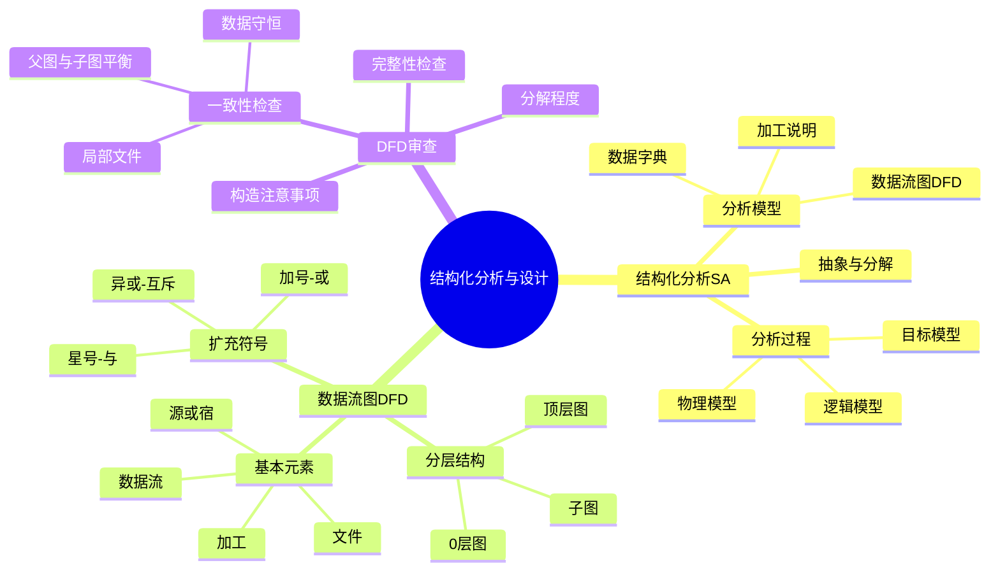

# 第5章-结构化分析与设计

## 基本信息
- **课程**：软件工程
- **章节**：第5章 结构化分析与设计
- **日期**：2026-06-30
- **标签**：#结构化方法 #分析与设计 #数据流图 #DFD #数据字典 #SA #SD

---

## 重点内容

### ⭐⭐ 本章核心
- **结构化方法三要素**：结构化分析（SA）+ 结构化设计（SD）+ 结构化程序设计（SP）
- **数据流图（DFD）**：结构化分析的核心工具，描述系统功能模型
- **分层DFD**：自顶向下逐层分解，控制复杂度

### ⭐ 关键概念
- **分析模型组成**：数据流图 + 数据字典 + 加工说明（三驾马车）
- **抽象与分解**：处理复杂问题的两个基本手段
- **父图与子图平衡**：分层DFD的正确性保障
- **7加减2原则**：每个加工分解的子加工数量控制

---

## 章节结构

### 5.1 结构化分析方法概述
- 抽象与分解的思想
- 结构化分析的4个步骤
- 分析模型的描述形式（DFD + 数据字典 + E-R图 + 状态转换图）
- 详细笔记：[第5章-5.1-结构化分析方法概述](./第5章-5.1-结构化分析方法概述.md)

### 5.2 数据流图 ⭐
- DFD基本图形元素（数据源/宿、加工、数据流、文件）
- DFD扩充符号（星号、加号、异或）
- 分层DFD的层次结构与编号
- 分层DFD的画法（顶层图 -> 0层图 -> 子图分解）
- 详细笔记：[第5章-5.2-数据流图](./第5章-5.2-数据流图.md)

### 5.3 分层数据流图的审查
- 一致性检查（父图与子图平衡、数据守恒、局部文件）
- 完整性检查
- 构造DFD的注意事项
- 分解程度（7加减2原则）
- 详细笔记：[第5章-5.3-分层数据流图的审查](./第5章-5.3-分层数据流图的审查.md)

### 5.4 数据字典（待补充）
### 5.5 描述基本加工的小说明（待补充）
### 5.6 结构化设计概述（待补充）
### 5.7 数据流图到软件体系结构的映射（待补充）
### 5.8 初始结构图的改进（待补充）

---

## 知识点脑图

---

## 关联章节

- [第4章-设计工程](../第4章-设计工程/第4章-设计工程.md) — 设计原则基础
- [第6章-面向数据结构的分析与设计](../第6章-面向数据结构的分析与设计/第6章-面向数据结构的分析与设计.md) — 另一种分析设计方法
- 第5章-5.4-数据字典（待创建）
- 第5章-5.5-描述基本加工的小说明（待创建）
- 第5章-5.6-结构化设计概述（待创建）
- 第5章-5.7-数据流图到软件体系结构的映射（待创建）
- 第5章-5.8-初始结构图的改进（待创建）

---

## 检查清单

- [x] 已梳理第5章整体结构
- [x] 已创建5.1节笔记
- [x] 已创建5.2节笔记
- [x] 已创建5.3节笔记
- [ ] 已创建5.4节笔记（数据字典）
- [ ] 已创建5.5节笔记（加工小说明）
- [ ] 已创建5.6节笔记（结构化设计概述）
- [ ] 已创建5.7节笔记（DFD到体系结构的映射）
- [ ] 已创建5.8节笔记（结构图改进）

---

*笔记创建时间：2026-06-30*
