# 第6章-6.1-JSP方法

## 基本信息
- **课程**：软件工程
- **章节**：第6章 6.1节 JSP方法
- **日期**：2026-06-30
- **标签**：#JSP方法 #Jackson图 #数据结构 #程序结构 #面向数据结构

---

## 重点内容

### ⭐⭐⭐ 核心概念
- **JSP方法**：Jackson Structured Programming，核心思想是使程序结构与问题结构（数据结构）相对应
- **Jackson图**：用树状层次结构表示数据结构和程序结构，从左到右阅读
- **结构正文（伪码）**：与Jackson图对应的文本表示形式

### ⭐⭐ 三种基本元素类型
- **顺序元素**：从左到右的元素序列，每个元素只出现一次
- **选择元素**：根据条件从多个子元素中选择一个（用右上角标小圆的矩形表示）
- **重复元素**：一个子元素重复0次或多次（用右上角标星号的矩形表示）

### ⭐ JSP方法的5个步骤
1. 画出输入和输出数据结构的Jackson图
2. 找出输入输出数据结构中有对应关系的数据元素
3. 从数据结构图导出程序结构图
4. 列出所有操作和条件，分配到程序结构图
5. 用伪码表示

---

## 详细笔记

### 一、数据结构与程序结构的表示（6.1.1节）

> 📚 **课本出处**：第6章 6.1.1节"数据结构与程序结构的表示"

JSP方法的核心设计原则：**使程序结构与问题结构（数据结构）相对应**。

对于一般的数据处理系统而言，大多数系统处理的是具有层次结构的数据。例如，一个文件由记录组成，记录又由数据项组成。对应于该数据结构，可建立其模块的层次结构。

#### 📷 图6.1 数据结构和程序结构

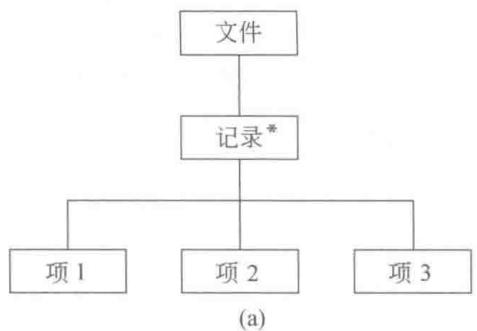

> 📚 **课本出处**：图6.1(a)数据结构图中方框表示数据，图6.1(b)程序结构图中方框表示模块（过程或函数）

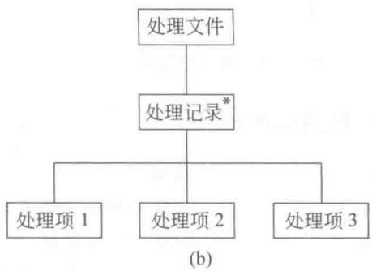

> 💡 **理解技巧**：Jackson图是一种从左到右阅读的树状层次结构图。树状图底部的叶子结点称为**基本元素**，底部枝干以上的结点称为**结构元素**。

#### 1. 顺序元素

一个顺序元素由一个或多个从左到右的元素组成，其中每个组成的元素只出现一次。

#### 📷 图6.2 顺序元素

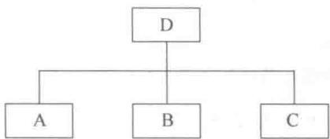

> 📚 **课本出处**：图6.2中，元素D是由元素A、元素B及元素C顺序组成的序列

#### 2. 选择元素

一个选择元素包括两个或两个以上的子元素，使用选择元素时根据指定的条件从这些子元素中选择一个子元素。

#### 📷 图6.3 选择元素

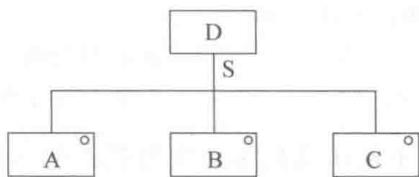

> 📚 **课本出处**：图6.3中，元素D或者是元素A、或者是元素B、或者是元素C，其中S是选择条件。父元素D必须包含选择的逻辑条件S

⚠️ **常见误区**：选择结构必须有两个或多个元素。如果需要`if S then X else do nothing`，则需要加入一个**空元素**（用标有连字符的矩形表示）。

#### 📷 图6.4 空元素

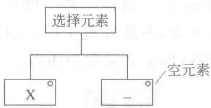

#### 3. 重复元素

重复元素仅由一个子元素构成，表示重复元素由子元素重复0次或多次组成。

#### 📷 图6.5 重复元素

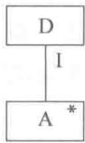

> 📚 **课本出处**：图6.5中，元素D由元素A重复0次或多次组成，其中I是重复条件

#### 4. 结构正文（伪码）

结构正文与Jackson图相对应，是Jackson图的文本表示形式。

**顺序结构正文**：

```
D Seq       -- 元素D是一个序列
  A;        -- 元素D是由元素A
  B;        -- 跟随一个元素B
  C;        -- 跟随一个元素C组成
D end       -- 元素D是A、B、C的序列
```

**选择结构正文**：

```
D Select cond1    -- 元素D选择
  A               -- 或是元素A
  or cond2
  B               -- 或是元素B
  or cond3
  C               -- 或是元素C组成
D end             -- cond1/cond2/cond3分别是选择A/B/C的条件
```

**重复结构正文**：

```
D Iter until cond   -- 元素D是重复（直到条件成立）
  A;                -- 元素D是由1个或多个元素A组成
D end               -- cond为循环终止条件
```

或：

```
D Iter while cond   -- 元素D是重复（条件成立时）
  A;                -- 元素D是由0至多个元素A组成
D end               -- cond为循环条件
```

> 💡 **理解技巧**：`Iter until`是先执行后判断（至少执行一次），`Iter while`是先判断后执行（可能一次都不执行），对应编程中的`do-while`和`while`循环。

---

### 二、实例：打印学校人员一览表（例6.1）

> 📚 **课本出处**：第6章 6.1.1节 例6.1

设计一个打印学校人员一览表的程序，表格由表头、表体、表尾组成。表体由若干行组成，每行有姓名、年龄、类别、状态4列。其中状态项根据类别（教师/学生）不同而分别输出工龄或年级。

#### 📷 图6.6 表格形式

表格的数据结构对应程序结构：

| 数据结构元素 | 程序结构模块 |
|:----------:|:----------:|
| 表格（顺序：表头+表体+表尾） | 产生表格（顺序：产生表头+产生表体+产生表尾） |
| 表体（重复：行） | 产生表体（重复：产生行） |
| 行（顺序：姓名+年龄+类别+状态） | 产生行（顺序：产生姓名+产生年龄+产生类别+产生状态） |
| 状态（选择：教师工龄/学生年级） | 产生状态（选择：产生工龄/产生年级） |

#### 📷 图6.7 打印表格程序的输出数据结构和对应的程序结构

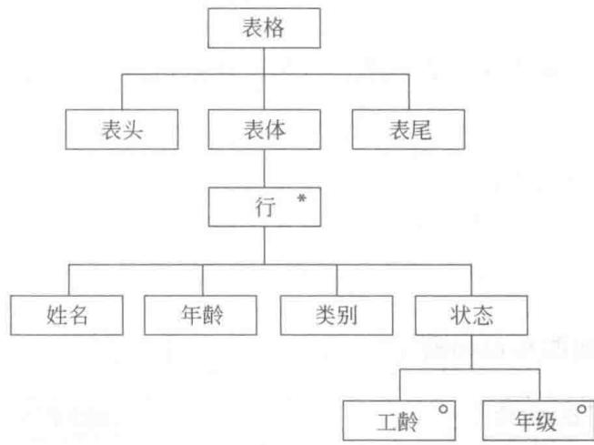

> 📚 **课本出处**：图6.7(a)为输出数据结构的Jackson图

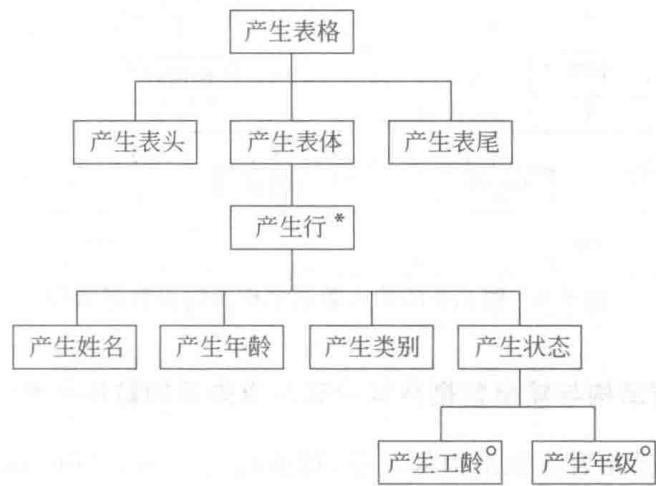

> 📚 **课本出处**：图6.7(b)为对应程序结构的Jackson图，展示了三种类型（顺序、重复、选择）在实际中的应用

---

### 三、JSP方法的分析和设计步骤（6.1.2节）

> 📚 **课本出处**：第6章 6.1.2节"JSP方法的分析和设计步骤"

以例6.2（统计正文文件中空格个数）为例，JSP方法共包含以下**5个顺序执行的步骤**。

#### 步骤1：分析并确定输入和输出数据结构的逻辑结构

用Jackson图画出输入和输出数据结构。

#### 📷 图6.8 输入数据结构及输出数据结构

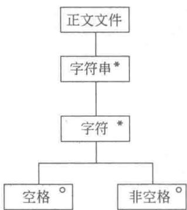

> 📚 **课本出处**：图6.8(a)为输入数据结构：正文文件由多个字符串组成，字符串由多个字符组成

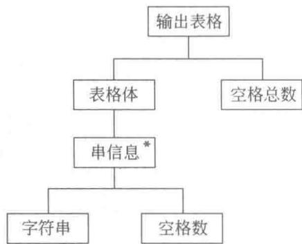

> 📚 **课本出处**：图6.8(b)为输出数据结构：输出表格由多个串信息和空格总数组成

#### 步骤2：找出输入输出数据结构中有对应关系的数据元素

**对应关系**：有直接的因果关系，在程序中可以同时处理的数据元素。

对应关系的确定规则：
- 输入输出数据结构最高层次的两个数据元素**总是**有对应关系的
- 对于表示"重复"的数据元素，只有**重复次数和次序都相同**时才有对应关系

#### 📷 图6.9 输入输出的对应关系

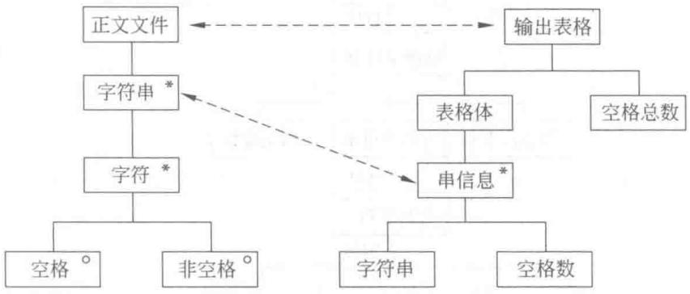

> 📚 **课本出处**：图6.9中虚线箭头表示对应关系——"正文文件"与"输出表格"有对应关系，"字符串"与"串信息"有对应关系

#### 步骤3：从数据结构图导出程序结构图

导出规则：
1. 有对应关系的数据元素：在程序结构图的相应层次上画一个处理框，层次取两者中**较低**的那个
2. 输入数据结构图中剩余元素：增加"分析"或"处理"前缀
3. 输出数据结构图中剩余元素：增加输出动词（如"打印"）

#### 📷 图6.10 程序结构图

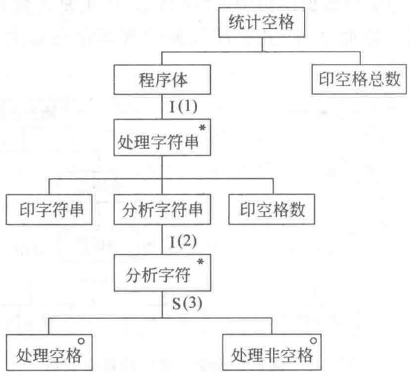

> 📚 **课本出处**：图6.10展示了根据对应关系导出的程序结构图

#### 步骤4：列出所有操作和条件，分配到程序结构图

从输出操作开始，再回到输入操作，最后加入条件相关操作。

**操作列表**：
| 编号 | 操作 | 编号 | 操作 |
|:----:|:-----|:----:|:-----|
| ① | 停止 | ⑧ | totalsum:=totalsum+1 |
| ② | 打开文件 | ⑨ | 读入字符串 |
| ③ | 关闭文件 | ⑩ | sum:=0 |
| ④ | 打印字符串 | ⑪ | totalsum:=0 |
| ⑤ | 打印空格数 | ⑫ | pointer:=1 |
| ⑥ | 打印空格总数 | ⑬ | pointer:=pointer+1 |
| ⑦ | sum:=sum+1 | | |

**条件列表**：
| 编号 | 条件 |
|:----:|:-----|
| I(1) | 文件结束条件 |
| I(2) | 字符串结束条件 |
| S(3) | 字符是空格 |

#### 📷 图6.11 带操作的结构图

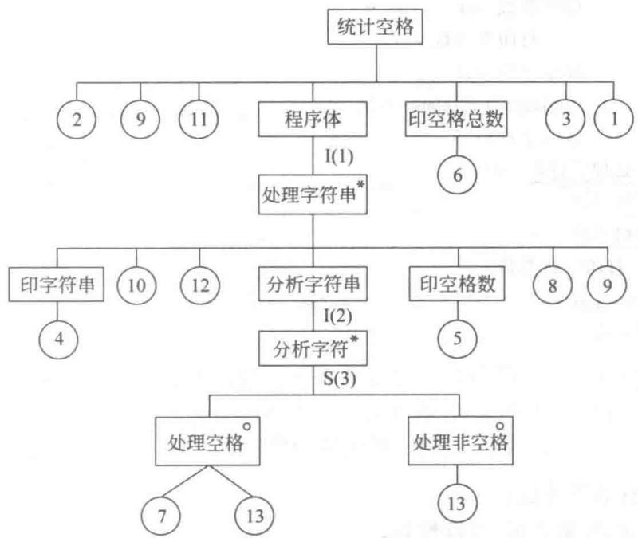

> 📚 **课本出处**：图6.11展示了将操作和条件分配到程序结构图后的完整结构图

#### 步骤5：用伪码表示

把带有操作的程序结构图转换成结构正文。

#### 📷 图6.12 程序伪码


> 📚 **课本出处**：图6.12展示了完整的程序伪码

伪码示例（简化）：

```
统计空格 Seq
  打开文件
  读入字符串
  totalsum := 0
  程序体 Iter until 文件结束
    处理字符串 Seq
      印字符串 Seq
        打印字符串
      印字符串 End
      sum := 0
      pointer := 1
      分析字符串 Iter until 字符串结束
        分析字符 Select 字符是空格
          处理空格 Seq
            sum := sum + 1
            pointer := pointer + 1
          处理空格 End
        分析字符 Or 字符不是空格
          处理非空格 Seq
            pointer := pointer + 1
          处理非空格 End
        分析字符 End
      分析字符串 End
      印空格数 Seq
        打印空格数
      印空格数 End
      totalsum := totalsum + sum
      读入字符串
    处理字符串 End
  程序体 End
  印空格总数 Seq
    打印空格总数
  印空格总数 End
  关闭文件
  停止
统计空格 End
```

---

### 四、JSP方法的特点

> 📚 **课本出处**：第6章 6.1.2节末尾

- 简单、易学、形象直观、可读性好
- 便于表示层次结构
- 适用于小型数据处理系统

---

## 总结

### Jackson图三种结构对比表

| 结构类型 | 图形标记 | 结构正文 | 编程对应 | 说明 |
|:--------:|:--------:|:--------:|:--------:|:-----|
| 顺序元素 | 多个矩形从左到右排列 | `Seq ... End` | 顺序语句 | 元素从左到右依次执行，每个只出现一次 |
| 选择元素 | 右上角标小圆 | `Select ... Or ... End` | if-else / switch | 根据条件选择一个子元素执行，必须有至少两个子元素 |
| 重复元素 | 右上角标星号 | `Iter until/while ... End` | do-while / while循环 | 子元素重复0次或多次 |
| 空元素 | 标有连字符的矩形 | （空操作） | else分支为空 | 当选择结构需要"不做任何操作"时使用 |

### JSP方法5个步骤总结

| 步骤 | 内容 | 关键动作 |
|:----:|:-----|:--------:|
| 1 | 分析输入/输出数据结构 | 用Jackson图画出 |
| 2 | 找出对应关系 | 有因果关系的数据元素 |
| 3 | 导出程序结构 | 层次取较低者，加入动词前缀 |
| 4 | 分配操作和条件 | 先输出后输入，再条件 |
| 5 | 伪码表示 | 转换为结构正文 |

### 关键要点

1. **核心原则**：程序结构与数据结构（问题结构）相对应
2. **Jackson图**是JSP的核心表示工具，用三种基本结构描述所有数据和程序
3. **对应关系**是连接数据结构和程序结构的桥梁，输入输出最高层总对应
4. **导出规则**的三个要点：有对应取低层、输入加"分析/处理"、输出加动词
5. JSP适用于**小型数据处理系统**，简单直观但有局限性

---

## 疑问与思考

### ❓ 疑问与思考

**❓ JSP三种基本结构的完整性：顺序、选择、重复是否足以表示所有数据处理问题？当数据结构不满足层次结构（如图结构、网状结构）时，JSP是否还能适用？**

💡 这三种基本结构足够表示所有层次结构的数据处理问题，这是结构化程序设计的理论基础（Böhm-Jacopini定理）。但对于非层次结构（图、网状结构），JSP确实不直接适用，需要先将数据组织为层次化表示，或者改用其他方法。

**❓ JSP和数据流分析的区别：第5章结构化设计从数据流图导出程序结构，JSP从数据结构导出程序结构，两种方法在本质上有什么区别？适用场景有何不同？**

💡 结构化设计（SD）以"数据流"驱动，关注数据在系统中的变换过程；JSP以"数据结构"驱动，关注数据的静态层次组织。SD更适合分析型系统（强调数据变换），JSP更适合数据处理型系统（强调数据的层次对应关系）。

**❓ 对应关系的确定：当输入输出数据结构之间存在多对多关系时，如何确定对应关系？**

💡 JSP要求输入输出的重复元素必须"重复次数和次序都相同"才建立对应关系。当出现多对多时，通常需要重新审视数据结构的划分，或引入辅助的数据结构来消除歧义。实际操作中，最高层次总是有对应关系的，逐层向下匹配即可。

**❓ JSP的局限性：JSP方法适用于顺序处理，对于并发、实时系统如何处理？**

💡 JSP本身确实只覆盖顺序处理。对于并发和实时系统，需要借助JSD方法（JSP的扩充），JSD在活动5中专门引入了"施加时间控制"来处理进程调度和并发协调问题。

### 💡 个人理解/技巧
- JSP三种基本结构直接对应结构化程序设计的三种基本控制结构，这是JSP的理论基础
- 记忆Jackson图标记：选择=圆（o表示选项），重复=星号（*表示多个）
- `Iter until`（直到型）至少执行一次，`Iter while`（当型）可能不执行，对应`do-while`和`while`
- JSP的5个步骤可以简化记忆为：**画结构-找对应-导程序-分操作-写伪码**
- 步骤4中操作分配的顺序很重要：先列输出操作、再列输入操作、最后加条件操作
- JSP方法的核心思想"数据结构决定程序结构"可以理解为：**你的数据长什么样，你的程序就该怎么组织**

---

## 相关链接

### 本节相关图片
- [图6.1(a) 数据结构](../../../images/9e2d82ade6c2e29ac731cb64e3061fdb75d1a7c0537aa81e5661342782e37bf3.jpg)
- [图6.1(b) 程序结构](../../../images/aa5c9bd3e036a4cb8c7aab3bd59b8ec4b2e0ba2c5170df587e88059e3fe2647d.jpg)
- [图6.2 顺序元素](../../../images/60857f3dfc72988bfad8d1a73ad115e2a0a27c939029a9eca336c29a8933b0c8.jpg)
- [图6.3 选择元素](../../../images/c224c1971332165a1e5253b899a98d52476c0007ba07d3ef96e479a9f12891d8.jpg)
- [图6.4 空元素](../../../images/79afbcb81ea9ea89fcbbb765d12eaefa852c0f9fa873cdabe47af94c26a05c11.jpg)
- [图6.5 重复元素](../../../images/bd0635c3085b24dc730701f7d099cc6df5a23925d7ecb745a9c94a209fcf153a.jpg)
- [图6.7(a) 输出数据结构](../../../images/6722324925da27043a1fd36c01566e65a94beae4d7221bb4d27cbad129e437f6.jpg)
- [图6.7(b) 程序结构](../../../images/957c466efd09f54b86a2ec2041bc02eae367e233b4c60b6f1666722ae5e1c0b7.jpg)
- [图6.8(a) 输入数据结构](../../../images/2a663eb2185bb191d52c0345ee256b5a43f583185171601e947549edfdcefad4.jpg)
- [图6.8(b) 输出数据结构](../../../images/4091c65cb2d3e552dcf6a47bc3fe41f0319fce00e4ef9932f9164ea023ff33d4.jpg)
- [图6.9 输入输出对应关系](../../../images/a45c88ce6ae80ff9da0384e6c04a4c4d986ccc8e9238cdbc985d8982d2123886.jpg)
- [图6.10 程序结构图](../../../images/1113ba09c669713fd9fbd479ba3a279fee903ae87b4374d9f6ea3b7ad4865138.jpg)
- [图6.11 带操作的结构图](../../../images/8b2d2dac988f4ac4a57dd80a932e14779892d3731b87f6eee18a17342a67df6e.jpg)

### 关联章节
- [第6章-面向数据结构的分析与设计](./第6章-面向数据结构的分析与设计.md) — 本章概述
- [第6章-6.2-JSD方法简介](./第6章-6.2-JSD方法简介.md) — JSD方法（JSP的扩充）
- [第5章-结构化分析与设计](../第5章-结构化分析与设计/) — 结构化方法（对比学习）

---

## 检查清单

- [x] 已理解JSP方法的核心思想
- [x] 已掌握Jackson图三种基本结构（顺序/选择/重复）
- [x] 已理解结构正文（伪码）的三种写法
- [x] 已掌握JSP方法的5个步骤
- [x] 已理解例6.1（打印表格）中三种结构的应用
- [x] 已理解例6.2（统计空格）的完整JSP分析设计过程
- [x] 已插入课本原图（图6.1-6.12）
- [x] 已添加课本出处标注

---

*笔记创建时间：2026-06-30*
