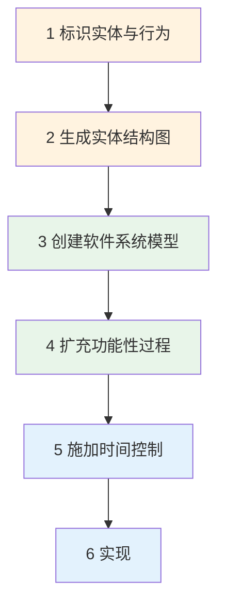

# 第6章-6.2-JSD方法简介

## 基本信息
- **课程**：软件工程
- **章节**：第6章 6.2节 JSD方法简介
- **日期**：2026-06-30
- **标签**：#JSD方法 #Jackson #系统开发 #面向数据结构 #实体建模

---

## 重点内容

### ⭐⭐ 核心概念
- **JSD方法**（Jackson System Development）：JSP的扩充，覆盖从系统分析到实现的完整过程
- **本质**：先建立一个现实模型，然后加入功能性处理，最后将逻辑系统转换为实际设计
- **6个主要活动**：标识实体与行为 -> 生成实体结构图 -> 创建软件模型 -> 扩充功能 -> 施加时间控制 -> 实现

### ⭐ JSP与JSD的区别
- JSP：局限于中小规模问题及顺序处理
- JSD：扩展到大规模系统，覆盖完整的开发生命周期

---

## 详细笔记

### 一、JSD方法概述

> 📚 **课本出处**：第6章 6.2节"JSD方法简介"

JSP方法广泛使用十多年后，Jackson对其进行了扩充，不再局限于中小规模的问题及顺序范围，新的开发方法称为**JSD方法**（Jackson System Development）。

**JSD的本质**：先建立一个现实模型，然后加入功能性处理。在最后阶段，逻辑系统才转换为实际设计。

与JSP相比，JSD的关键变化：

| 方面 | JSP | JSD |
|:----:|:----:|:----:|
| 关注范围 | 程序级 | 系统级 |
| 问题规模 | 中小型 | 可扩展到大规模 |
| 处理方式 | 顺序处理 | 含时间控制和并发 |
| 开发阶段 | 侧重设计 | 覆盖分析到实现 |
| 建模起点 | 数据结构 | 现实世界的实体与行为 |

> 💡 **理解技巧**：可以把JSD理解为"升级版的JSP"——JSP只关注如何把数据结构映射为程序结构，而JSD则从更高的视角出发，先建模现实世界，再逐步加入功能性处理和技术实现。

### 二、JSD方法的6个主要活动

> 📚 **课本出处**：第6章 6.2节"JSD方法的6个步骤"

#### 活动1：标识实体与行为

建立现实的模型，列出与系统有关的**实体表**及**活动表**。

> 📚 **课本出处**：第6章 6.2节"1.标识实体与行为"

- 识别系统中有哪些客观存在的实体（如用户、订单、商品等）
- 识别每个实体有哪些行为（如用户下单、商品入库等）
- 这是JSD分析阶段的起点，对应需求分析

#### 活动2：生成实体结构图

分析实体表中实体之间的关系，形成**实体结构图**。

> 📚 **课本出处**：第6章 6.2节"2.生成实体结构图"

- 使用Jackson图表示实体之间的层次关系
- 实体结构图描述了系统的静态结构

#### 活动3：创建软件系统模型

根据现实世界，对实体与行为的组合建立**进程模型**。

> 📚 **课本出处**：第6章 6.2节"3.创建软件系统模型"

- 将现实世界的实体和行为转化为软件进程
- 每个进程对应一个实体的行为序列

#### 活动4：扩充功能性过程

说明系统输出的功能，必要时在规格说明中加入附加的处理。

> 📚 **课本出处**：第6章 6.2节"4.扩充功能性过程"

- 在基本模型的基础上添加功能性处理
- 定义系统的输入输出和数据转换

#### 活动5：施加时间控制

开发者考虑进程调度的某些特征，这些特征可能影响系统功能所输出的结果的正确性及时间关系。

> 📚 **课本出处**：第6章 6.2节"5.施加时间控制"

- 考虑进程之间的时序关系
- 处理并发和同步问题
- 确保系统在时间约束下的正确性

> ⚠️ **常见误区**：时间控制不仅仅是"定时"，还包括进程调度、并发协调和实时性要求等方面。

#### 活动6：实现

开发者考虑运行系统的软硬件方面的问题，采用变换技术、调度技术、数据库定义技术等，以使系统能有效地运行。

> 📚 **课本出处**：第6章 6.2节"6.实现"

- 将逻辑设计转换为物理实现
- 考虑具体的运行环境（硬件、操作系统、数据库等）
- 使用各种技术手段确保系统高效运行

> 💡 **理解技巧**：JSD的6个步骤可以分为三个阶段理解——**建模阶段**（活动1-2）：认识问题域；**设计阶段**（活动3-5）：设计解决方案；**实现阶段**（活动6）：技术实现。每个步骤都有一组明显的开始和结束标志。

### 三、JSP与JSD的核心区别

| 对比维度 | JSP方法 | JSD方法 |
|:--------:|:-------:|:-------:|
| 全称 | Jackson Structured Programming | Jackson System Development |
| 提出时间 | JSP先提出 | 在JSP使用十多年后扩充 |
| 关注层次 | 程序/模块级 | 系统/应用级 |
| 适用规模 | 中小型数据处理系统 | 可扩展到大规模系统 |
| 覆盖范围 | 侧重程序设计阶段 | 覆盖分析到实现全过程 |
| 核心步骤 | 5个（数据结构到程序结构） | 6个（实体建模到实现） |
| 建模起点 | 输入/输出数据结构 | 现实世界的实体与行为 |
| 处理并发 | 不涉及（顺序处理） | 含时间控制和并发处理 |
| 关键概念 | Jackson图、对应关系 | 实体结构图、进程模型 |
| 复杂度 | 简单直观 | 相对复杂，需要更多建模经验 |

---

## 总结

### JSP vs JSD对比表

| 对比项 | JSP | JSD |
|:------:|:---:|:---:|
| 目标 | 获得简单清晰的程序设计 | 覆盖完整的系统开发过程 |
| 视角 | 从数据结构导出程序结构 | 从现实模型到功能再到实现 |
| 步骤数 | 5个 | 6个 |
| 是否涉及时间 | 否 | 是（活动5） |
| 是否涉及硬件 | 否 | 是（活动6） |
| 适用场景 | 数据处理程序 | 完整的软件系统 |
| 方法关系 | 基础方法 | JSP的扩充和升级 |

### 关键要点

1. **JSD是JSP的扩充**：不是替代关系，而是在JSP基础上扩展了系统级的分析和实现能力
2. **JSD的核心理念**：先建模现实世界，再加入功能，最后技术实现（三阶段递进）
3. **JSD的6个步骤**按顺序执行，每个步骤都有明确的开始和结束标志
4. **从JSP到JSD的进化**体现了软件工程方法从"程序设计"到"系统开发"的发展趋势
5. 本章只对JSD作简介，详细内容可参考Jackson的相关文献

---

## 疑问与思考

### ❓ 疑问与思考

**❓ JSD中"创建软件系统模型"（活动3）和"扩充功能性过程"（活动4）之间的界限是什么？为什么不能合并为一个步骤？**

💡 活动3是将现实世界的实体和行为转化为软件进程，只建立基本的"骨架"模型；活动4是在此基础上添加功能性处理，定义输入输出和数据转换。两者分开是因为JSD遵循"先建模再加功能"的渐进式思路——先确保模型正确反映现实，再逐步添加功能，降低复杂度。

**❓ JSD的适用场景：JSD方法在国内应用较少，在什么样的项目中使用JSD会比结构化方法或面向对象方法更有优势？**

💡 JSD特别适合实体关系明确、需要处理时间约束和并发的系统（如实时控制系统、数据流密集的批处理系统）。在实体识别清晰且系统行为主要由数据结构驱动的场景中，JSD比通用的OO方法更直接。但在大多数业务系统中，面向对象方法因其灵活性和丰富的工具支持而更为常用。

**❓ JSD中的"实体与行为"概念与面向对象中的"对象"概念有何异同？JSD是否可以看作面向对象方法的前身？**

💡 相同点：两者都从现实世界中识别实体/对象，关注其行为/操作。不同点：JSD的实体是被动的数据记录，行为是独立定义的进程；OO的对象是数据和操作的封装体，具有继承和多态。JSD的建模思想确实对后来的面向对象方法有一定启发，可以看作从结构化到面向对象之间的过渡。

**❓ 活动5"施加时间控制"的具体技术：时间控制中涉及的"变换技术"和"调度技术"具体指什么？**

💡 变换技术是指将逻辑模型转换为可在实际硬件上运行的物理模型的过程（如数据格式转换、通信协议适配）。调度技术是指确定进程的执行时序和优先级（如轮转调度、优先级调度），确保并发进程之间的时序正确性和系统响应时间。

### 💡 个人理解/技巧
- JSD的6个步骤可以类比为：**认识世界**（1-2）-> **设计蓝图**（3-4）-> **考虑约束**（5）-> **建造实现**（6）
- JSP关注的是"怎么做"（程序结构），JSD关注的是"做什么"和"怎么做"（从建模到实现）
- JSD中"先建立现实模型，再加入功能性处理"的思想与面向对象分析中"先识别对象，再定义操作"有异曲同工之处
- 记忆JSD 6步的口诀：**标识实体画结构，建模扩充加控制，最后实现跑起来**
- 虽然JSD在国内应用少，但其"从现实到模型到实现"的三段式思路是通用的软件工程方法论

---

## 相关链接

### 关联章节
- [第6章-面向数据结构的分析与设计](./第6章-面向数据结构的分析与设计.md) — 本章概述
- [第6章-6.1-JSP方法](./第6章-6.1-JSP方法.md) — JSP方法详解（JSD的基础）
- [第5章-结构化分析与设计](../第5章-结构化分析与设计/) — 结构化方法（与面向数据结构方法对比）
- [第7章-面向对象方法基础](../第7章-面向对象方法基础/) — 面向对象方法（另一种建模范式）

---

## 检查清单

- [x] 已理解JSD方法的背景和本质
- [x] 已掌握JSD的6个主要活动及其含义
- [x] 已理解JSP与JSD的核心区别
- [x] 已添加课本出处标注

---

*笔记创建时间：2026-06-30*
