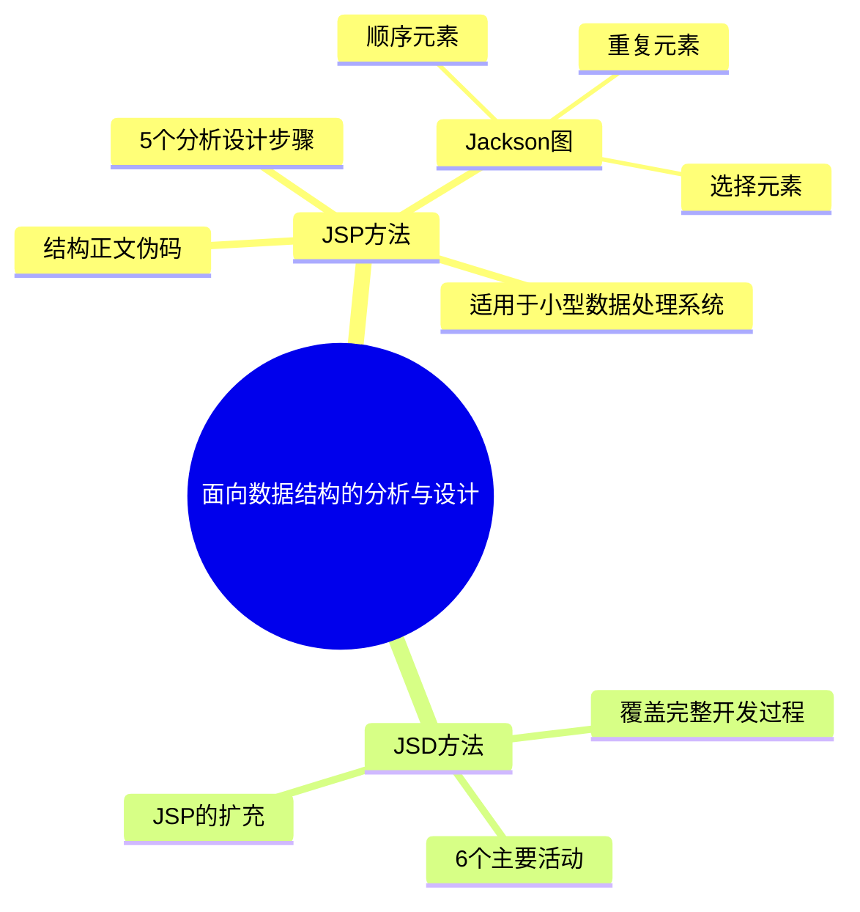

# 第6章-面向数据结构的分析与设计

## 基本信息
- **课程**：软件工程
- **章节**：第6章 面向数据结构的分析与设计
- **日期**：2026-06-30
- **标签**：#面向数据结构 #JSP方法 #JSD方法 #Jackson图 #程序设计

---

## 重点内容

### ⭐⭐ 核心概念
- **JSP方法**（Jackson Structured Programming）：使程序结构与问题结构（数据结构）相对应
- **Jackson图**：用顺序、选择、循环三种基本结构表示数据结构和程序结构
- **JSD方法**（Jackson System Development）：JSP的扩充，覆盖从分析到实现的全过程

### ⭐ 方法特点
- JSP：简单、易学、形象直观，适用于小型数据处理系统
- JSD：从现实模型出发，加入功能性处理，适用于更大规模的系统

### ⭐ 设计原则
- 面向数据结构方法的核心：**以数据结构为中心，从输入输出的数据结构导出程序结构**

---

## 详细笔记

### 一、第6章整体框架

本章介绍面向数据结构的分析与设计方法，包括两个主要方法：

| 方法 | 全称 | 适用范围 | 详细程度 |
|:----:|:-----|:--------:|:--------:|
| JSP | Jackson Structured Programming | 中小型数据处理系统 | 6.1节详细展开 |
| JSD | Jackson System Development | 更大规模系统（含分析到实现） | 6.2节简介 |

> 📚 **课本出处**：第6章 章节概述

### 二、JSP方法（6.1节）

> 📚 **课本出处**：第6章 6.1节"JSP方法"

**核心思想**：程序结构应当与问题结构（数据结构）相对应。大多数系统处理的是具有层次结构的数据，因此可以用数据结构来表示问题结构。

**基本流程**：

**Jackson图的三种基本结构**：
- **顺序元素**：由左到右依次执行的元素序列
- **选择元素**：根据条件从多个子元素中选择一个
- **重复元素**：某个子元素重复0次或多次

详见 [第6章-6.1-JSP方法](./第6章-6.1-JSP方法.md)

### 三、JSD方法（6.2节）

> 📚 **课本出处**：第6章 6.2节"JSD方法简介"

**背景**：JSP广泛使用十多年后，Jackson对其进行扩充，不再局限于中小规模问题及顺序范围。

**本质**：先建立一个现实模型，然后加入功能性处理，最后将逻辑系统转换为实际设计。

**6个主要步骤**：
1. 标识实体与行为
2. 生成实体结构图
3. 创建软件系统模型
4. 扩充功能性过程
5. 施加时间控制
6. 实现

详见 [第6章-6.2-JSD方法简介](./第6章-6.2-JSD方法简介.md)

### 四、本章小结

> 📚 **课本出处**：第6章 6.3节"小结"

面向数据结构方法的主要特点：以数据结构为中心，从输入输出的数据结构导出程序结构。

---

## 总结

### 本章知识脉图

### 关键要点

1. **JSP的核心原则**：程序结构与数据结构（问题结构）相对应
2. **Jackson图三种结构**：顺序、选择、重复是表示数据结构和程序结构的基本元素
3. **JSP的5个步骤**：画数据结构图 -> 找对应关系 -> 导出程序结构 -> 分配操作和条件 -> 用伪码表示
4. **JSD是JSP的扩充**：从只关注顺序处理扩展到覆盖完整的分析-设计-实现过程
5. **JSD的6个步骤**：标识实体与行为 -> 生成实体结构图 -> 创建软件模型 -> 扩充功能 -> 施加时间控制 -> 实现

---

## 疑问与思考

### ❓ 疑问与思考

**❓ 当输入和输出数据结构的层次不一致时，JSP如何确定程序结构的层次？**

💡 JSP导出规则中规定，有对应关系的数据元素在程序结构图中的层次取两者中较低的那个。层次不一致时，较高层的数据元素会在程序结构中向下扩展，直到与对应元素对齐。实际操作中，可以通过合并或拆分数据结构的层次来使两者尽量匹配。

**❓ JSP方法在遇到非层次结构（如图结构、网状结构）的数据时是否仍然有效？**

💡 JSP主要针对具有层次结构的数据设计，对于图结构或网状结构的数据不能直接使用。通常的做法是先将非层次数据转化为层次化的表示（如将图遍历序列化为树结构），或者改用其他适合的方法（如面向对象方法或数据流方法）。

**❓ JSD中的"施加时间控制"具体涉及哪些调度特征？在实际项目中如何应用？**

💡 时间控制涉及进程间的并发协调、时序约束和实时性要求。在实际项目中，例如一个多实体的银行系统，需要控制多个账户操作进程的并发执行顺序，防止数据竞争；在实时系统中，还需要确保处理结果在规定时间窗内输出。具体技术包括进程优先级分配、同步机制设计和死锁预防。

### 💡 个人理解/技巧
- JSP的本质思想是"数据结构决定程序结构"，这与第5章结构化设计中"数据流决定程序结构"形成对比
- Jackson图的三种结构直接对应编程中的三种基本控制结构：顺序语句、if-else/switch、while/for循环
- JSD可以看作是JSP从"程序级"扩展到"系统级"的方法升级
- 面向数据结构方法在国内应用较少，但其核心思想（以数据为中心）在数据库驱动的系统设计中仍有重要价值

---

## 相关链接

### 关联章节
- [第5章-结构化分析与设计](../第5章-结构化分析与设计/) — 结构化方法与面向数据结构方法的对比
- [第7章-面向对象方法基础](../第7章-面向对象方法基础/) — 面向对象方法与本章方法的对比

### 课本章节
- 6.1 JSP方法 → [第6章-6.1-JSP方法](./第6章-6.1-JSP方法.md)
- 6.2 JSD方法简介 → [第6章-6.2-JSD方法简介](./第6章-6.2-JSD方法简介.md)
- 6.3 小结

---

## 检查清单

- [x] 已理解JSP方法的核心思想（程序结构与数据结构对应）
- [x] 已理解Jackson图三种基本结构
- [x] 已理解JSP方法的5个步骤
- [x] 已理解JSD方法的6个主要活动
- [x] 已掌握JSP与JSD的区别
- [x] 已添加课本出处标注

---

*笔记创建时间：2026-06-30*
